# When Causality meets Computer Vision

The repository contains lists of papers on causality and how relevant techniques are being used to further enhance deep learning era computer vision solutions. 

The repository is organized by [Maheep Chaudhary](https://maheepchaudhary.github.io/maheep.github.io/) and [Haohan Wang](http://www.cs.cmu.edu/~haohanw/) as an effort to collect and read relevant papers and to hopefully serve the public as a collection of relevant resources. 

## Causality 

  - [The Seven Tools of Causal Inference with Reflections on Machine Learning](https://ftp.cs.ucla.edu/pub/stat_ser/r481.pdf) 
      - 

Maheep's notes 

         The author proposes the 7 tools based on the 3 ladder of causation, i.e. Associaion, Intervention and Counterfactual. the paper proposes a diagram which describes that we have some assumptions from which we answer our query and from our data we validate our assumptions, i.e. "Fit Indices".The author proposes the 7 tools as :- 
          
         1. Transparency and Testability : Transparency indicates that the encoded form is easily usable and compact. The testability validates that the assumption encoded are compatible with the available data
          
         2. Do-Calculas and the control of Confounding : It is used for intervention, mainly used when we are trying to shift from 1st layer to 2nd. 
          
         3. The Algorithmization of Counterfactuals : When we can analyse the counterfactual reasoning using the experimental or observational studies. 
          
         4.  Mediation Analysis and the Assessment of Direct and  Indirect Effects : We find out the direct and indirect effects, such as what fraction of effect does X on Y mediated by variable Z.
          
         5.  Adaptability, External Validity and Sample Selection Bias : Basically it deals with the robustness of the model and offers do-calculas for overcoming the bias due to environmental changes.
          
         6. Recovering from Missing Data : The casual inference is made to find out the data-generating principles through probablisitic relationship and therefore promises to fill the missing data. 
          
         7. Causal Discovery : The d-separation can ebable us to detect the testable implications of the casual model therefore can prune the set of compatible models
         significantly to the point where causal queries can be estimated directly from that set.
        

  - [On Pearl’s Hierarchy and the Foundations of Causal Inference](https://causalai.net/r60.pdf) 
      - 

Maheep's notes 

        The pearl causal hierarchy encodes different concepts like : association. intervention and counterfactual.
         
        Corollary1 : It is genrally impossible to draw higher-layer  inferences using only lower-layer informatio but the authors claim that they have atleast developed a framework to move from layer 1 to layer 2 just from the layer 1 data using Causal Bayesian Network that uses do-calculas, i.e. intervention to get insight of layer 2 using the layer 1 data. 
         
        A SCM includes 4 variables, i.e. exongenous "U", endogneous "V", set of functions and P(U).
         
        A structural model is said to be markovian if the variable in the exogenous part are independent. 
         
        Observing : Joint porobability distribution for the Y(u) = y 
        Interventional SCM : SCM computed by fixing some varibales X = x. where X is in V. 
        Potential Response : It is the solution of Y caluclated thorugh the set of eqautions of SCM when we intervene on it.   
        Intervening : observing just when we do(X  = x)
        Effectiveness : P(v|do(x)) is effectiveness when for every v, P(v|do(x)) = 1 
        Collapse : The layers collapse when we can compute the results of the upper layer using the lower layer. For ex:- if Layer 2 collapses to layer 1, then it implies that we can draw all possible causal conculsion with mere correlation. 
         
        Theorem 1: PCH never collapses. 
         
        It could be  easily observed/seen that SCM agrees on all lower layers but disagrees on all higher layers.  A typical rdata-generating SCM encodes rich information at all threee layers but even very small changes might have substantial effect, which is generally seen in the higher layers.  
         
        Truncated Factorization Product is the equation stating P(v|do(x)) = pi P(v|pai)
         
        When two variables are correlated it does not mean that one is causing the other, i.e. P(y|do(x)) = P(y) and P(x|do(y)) =P(x), in this case what happens is there is another unobserved variable that is influencing both x and y variable which is often indicated by the bi-directed line in the graph.
         
        Factorization implied by the semi-markovian model does not act like chain rule, i.e. 
        P(e|a,b,c,d) = P(a)P(b|a)P(c|b,a)P(d|c,b,a)
        but the factorization looks something like: P(e|d,c,b,a) = P(a)P(b|a)P(c|a)P(e|b.c) which implies that b and c are only affected by a also seen by a direct edge in SCM. 
          
        

  - [Unit selection based on counterfactual logic](https://escholarship.org/content/qt8pw00989/qt8pw00989.pdf) 
      - 

Maheep's notes 

         The unit selection problem entails two sub-problems, evaluation and search. The evaluation problem is to find an objective function that, ensure a counterfactual behaviour when optimized over the set of observed characteristics C for the selected group. The search task is to devise a search algorithm to select individuals based both on their observed characteristics and the objective function devised above. 
           
         The paper only focuses on the evaluation sub-problem and focuses on the previous effort to solve this problem, i.e. A/B testing so as to maximizes the percentage of compliers and minimizes the percentages of defiers, always-takers, and never-takers. But the author argues that the proposed term for it does not satisfy the criteria as P(positive response|c, encouraged) - P(positive response|c, not encouraged) represents "compilers + always-takers" - "defiers + always-takers", therefore the author suggest to have two theorems, i.e. "monotonicity" and "gain equality" which can easily optimize the A/B testing. 
         Monotonicity expresses the assumption that a change from X = false to X = true cannot, under any circumstance make Y change from true to false.
         Gain-equality states that the benefit of selecting a complier and a defier is the same as the benefit of selecting an always-taker and a never-taker (i.e., β + δ = γ + θ).
         
         Taking into account the following theorems the author proposes a alternate term of A/B testing which stands for maximizing the benefit. 

         `argmax c βP (complier|c) + γP (always-taker|c) + θP (never-taker|c) + δP (defier|c)` 
         where benefit of selecting a complier is β, the benefit of selecting an always-taker is γ, the benefit of selecting a never-taker is θ, and the benefit of selecting a defier is δ. Our objective, then, should be to find c. 
         Theorem 4 says that if Y is monotonic and satisfies gain equallity then the benefit function may be defined as: - 
         `(β − θ)P (y,x |z) + (γ − β)P (y,x′ |z) + θ`
           
         "Third, the proposed approach could be used to evaluate machine learning models as well as to generate labels for machine learning models. The accuracy of such a machine learning model would be higher because it would consider the counterfactual scenarios."
        

  - [Unit Selection with Causal Diagram](https://arxiv.org/pdf/2109.07556.pdf) 
      - 

Maheep's notes 

         Same as above
          
         Additionoal content continues here..........
          
         After proposing the technioques to account for unit selection in general the author proposes a new kind of problem by introducing the confounders in the causal Diagram. The following discovery was partially made by the paper "Causes of Effects: Learning Individual responses from Population Data ". The author proposes a new equation to handle these scenarios.  

         `W + σU ≤ f ≤ W + σL if σ < 0`,
         `W + σL ≤ f ≤ W + σU if σ > 0`,
         where "f" is the objective function. Previously in normal case the objective fucntion is bounded by the equation: 
          
         `max{p 1 , p 2 , p 3 , p 4 } ≤ f ≤ min{p 5 , p 6 , p 7 , p 8 } if σ < 0,` 
         `max{p 5 , p 6 , p 7 , p 8 } ≤ f ≤ min{p 1 , p 2 , p 3 , p 4 } if σ > 0`, 
         In the extension of the same the author proposes the new situations which arise such as the when "z" is partially observable. and if "z" is  a pure mediator. 
           
         The author then discusses about the availablity of the observational and experimantal data. If we only have experimantal data then we can simply remove the observationa terms in the theorem  
         `max{p 1 , p 2 } ≤ f ≤ min{p 3 , p 4 } if σ < 0`, 
         `max{p 3 , p 4 } ≤ f ≤ min{p 1 , p 2 } if σ > 0`, 
         but if we have only onservational data then we can take use of the observed back-door and front-door variables to generate the experimental data, but if we have partially observable back-dorr and front-door variables then we can use the equation:  
         `LB ≤ P (y|do(x)) ≤ UB`
           
         The last topic which author discusses about is the reduciton of the dimensionality of the variable "z" which satisfies the back-door and front-door variable by substituting the causal graph by substiuting "z" by "W" and "U" which satisfies the condition that "no_of_states_of_W *  no_of_states_of_U = no_of_states_of_z". 

        

  - [The Causal-Neural Connection: Expressiveness, Learnability, and Inference](https://causalai.net/r80.pdf) 
      - 

Maheep's notes 

        
        The author proposes Neural Causal Models, that are a type of SCM but are capable of amending Gradient Descent. The author propses the network to solve two kinds of problems, i.e. "causal effect identification" and "estimation" simultaneously in a Neural Network as genrative model acting as a proxy for SCM.
         
        "causal estimation" is the process of identifying the effect of different variables 
        "Identification" is obtained when we apply backdoor criterion or any other step to get a better insight. The power of identification has been seen by us as seen in the papers of Hanwang Zhang.
         
        Theorem 1: There exists a NCM that is in sync with the SCM on ladder 3
        
        

  - [The Causal Loss: Driving Correlation to Imply Causation(autonomus)](https://arxiv.org/abs/2110.12066) 
      - 

Maheep's notes 

         The paper introduces a loss function known as causal loss which aims to get the intervening effect of the data and shift the model from rung1 to rung2 of ladder of causation. Also the authors propose a Causal sum Product Network(CaSPN).
           
         Basically the causal loss measures the prob of a variable when intervened on another variable. 
         They extend CaSPN from iSPN be reintroducing the conditional vaaribales, which are obtained when we intervene on the observational data. They argue that the CaSPN are causal losses and also are very expressive. 
         The author suggests a way(taken from iSPN) consitional variables will be passed with adjacency matrix while weight training and target varibales are applied to the leaf node. 
           
         They train the CaSPN, NN with causal loss, standard loss and standard loss + alpha*causal loss and produce the results. Also they train a Decision tree to argue that their technique also works on Non-Differential Networks, therefore they propose to  substitute the Gini Index with the Causal Decision Score which measures the average probability of a spit resulting in correct classification. 
        

  - [Double Machine Learning Density Estimation for Local Treatment Effects with Instruments](https://causalai.net/r75.pdf) 
      - 

Maheep's notes 

         The LTE measures the affect of among compilers under assumptions of monotonicity.  The paper focuses on estimating the LTE Density Function(not expected value) using the binary instrumental variable which are used to basically counteract the effect of unobserved confounders. 
           
         Instrumental Variables : These are the variables to counteract the affect of inobserved confounders. To be an instrumental varibale these are the following conditions it should consist of: 
           
         Relevance: The instrument Z has a causal effect on the treatment X. 
         Exclusion restriction: The instrument Z affects the outcome Y only through the treatment X. 
         Exchangeability (or independence): The instrument Z
         is as good as randomly assigned (i.e., there is no confounding for the effect of Z on Y). 
         Monotonicity: For all units i, Xi(z1)⩾Xi(x2) when z1⩾z2 (i.e., there are no units that always defy their assignment).
           
         The author develops two methods to approximate the density function, i.e. kernel - smoothing and model-based approximations. For both approaches the author derive double/deboased machine learning estimators. 
           
         Kernel Smoothing method: They smoothes the density by convoluting with a smooth kernel function............................ 
         Model-based approximators: It projects the density in the dfinite-dimenional density class basedon a distributional distance measure.......... 

         The author argues that by obtaining the PDF may give very valuable information as compared to only estimating the Cumlative Distribution Function. 
        

 

## Causality & Computer Vision

<!--- Week 1 --> 

  - [Counterfactual Samples Synthesizing and Training for Robust Visual Question Answering](https://arxiv.org/pdf/2003.06576.pdf) 
      - 

Maheep's notes 

         In this research paper the author focuses on 2 major questions, i.e.  
         1) Visual-explainable: The model should rely on the right visual regions when making decisions. 
         2) Question-sensitive: The model should be sensitive to the linguistic variations in questions. 
         The author proposes a technique, i.e. CSST which consist  of CSS and CST which do counterfactual in VQA as the CSS generates the counterfactual samples by masking critical objects  in the images and words. The CST model tackles the second challenge of sensitivity is handled by  the CST which make the model learn to distinguish between the origianl samples and counterfactal ones. Addtionally it trains the model to learn both kind of samples, i.e. origianl and counterfactual ones, making  the model robust. 
        

  - [How Should Pre-Trained Language Models Be Fine-Tuned Towards Adversarial Robustness?](https://openreview.net/pdf?id=pl2WX3riyiq) 
      - 

Maheep's notes 

         The fine-tuning of pre-trained language models has a great success in many NLP fields but it is strikingly vulnerable to adversarial examples, as it suffers severely from catastrophic forgetting: failing to retain the generic and robust linguistic features that have already been captured by the pre-trained model. The proposed model maximizes the mutual information between the output of an objective model and that of the pre-trained model conditioned on the class label. It encourages an objective model to continuously retain useful information from the pre-trained one throughout the whole fine-tuning process.  

         `I(S; Y, T ) = I(S; Y ) + I(S; T|Y ),`
          The author proposes by this equation that the two models overlap, i.e. the objective model and the pretrained model. S represents the features extracted the model by the objective model and T is the features extracted by the pretrained model.
        

  - [Counterfactual Zero-Shot and Open-Set Visual Recognition](https://arxiv.org/pdf/2103.00887.pdf) 
      - 

Maheep's notes 

         The author proposes a novel counterfactual framework for  both Zero-Shot Learning (ZSL) and Open-Set Recognition (OSR), whose common challenge is generalizing to the unseen-classes by only training on the seen-classes. all the unseen-class recognition methods stem from the same grand assumption: attributes (or features) learned from the training seen-classes are transferable to the testing unseen-classes. But this does not happen in practise.  

         ZSL is usually provided with an auxiliary set of class attributes to describe each seen- and unseen-class whereas the OSR has open environment setting with no information on the unseen-classes [51, 52], and the goal is to build a classifier for seen-classes. Thae author describers previous works in which the generated samples from the class attribute of an unseen-class, do not lie in the sample domain between the ground truth seen and unseen, i.e., they resemble neither the seen nor the unseen. As a result, the seen/unseen boundary learned from the generated unseen and the true seen samples is imbalanced.  

         The author proposes a technique using counterfactual, i.e. to generate samples using the class attributes, i.e. Y and sample attrubute Z by the counterfactual, i.e. 
         X would be x̃, had Y been y, given the fact that Z = z(X = x) and the consistency rule defines that if the ground truth is Y then x_bar would be x. The proposed genrative causal model P(X|Z, Y ) generate exapmles for ZSL and OSR. 
        

  - [Counterfactual VQA: A Cause-Effect Look at Language Bias](https://arxiv.org/pdf/2006.04315.pdf) 
      - 

Maheep's notes 

         Besides, counterfactual training samples generation [12, 1, 58, 19, 31] helps to balance the training data, and outperform other debiasing methods by large margins on VQA-CP.
          
         The statement specifies the reason why the author in the origianl paper mentioned that we can generate missing labels with that  process in Machine Leanring. They formulate the language bias as the direct causal effect of questions on answers, and mitigate the bias by subtracting the direct language effect from the total causal effect. They  proposed a very simple method to debias the  NLP part in VQA using  the Causal Inference, i.e. they perform VQA using different layers for different part, i.e. for visual, question and visual+question which is denoted by Knowledge base K. They argue that if we train a model like this then we would have result with Z_q,k,v, then to get the Total Indirect Effect, they train another model with parameters as Z_q,v*k* and are subtracted from each other. to eliminate the biasness of the language model.     
        

  - [CONTERFACTUAL GENERATIVE ZERO-SHOT SEMANTIC SEGMENTATION](https://arxiv.org/pdf/2106.06360.pdf)
      - 

Maheep's Notes

        The paper proposes a zero-shot semantic segmentation. One of the popular zero-shot semantic segmentation methods is based on the generative model, but no one has set their eyes on the statstical spurious correlation. In this study the author proposes a counterfactual methods to avoid the confounder in the original model. In the spectrum of unsupervised methods, zero-shot learning always tries to get the visual knowledge of unseen classes by learning the mapping from word embedding to visual features. The contribution of the paper accounts as: 
        (1) They proposed a new strategy to reduce the unbalance in zero-shot semantic segmentation.  
        (2) They claim to explain why recent different structures of models can develop the performance of traditional work. 
        (3) They extend the model with their structures and improve its performance.

        The model will contain a total of 4 variables R, W, F and L. The generator will to generate the fake features using the word embeddings and real features of the seen class and will generate fake images using word embeddings after learning. However, this traditional model cannot capture the pure effect of real features on the label because the real features R not only determine the label L by the link R !L but also indirectly influence the label by path R ! F ! L. This structure, a.k.a. confounder. Therefore they remove the R!F!L and let it be W!F!L, removing the confounding effect of F. Also they  use GCN to generate the image or fake features from eord embeeddings using the GCN which alos provides to let the generator learn from similar classes. 
        

  - [Adversarial Visual Robustness by Causal Intervention](https://arxiv.org/abs/2106.09534) 
      - 

Maheep's notes 

         The paper focuses on adverserial training so as to prevent from adverserial attacks. The author use instrumental variable to achieve casual intervention.            The author proposes 2 techniques, i.e. 
         
         1) Augments the image with multiple retinoptic centres
         
         2) Encourage the model to learn causal features, rather than local confounding patterns.
         
         They propose the model to be such that max P (Y = ŷ|X = x + delta) - P(Y = ŷ|do(X = x + delta)), 
         subject to P (Y = ŷ|do(X = x + delta)) = P (Y = ŷ|do(X = x)), in other words they focus on annhilating the confounders using the retinotopic centres as the instrumental variable.
        

  - [What If We Could Not See? Counterfactual Analysis for Egocentric Action Anticipation](https://vipl.ict.ac.cn/homepage/jsq/publication/2021-Zhang-IJCAI.pdf) 
      - 

Maheep's notes 

         Egocentric action anticipation aims at predicting the near future based on past observation in first-person vision. In addition to visual features which capture spatial and temporal representations, semantic labels act as high-level abstraction about what has happened. Since egocentric action anticipation is a vision-based task, they consider that visual representation of past observation has a main causal effect on predicting the future action. In the second stage of CAEAA, we can imagine a counterfactual situation: “what action would be predicted if we had not observed any visual representation?" 

         They ask this question so as to only get the effect of semantic label. As the visual feature is the main feature the semantic label can act as a confouder due to some situations occuring frequently. Therfore the author proposes to get the logits "A" from the pipeline without making any changes to the model and then also getting the logits "B" when they provide a random value to visual feature denoting the question of counterfactual, i.e. “what action would be predicted if we had not observed any visual representation?" getting the unbiased logit by: 

         Unbiased logit = A - B
        

  - [Transporting Causal Mechanisms for Unsupervised Domain Adaptation](https://openaccess.thecvf.com/content/ICCV2021/papers/Yue_Transporting_Causal_Mechanisms_for_Unsupervised_Domain_Adaptation_ICCV_2021_paper.pdf) 
      - 

Maheep's notes 

         Existing Unsupervised Domain Adaptation (UDA) literature adopts the covariate shift and conditional shift assumptions, which essentially encourage models to learn common features across domains, i.e. in source domain and target domain but  as it is unsupervised, the feature will inevitably lose non-discriminative semantics in source domain, which is however discriminative in target domain. This is represented by Covariate Shift: P (X|S = s) != P (X|S = t), where X denotes the samples, e.g., real-world vs. clip-art images; and 2) Conditional Shift: P (Y |X, S = s) != P (Y |X, S = t). In other words covariate dhift defiens that the features or images of both the target and source domain will be different. The conditional shift represents the logit probability from same class images in source and target domain will vary. The author argues that the features discartrded but are important say "U" are confounder to image and features extracterd.
         Therefore the author discovers k pairs of end-to-end functions {(M i , M i inverse )}^k in unsupervised fashion, where M(Xs) =  (Xt) and M i_inverse(Xt) = Xs , (M i , M i 1 ) corresponds to U i intervention. Specifically, training samples are fed into all (M i , M i 1 ) in parallel to compute L iCycleGAN for each pair. Only the winning pair with the smallest loss is updated. This is how they insert images with same content but by  adding U in both target and source domain using image generation. 
        

  - [WHEN CAUSAL INTERVENTION MEETS ADVERSARIAL EXAMPLES AND IMAGE MASKING FOR DEEP NEURAL NETWORKS](https://arxiv.org/pdf/1902.03380.pdf) 
      - 

Maheep's notes 

         To study the intervention effects on pixel-level features for causal reasoning, the authors introduce pixel-wise masking and adversarial perturbation. The authors argue that the methods such as Gradient information from a penultimate convolutional layer was used in GradCAM are good to provide  the saliency map of the image but it is not justifiable inmany situaitons as the Saliency maps onlyCAM  establish a correlation for interpretability while it is possible to trace a particular image region that is responsible for it to be correctly classified; it cannot elucidate what would happen if a certain portion of the image was masked out. 

         Effect(xi on xj , Z) = P (xj |do(xi_dash ), Z_Xi) -  P (xj |Z_Xi ) ......................................(1)
         The excepted casual effect has been defined as:
         E_Xi[Effect(xi on xj , Z)] = (P(Xi = xi |Z)*(equation_1))

         The author proposes three losses to get the above equaitons, i.e. the effect of pixels. The losses are interpretability loss, shallow reconstruction loss, and deep reconstruction loss. Shallow reconstruction loss is simply the L 1 norm of the difference between the input and output of autoencoder to represent the activations of the network. For the second equation they applied the deep reconstruction loss in the form of the KL-divergence between the output probability distribution of original and autoencoder-inserted network.

         These losses are produced afer perturbtaing the images by maksing the images and inserting adverserial noise. 
        

  - [Interventional Few-Shot Learning](https://arxiv.org/pdf/2009.13000.pdf) 
      - 

Maheep's notes 

         In  this paper the author argues that in the prevailing Few-Shot Learning (FSL) methods: the pre-trained knowledge of the models is used which is indeed a confounder that limits the performance. They develop three effective IFSL algorithmic implementations based on the backdoor adjustment, the fine-tuning only exploits the D’s knowledge on “what to transfer”, but neglects “how to transfer”. Though stronger pretrained model improves the performance on average, it
         indeed degrades that of samples in Q dissimilar to S. The deficiency is expected  in the meta-learning paradigm, as fine-tune is also used in each meta-train episode

         The author proposes  the solution by proposing 4 variables, i.e. "D", "X", "C", "Y" where D is the pretrained model, X is the feature representaiton of the image, C is the low dimesion representation of X and Y are the logits. The author says the D affects both the X and C, also X affects C, X and C affects the logit Y. The autho removes the affect of D on X using backdoor.  
        

  - [CLEVRER: COLLISION EVENTS FOR VIDEO REPRESENTATION AND REASONING](https://arxiv.org/pdf/1910.01442.pdf) 
      - 

Maheep's notes 

         The authors propose CoLlision Events for Video REpresentation and Reasoning (CLEVRER) dataset, a diagnostic video dataset for systematic evaluation of computational models on a wide range of reasoning tasks. Motivated by the theory of human causal judgment, CLEVRER includes four types of question: descriptive (e.g., ‘what color’), explanatory (‘what’s responsible for’), predictive (‘what will happen next’), and counterfactual (‘what if’). 

          The dataset is build on CLEVR dataset and has predicitive both predictive and counterfactual questions, i.e. done by, Predictive questions test a model’s capability of predicting possible occurrences of future events after the video ends. Counterfactual questions query the outcome of the video under certain hypothetical conditions (e.g. removing one of the objects). Models need to select the events that would or would not happen under the designated condition. There are at most four options for each question. The numbers of correct and incorrect options are balanced. Both predictive and counterfactual questions require knowledge of object dynamics underlying the videos and the ability to imagine and reason about unobserved events.

          The dataset is being prepared by using the pysics simulation engine.
        

  - [Towards Robust Classification Model by Counterfactual and Invariant Data Generation](https://openaccess.thecvf.com/content/CVPR2021/papers/Chang_Towards_Robust_Classification_Model_by_Counterfactual_and_Invariant_Data_Generation_CVPR_2021_paper.pdf) 
      - 

Maheep's notes 

         The paper is about augmentaiton using the counterfactual inference by  using the human annotations of the subset of the features responsible (causal) for the labels (e.g. bounding boxes), and modify this causal set to generate a surrogate image that no longer has the same label (i.e. a counterfactual image). 
         Also they alter non-causal features to generate images still recognized as the original labels, which helps to learn a model invariant to these features. 

         They augment using the augmentaions as: None, CF(Grey), CF(Random), CF(Shuffle), CF(Tile), CF(CAGAN) 
         and the  augmentaions which alter the invariant features using: F(Random) F(Shuffle) F(Mixed-Rand) F(FGSM)
        
        
---
<!--- ### Week 2 -->

  - [Unbiased Scene Graph Generation from Biased Training](https://arxiv.org/pdf/2002.11949.pdf)
      - 

Maheep's Notes

        The paper focuses on scene graph generation (SGG) task based on causal inference. The author use Total Direct Effect for an unbiased SGG. The author proposes the technique, i.e. 
         
         1) To take remove the context bias, the author compares it with the counterfactual scene, where visual features are wiped out(containing no objects). 
         
         The author argues that the true label is influenced by Image(whole content of the image) and context(individual objects, the model make a bias that the object is only to sit or stand for and make a bias for it) as confounders, whereas we only need the Content(object pairs) to make the true prediction. 
         The author proposes the TDE = y_e - y_e(x_bar,z_e), the first term denote the logits of the image when there is no intervention, the latter term signifies the logit when content(object pairs) are removed from the image, therfore giving the total effect of content and removing other effect of confounders.    
        

        
   - [Counterfactual Visual Explanations](https://arxiv.org/pdf/1904.07451.pdf)
      - 

Maheep's Notes

        The paper focuses on Counterfactual Visual Explanations. The author ask a very signifiant question while developing the technique proposed in the paper, i.e. how I could change such that the system would output a different specified class c'. To do this, the author proposes the defined technique: - 
         
         1) He selects ‘distractor’ image I' that the system predicts as class c' and identify spatial regions in I and I' such that replacing the identified region in I with the identified region in I' would push the system towards classifying I as c'. 
        
        The author proposes the implementation by the equation:  
        `f(I*) = (1-a)*f(I) + a*P(f(I'))`   
        where   
        `I*` represents the image made using the `I` and `I'`
        `*` represents the Hamdard product.  
        `f(.)` represents the spatial feature extractor  
        `P(f(.))` represents a permutation matrix that rearranges the spatial cells of `f(I')` to align with spatial cells of `f(I)`
      
        The author implements it using the two greedy sequential relaxations – first, an exhaustive search approach keeping a and P binary and second, a continuous relaxation of a and P that replaces search with an optimization. 
        

   - [Counterfactual Vision and Language Learning](https://openaccess.thecvf.com/content_CVPR_2020/papers/Abbasnejad_Counterfactual_Vision_and_Language_Learning_CVPR_2020_paper.pdf)
      - 

Maheep's Notes

        The paper focuses on VQA models using the counterfactual intervention to make it robust. They ask a crucial question, i.e. “what would be the minimum alteration to the question or image that could change the answer”. The author uses the observational data as well as the counterfactual data to predict the answer. To do this, the author proposes the defined technique: - 
         
         1) The author replaces the embedding of the question or image using another question or image so as to predict the correct answer and minimize counterfactual loss. 
        

        
   - [Counterfactual Vision-and-Language Navigation via Adversarial Path Sampler](https://arxiv.org/pdf/1911.07308.pdf)
      - 

Maheep's Notes

        The paper focuses on Vision-and-Language Navigation (VLN). The author combine the adversarial training with counterfactual conditions to guide models that might lead to robust model. To do this, the author proposes the defined techniques: - 
         
         1) The author APS, i.e. adversarial path sampler which samples batch of paths P after augmenting them and reconstruct instructions I using Speaker. With the pairs of (P,I), so as to maximize the navigation loss L_NAV. 
         2) The NAV, i.e. navigation model trains so as to minimize the L_Nav making the whole process more robust and increasing the performance. 
         
        The APS samples the path based on the visual features v_t which are obtained using the attention on the feature space f_t and history h_t-1 and previous action taken a_t-1 to output the path using the predicted a_t and the features f_t.
        

   - [Beyond Trivial Counterfactual Explanations with Diverse Valuable Explanations](https://arxiv.org/pdf/2103.10226.pdf)
      - 

Maheep's Notes

        The paper system DiVE in a world where the works are produced to get features which might change the output of the image and learns a perturbation in a disentangled latent space that is constrained using a diversity-enforcing loss to uncover multiple valuable explanations about the model’s prediction. The author proposes these techniques to get the no-trivial explanations and making the model more diversified, sparse and valid: - 
         
         1) DiVE uses an encoder, a decoder, and a fixed-weight ML model.
         2) Encoder and Decoder are trained in an unsupervised manner to approximate the data distribution on which the ML model was trained. 
         3) They optimize a set of vectors E_i to perturb the latent representation z generated by the trained encoder.
          
        The author proposes 3 main losses: 
        `Counterfatual loss` : It identifies a change of latent attributes that will cause the ML model f to change it’s prediction.
        `Proximity loss` : The goal of this loss function is to constrain the reconstruction produced by the decoder to be similar in appearance and attributes as the input, therfore making the model sparse. 
        `Diversity loss` : This loss prevents the multiple explanations of the model from being identical and reconstructs different images modifing the different spurious correlations and explaing through them.
        The model uses the beta-TCVAE to obtain a disentangled latent representation which leads to more proximal and sparse explanations and also Fisher information matrix of its latent space to focus its search on the less influential factors of variation of the ML model as it defines the scores of the influential latent factors of Z. This mechanism enables the discovery of spurious correlations learned by the ML model.
        
       
         
        
        
   - [SCOUT: Self-aware Discriminant Counterfactual Explanations](https://arxiv.org/pdf/2004.07769.pdf)
      - 

Maheep's Notes

        The paper proposes to connect attributive explanations, which are based on a single heat map, to counterfactual explanations, which seek to identify regions where it is easy to discriminate between prediction and counter class. They also segments the region which discriminates between the two classes of a class image. 
        
        The author implements using a network by giving a query image x of class y , a user-chosen counter class y' != y, a predictor h(x), and a confidence predictor s(x), x is then forwarded to get the F_h(x) and F_s(x). From F_h(x) we predict h_y(x) and h_y'(x) which are then combined with the original F_h(x) to produce the A(x, y) and A(x, y') to get the activation tensors and they are then combined with A(x, s(x)) to get the segmented region of the image which is discriminative of the counter class. 
        
         
     
     
                 
   - [Born Identity Network: Multi-way Counterfactual Map Generation to Explain a Classifier’s Decision](https://arxiv.org/pdf/2011.10381.pdf)
      - 

Maheep's Notes

        The paper proposes a system BIN that is used to produce counterfactual maps as a step towards counterfactual reasoning, which is a process of producing hypothetical realities given observations. The system proposes techniques: - 
         
         1) The author proposes Counterfactual Map Generator (CMG), which consists of an encoder E , a generator G , and a discriminator D . First, the network design of the encoder E and the generator G is a variation of U-Net with a tiled target label concatenated to the skip connections. This generator design enables the generation to synthesize target conditioned maps such that multi-way counterfactual reasoning is possible.  
         2) The another main technique porposes is the Target Attribution Network(TAN) the objective of the TAN is to guide the generator to produce counterfactual maps that transform an input sample to be classified as a target class. It is a complementary to CMG.

        The author proposes 3 main losses: 
        `Counterfatual Map loss` : The counterfactual map loss limits the values of the counterfactual map to grow as done by proximity loss in DiVE.
        `Adverserial loss` : It is an objective function reatained due to its stability during adversarial training. 
        `Cycle Consistency loss` : The cycle consistency loss is used for producing better multi-way counterfactual maps. However, since the discriminator only classifies the real or fake samples, it does not have the ability to guide the generator to produce multi-way counterfactual maps.
        

---        
<!--- Week 3 -->

   - [Introspective Distillation for Robust Question Answering](https://arxiv.org/pdf/2111.01026.pdf)
      - 

Maheep's Notes

        The paper focuses on the fact that the present day systems to make more genralized on OOD(out-of-distribution) they sacrifice their performance on the ID(in-distribution) data. To achieve a better performance in real-world the system need to have accuracy on both the distributions to be good. Keeping this in mind the author proposes: - 
         
         1) The author proposes to have a causal feature to teach the model both about the OOD and ID data points and take into account the `P_OOD` and `P_ID`, i.e. the predictions of ID and OOD.  
         2) Based on the above predictions the it can be easily introspected that which one of the distributions is the model exploiting more and based on it they produce the second barnch of the model that scores for `S_ID` and `S_OOD` that are based on the equation `S_ID = 1/XE(P_GT, P_ID)`, where `XE` is the cross entropy loss. further these scores are used to compute weights `W_ID` and `W_OOD`, i.e. `W_OOD = S_OOD/(S_OOD + S_ID)` to train the model to blend the knowledge from both the OOD and ID data points. 
         3) The model is then distilled using the knowledge distillation manner, i.e. `L = KL(P_T, P_S)`, where `P_T` is the prediction of the teacher model and the `P_S` is the prediction of the student model. 
        

        
   - [Counterfactual Explanation and Causal Inference In Service of Robustness in Robot Control](https://arxiv.org/pdf/2009.08856.pdf)
      - 

Maheep's Notes

        The paper focuses on the generating the features using counterfactual mechanism so as to make the model robust. The author proposes to generate the features which are minimal and realistic in an image so as to make it as close as the training image to make the model work correctly making the model robust to adverserial attacks, therfore robust. The generator has two main components, a discriminator which forces the generator to generate the features that are similar to the output class and the modification has to be as small as possible.     

        The additonal component in the model is the predictor takes the modified image and produces real-world output. The implementation of it in mathematics looks like:  
        `min d_g(x, x') + d_c(C(x'), t_c)`, where d_g is the distance b/w the modified and original image, d_c is the distance b/w the class space and C is the predictor that x' belongs to t_c class.  
        The loss defines as: `total_loss = (1-alpha)*L_g(x, x') + (alpha)*L_c(x, t_c)`, where L_c is the loss `x` belongs to `t_c` class   

        

   - [Counterfactual Explanation Based on Gradual Construction for Deep Networks](https://arxiv.org/pdf/2008.01897.pdf)
      - 

Maheep's Notes

        The paper focuses on gradually construct an explanation by iterating over masking and composition steps, where the masking step aims to select the important feature from the input data to be classified as target label. The compostition step aims to optimize the previously selected features by perturbating them so as to prodice the target class.   

        The proposed also focuses on 2 things, i.e. Explainability and Minimality. while implementing the techniue the authors observe the target class which were being generated were getting much perturbated so as to come under asverserial attack and therfore they propose the logit space of x' to belong to the space of training data as follows:   
        `argmin(sigma(f_k'(x') - (1/N)*sigma(f_k'(X_i,c_t))) + lambda(X' - X))`  
        where `f'` gives the logits for class k, `X_i,c_t` represents the i-th training data that is classified into c_k class and the N is the number of modifications. 
        

        
   - [CoCoX: Generating Conceptual and Counterfactual Explanations via Fault-Lines](https://ojs.aaai.org/index.php/AAAI/article/view/5643/5499)
      - 

Maheep's Notes

        The paper focuses a model for explaining decisions made by a deep convolutional neural network (CNN) fault-lines that defines the main features from which the humans deifferentiate the two similar classes. The author introduces 2 concepts: PFT and NFT, PFT are those xoncepts to be added to input image to change model prediction and for NFT it subtracts, whereas the xconcepts are those semantic features that are main features extracted by CNN and from which fault-lines are made by selecting from them.  

        The proposed model is implemented by taking the CNN captured richer semantic aspect and construct xconcepts by making use of feature maps from the last convolution layer. Every feature map is treated as an instance of an xconcept and obtain its localization map using the Grad-CAM and are spatially pooled to get important weights, based on that top p pixels are selected and are clustered using K-means. The selection is done using the TCAV tecnique. 

        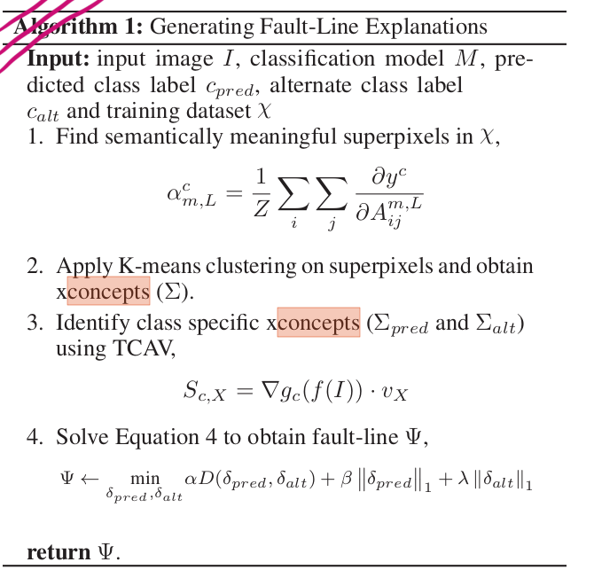
        

        
   - [CX-ToM: Counterfactual Explanations with Theory-of-Mind for Enhancing Human Trust in Image Recognition Models](https://arxiv.org/pdf/2109.01401.pdf)
      - 

Maheep's Notes

        The paper is kind of an extension of the above paper(CoCoX), i.e. it also uses fault-lines for explainability but states a dialogue between a user and the machine. The model is made by using the fault-lines and the Theory of Mind(ToM).   
        The proposed is implemented by taking an image and the same image is blurred and given to a person, then the machine take out the crucial features by thinking what the person may have understood and what is the information it should provide. The person is given more images and then the missing parts are told to be predicted after the dialogue, if the person is able to predict the parts that it was missing before then the machine gets a positive reward and functions in a RL training technique way.  

        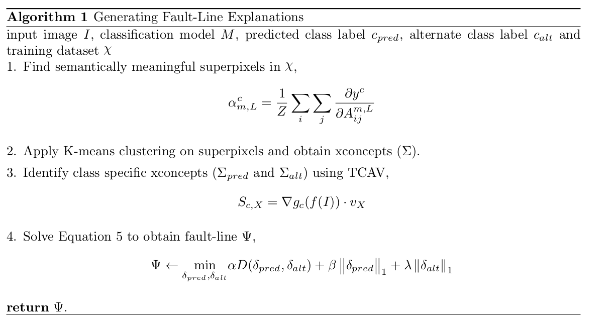
        

        
   - [DeDUCE: Generating Counterfactual Explanations At Scale](https://arxiv.org/pdf/2111.15639.pdf)
      - 

Maheep's Notes

        The paper focues to detect the erroneous behaviour of the models using counterfatctual as when an image classifier outputs a wrong class label, it can be helpful to see what changes in the image would lead to a correct classification. In these cases the counterfactual acrs as the closest alternative that changes the prediction and we also learn about the decision boundary.  
        The proposed model is implemented by identifying the Epistemic uncertainity, i.e. the useful features using the Gaussian Mixture Model and therfore only the target class density is increased. The next step would be to change the prediction using a subtle change therefore the most slaient pixel, identified usign the gradient are changed.  

        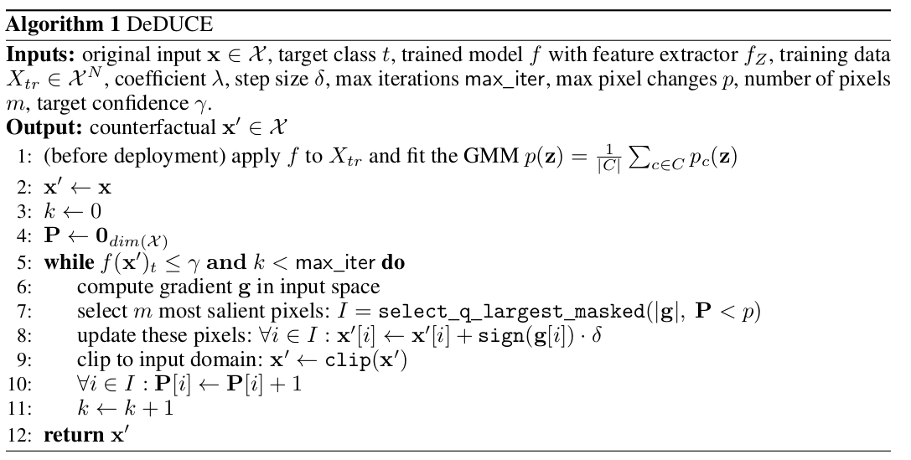
        
     
        
   - [Designing Counterfactual Generators using Deep Model Inversion](https://arxiv.org/pdf/2109.14274.pdf)
      - 

Maheep Notes

        The paper focues on the scenario when the we have access only to the trained deep classifier and not the actual training data. The paper proposes a goal to develop a deep inversion approach to generate counterfactual explanations. The paper propses methods to preserve metrics for semantic preservation using the different methods such as ISO and LSO. The author also focuses on manifold consistency for the counterfactual image using the Deep Image Prior model. -

        `argmin(lambda_1*sigma_on_l(layer_l(x'), layer_l(x)) + lambda_2*L_mc(x';F) + lambda_3*L_cf(F(x'), y'))` 
         
        where,  
        `layer_l` :The differentiable layer "l" of the neural network, it is basically used for semantic preservation.  
        `L_mc`: It penlaizes x' whcih do not lie near the manifold. L_mc can be Deterministic Uncertainty Quantification (DUQ). 
        `L_fc`: It ensures that the prediction for the counterfactual matches the desired target
        

        
        
   - [ECINN: Efficient Counterfactuals from Invertible Neural Networks](https://arxiv.org/pdf/2103.13701.pdf)
      - 

Maheep's Notes

        The paper utilizes the generative capacities of invertible neural networks for image classification to generate counterfactual examples efficiently. The main advantage of this network is that it is fast and invertible, i.e. it has full information preservation between input and output layers, where the other networks are surjective in nature, therfore also making the evaluation easy. The network claims to change only class-dependent features while ignoring the class-independence features succesfully. This happens as the INNs have the property that thier latent spaces are semantically organized. When many latent representations of samples from the same class are averaged, then class-independent information like background and object orientation will cancel out and leaves just class-dependent information 

        `x' = f_inv(f(x) + alpha*delta_x)` 
         
        where,  
        `x'` :Counterfactual image.  
        `f`: INN and therfore `f_inv` is the inverse of `f`. 
        `delta_x`: the infoprmation to be added to convert the latent space of image to that of counterfactual image. 
        `||z + alpha_0*delta_x- µ_p || = ||z + alpha_0*delta_x - µ_q ||` where the z + alpha_0*delta_x is the line separating the two classes and µ_q and µ_q are the mean distance from line. Therefore  
        `alpha = alpha_0 + 4/5*(1-alpha_0)`  
        

        
   - [EXPLAINABLE IMAGE CLASSIFICATION WITH EVIDENCE COUNTERFACTUAL](https://arxiv.org/pdf/2004.07511.pdf)
      - 

Maheep's Notes

        The author proposes a SDEC model that searches a small set of segments that, in case of removal, alters the classification 
        The image is segemented with l segments and then the technique is implemented by using the best-first search avoid a complete search through all possible segment combinations. The best-first is each time selected based on the highest reduction in predicted class score. It continues until one or more same-sized explanations are found after an expansion loop. An additional local search can be performed by considering all possible subsets of the obtained explanation. If a subset leads to a class change after removal, the smallest set is taken as final explanation. When different subsets of equal size lead to a class change, the one with the highest reduction in predicted class score can be selected.

        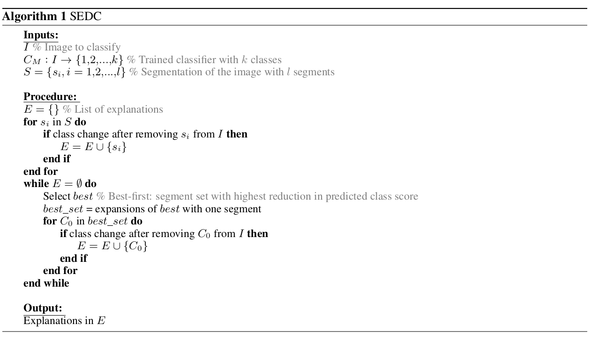
        
      
        
        
   - [Explaining Visual Models by Causal Attribution](https://arxiv.org/pdf/1909.08891.pdf)
      - 

Maheep Notes

        The paper focuses on the facts that there are limitations of current Conditional Image Generators for Counterfactual Generation and also proposes a new explanation technique for visual models based on latent factors.  
        The paper is implemented using the Distribution Causal Graph(DCG) where the causal graph is made but the nodes is represented the MLP, i.e. 
        `logP(X = (x1,x2,x3...xn)) = sigma(log(P(X = xi|theta_i)))` and the Counterfactual Image Generator which translate the latent factor into the image using the original image as anchor while genrating it which is done using Fader Networks which adds a critic in the latent space and AttGAN adds the critic in the actual output. 
        
      

   - [Explaining the Black-box Smoothly-A Counterfactual Approach](https://arxiv.org/pdf/2101.04230.pdf)
      - 

Maheep's Notes

        The paper focuses on explaining the outcome of medical imaging by gradually exaggerating the semantic effect of the given outcome label and also show a counterfactual image by introducing the perturbations to the query image that gradually changes the posterior probability from its original class to its negation. The explanation therfore consist of 3 properties: 
        1.) **Data Consistency**: The resembalance of the generated and orignal data should be same. Therefore cGAN id introduced with a loss as
        
        `L_cgan = log(P_data(x)/q(x)) + log(P_data(c|x)/q(c|x))` 
        
        where P_data(x) is the data distribtion and learned distribution q(x), whreas P_data(c|x)/q(c|x) = r(c|x) is the ratio of the generated image and the condition.   
        2.) **Classification model consistency**: The generated image should give desired output. Therefore the condition-aware loss is introduced, i.e. 
        `L := r(c|x) + D_KL (f(x')||f (x) + delta),`, where f(x') is the output of classifier of the counterfactual image is varied only by delta amount when added to original image logit. They take delta as a knob to regularize the genration of counterfactual image.  
        3.) **Context-aware self-consistency**: To be self-consistent, the explanation function should satisfy three criteria  
        > (a) Reconstructing the input image by setting = 0 should return the input image, i.e., G(x, 0) = x.   
        > (b) Applying a reverse perturbation on the explanation image x should recover x.   

        To mitigate this conditions the author propose an identity loss. The author argues that there is a chance that the GAN may ignore small or uncommon details therfore the images are compared using semantic segemntation with object detection combined in identity loss. The identity loss is :
        L_identity = L_rec(x, G(x, 0))+ L_rec(x, G(G(x,delta), -delta))
        
      
                
        
   - [Explaining the Behavior of Black-Box Prediction Algorithms with Causal  Learning](https://arxiv.org/pdf/2006.02482.pdf)
      - 

Maheep's Notes

        The paper using proposes causal graphical models so as to  indicate which of the interpretable features, if any, are possible causes of the prediction outcome and which may be merely associated with prediction outcomes due to confounding. The choose causal graphs consistent with observed data by directly testing focus on type-level explanation rather token-level explanations of particular events. The token-level refers to links between particular events, and the type-level refers to links between kinds of events, or equivalently, variables. Using the causal modelling they focus on obtaining a model that is consistent with the data.   
        They focus on learning a Partial Ancestral Graph(PAG) G, using the FCI algorithm and the predicted outcome Y' whereas Z are the high-level which are human interpretable and not like pixels.  

        `V = (Z,Y')` 
        `Y' = g(z1,.....zs, epsilon)` 
        On the basis of possible edge types, they find out which high level causes, possible causes or non-causes of the balck-box output Y'. 
        
         
        
        
   - [Explaining Classifiers with Causal Concept Effect (CaCE)](https://arxiv.org/pdf/1907.07165.pdf)
      - 

Maheep's Notes

        The paper proposes a system CaCE, which focuses on confounding of concepts, i.e higher level unit than low level, individual input features such as pixels by intervening on concepts by taking an important assumption that intervention happens atomically. The effect is taken as 

        `Effect = E(F(I)|do(C = 1)) - E(F(I)|do(C = 0))` where F gives output on image I and C is the concept. This can be done at scale by intervening for a lot of values in a concept and find the spurious corrlation. But due to the insufficient knowlegde of the Causal Graph teh author porposes a VAE which can calculate the precise CaCE by by generating counterfactual image by just changing a concept and hence computing the difference between the prediction score.  
        
         
                
   - [Fast Real-time Counterfactual Explanations](https://arxiv.org/pdf/2007.05684.pdf)
      - 

Maheep's Notes

        The paper proposes a transformer is trained as a residual generator conditional on a classifier constrained under a proposal perturbation loss which maintains the content information of the query image, but just the class-specific semantic information is changed. The technique is implemented as :  

        1.) **Adverserial loss**: It measures whether the generated image is indistinguishable from the real world images  
        2.) **Domain classification loss**: It is used to render the generate image x + G(x,y') conditional on y'. `L = E[-log(D(y'|x + G(x,y')))]` where G(x, y') is the perterbuation introduced by generator to convert image from x to x'  
        3.) **Reconstruction loss**: The Loss focuses to have generator work propoerly so as to produce the image need to be produced as defined by the loss. `L = E[x - (x + G(x,y') + G(x + G(x,y'), y))]`
        4.) **Explanation loss**: This is to gurantee that the generated fake image produced belongs to the distribution of H. `L = E[-logH(y'|x + G(x,y'))]`        
        5.) **Perturbation loss**: To have the perturbation as small as possible it is introduced. `L = E[G(x,y') + G(x + G(x,y'),y)]`
         
        All these 5 losses are added to make the final loss with different weights.
        
         
        

   - [GENERATIVE_COUNTERFACTUAL_INTROSPECTION_FOR_EXPLAINABLE_DEEP_LEARNING](https://arxiv.org/pdf/1907.03077.pdf)
      - 

Maheep's Notes

        The paper propose to generate counterfactual using the Generative Counterfactual Explanation not by replacing a patch of the original image with something but by generating a counterfactual image by replacing minimal attributes uinchanged, i.e. A = {a1, a2, a3, a4, a5....an}. It is implemented by: -  

        `min(lambda*loss(I(A')) + ||I - I(A'))`, where loss is cross-entropy for predicting image I(A') to label c'.

        
        
        
  - [Generative_Counterfactuals_for_Neural_Networks_via_Attribute_Informed_Perturbations](https://arxiv.org/pdf/2101.06930.pdf)
      - 

Maheep's Notes

        The paper focues on generating counterfactuals for raw data instances (i.e., text and image) is still in the early stage due to its challenges on high data dimensionality, unsemantic raw features and also in scenario when the effictive counterfactual for certain label are not guranteed, therfore the author proposes Attribute-Informed-Perturbation(AIP) which convert raw features are embedded as low-dimension and data attributes are modeled as joint latent features. To make this process optimized it has two losses: Reconstruction_loss(used to guarantee the quality of the raw feature) + Discrimination loss,(ensure the correct the attribute embedding) i.e.  

        `min(E[sigma_for_diff_attributes*(-a*log(D(x')) - (1-a)*(1-D(x)))]) + E[||x - x'||]` where D(x') generates attributes for counterfactual image.  To generate the counterfactual 2 losses are produced,one ensures that the perturbed image has the desired label and the second one ensures that the perturbation is minimal as possible, i.e.   `L_gen = Cross_entropy(F(G(z, a)), y) + alpha*L(z,a,z_0, a_0)` 
        The L(z,a,z0,a0) is the l2 norm b/w the attribute and the latent space.
        
        
        
   - [Question-Conditioned Counterfactual Image Generation for VQA](https://arxiv.org/pdf/1911.06352.pdf)
      - 

Maheep's Notes

        The paper on generating the counterfactual images for VQA, s.t.  
        i.) the VQA model outputs a different answer 
        ii.) the new image is minimally different from the original  
        iii) the new image is realistic  
        The author uses a LingUNet model for this and proposes three losses to make the perfect.  
        1.) Negated cross entropy for VQA model.   
        2.) l2 loss b/w the generated image and the original image.
        3.) Discriminator that penalizes unrealistic images.  
        
           
        

   - [FINDING AND FIXING SPURIOUS PATTERNS WITH EXPLANATIONS](https://arxiv.org/pdf/2106.02112.pdf)
      - 

Maheep's Notes

        The paper proposes an augmeting technique taht resamples the images in such a way to remove the spurious pattern in them, therfore they introduce their framework Spurious Pattern Identification and REpair(SPIRE). They view the dataset as Both, Just Main, Just Spurious, and Neither. SPIRE measures this probability for all (Main, Spurious) pairs, where Main and Spurious are different, and then sorts this list to find the pairs that represent the strongest patterns. After finding the pattern the dataset is redistributes as:  

        `P(Spurious | Main) = P(Spurious | not Main) = 0.5` 
        The second step consist of minimizing the potential for new SPs by setting the  `P(Main|Artifact) = 0.5)`.  
        SPIRE moves images from {Both, Neither} to {Just Main, Just Spurious} if p > 0.5, i.e. p = P(Main|Spurious) but if p < 0.5 then SPIRE moves images from {Just Main, Just Spurious} to {Both, Neither}. 
        
  

   - [Contrastive_Counterfactual_Visual_Explanations_With_Overdetermination](https://arxiv.org/pdf/2106.14556.pdf)
      - 

Maheep's Notes

        The paper proposes a system CLEAR Image that explains an image’s classification probability by contrasting the image with a corresponding image generated automatically via adversarial learning. It also provides an event with a label of "*overdetermination*", which is given when the model is more than sure that the label is something. CLEAR Image segments x into different segments S = {s1 ,...,sn } and then applies the same segmentation to x' creating S' = {s'1,...., s'n}. CLEAR Image determines the contributions that different subsets of S make to y by substituting with the corresponding segments of S'. This is impelmeted by:  
        A counterfactual image is generated by GAN which is then segmented and those segments by a certian threshold replace the segment in the original image and therfore we get many perturbed images. Each perturbed image is then passed through the model m to identify the classification probability of all the classes and therfore the significance of every segment is obtained that is contributing in the layer. If the
        
 

   - [Training_calibration‐based_counterfactual_explainers_for_deep_learning](https://www.nature.com/articles/s41598-021-04529-5)
      - 

Maheep's Notes

        The paper proposes TraCE for deep medical imaging that trained using callibaration-technique to handle the problem of counterfactual explanation, particularly when the model's prediciton are not well-callibrated due to which it produces irrelevant feature manipulation. The system is implemeted using the 3 methods, i.e.  
        (1.) an auto-encoding convolutional neural network to construct a low-dimensional, continuous latent space for the training data  
        (2.) a predictive model that takes as input the latent representations and outputs the desired target attribute along with its prediction uncertainty 
        (3.) a counterfactual optimization strategy that uses an uncertainty-based calibration objective to reliably elucidate the intricate relationships between image signatures and the target attribute. 
        TraCE works on the following metrics to evaluate the counterfactual images, i.e.  

        **Validity**: ratio of the counterfactuals that actually have the desired target attribute to the total number of counterfactuals  
        The confidence of the **image** and **sparsity**, i.e. ratio of number of pixels altered to total no of pixels. Th eother 2 metrcs are **proximity**, i.e. average l2 distance of each counterfactual to the K-nearest training samples in the latent space and **Realism score** so as to have the generated image is close to the true data manifold. 
        TraCE reveals attribute relationships by generating counterfactual image using the different attribute like age "A" and diagnosis predictor "D".  
        `delta_A_x = x - x_a'` ; `delta_D_x = x - x_d'`  
        The x_a' is the counterfactual image on the basis for age and same for x_d'.  
        `x' = x + delta_A_x + delta_D_x` and hence atlast we evaluate the sensitivity of a feature by `F_d(x') - F_d(x_d')`, i.e. F_d is the classifier of diagnosis.  

        
  

   - [Generating Natural Counterfactual Visual Explanations](https://www.ijcai.org/proceedings/2020/0742.pdf)
      - 

Maheep's Notes

        The paper proposes a counterfactual visual explainer that look for counterfactual features belonging to class B that do not exist in class A. They use each counterfactual feature to replace the corresponding class A feature and output a counterfactual text. The counterfactual text contains the B-type features of one part and the A-type features of the remaining parts. Then they use a text-to-image GAN model and the counterfactual text to generate a counterfactual image. They generate the images using the AttGAN and StackGAN and they take the image using the function.  
        `log(P(B)/P(A))` where P(.) is the classifier probability of a class for obtaining the highest-scoring counterfactual image. 
        
 

   - [On Causally Disentangled Representations](https://arxiv.org/pdf/2112.05746.pdf)
      - 

Maheep's Notes

        The paper focuses on causal disentanglement that focus on disentangle factors of variation and therefore proposes two new metrics to study causal disentanglement and one dataset named CANDLE. Generative factors G is said to be disentangled only if they are influenced by their parents and not confounders. The system is implemented as:    
        A latent model M (e,g, pX ) with an encoder e, generator g and a data distribution pX , assumes a prior p(Z) on the latent space, and a generator g is parametrized as p(X|Z), then posterior p(Z|X) is approzimated using a variational distribution q (Z|X) parametrized by another deep neural network, called the encoder e. Therefore we obtain a z for every g and acts as a proxy for it.  
        1.) **Unconfoundess metric**: If a model is able to map each Gi to a unique ZI ,the learned latent space Z is unconfounded and hence the property is known as unconfoundedness.  
        2.)**Counterfactual Generativeness**: a counterfactual instance of x w.r.t. generative factor Gi , x'(i.e., the counterfactual of x with change in only Gi) can be generated by intervening on the latents of x corresponding to Gi , ZIx and any change in the latent dimensions of Z that are x not responsible for generating G i , i.e. Z\I, should have no influence on the generated counterfactual instance x' w.r.t. generative factor Gi. It can be computed using the Avergae Causal Effect(ACE).  
        
  

   - [INTERPRETABILITY_THROUGH_INVERTIBILITY_A_DEEP_CONVOLUTIONAL_NETWORK](https://openreview.net/pdf?id=8YFhXYe1Ps)
      - 

Maheep's Notes

        The paper proposes a model that generates meaningful, faithful, and ideal counterfactuals. Using PCA on the classifier’s input, we can also create “isofactuals”, i.e. image interpolations with the same outcome but visually meaningful different features. The author argues that a system should provide power to the users to discover hypotheses in the input space themselves with faithful counterfactuals that are ideal. They claim that it could be easily done by combining an invertible deep neural network z = phi(x) with a linear classifier y = wT*phi(x) + b. They generate a counterfatual by altering a feature representation of x along the direction of weight vector, i.e.  

        `z' = z + alpha*w` where `x' = phi_inverse(z + alpha*w)`. Any change orthogonal to w will create an “isofactual. To show that their counterfactuals are ideal, therfore they verify that no property unrelated to the prediction is changed. Unrealted properties = e(x), `e(x) = vT*z`, where v is orthogonal to w. `e(x') = vT*(z + alpha* w) = vT*z = e(x)`. To measure the difference between the counterfactual and image intermediate feature map h, i.e. `m = |delta_h|*cos(angle(delta_h, h))` for every location of intermediate feature map. 
        
  

   - [Model-Based Counterfactual Synthesizer for Interpretation](https://arxiv.org/pdf/2106.08971.pdf)
      - 

Maheep's Notes

        The paper focues on eridicating the algorithm-based counterfactual generators which makes them ineffcient for sample generation, because each new query necessitates solving one specific optimization problem at one time and propose Model-based Counterfactual Synthesizer. Existing frameworks mostly assume the same counterfactual universe for different queries. The present methods do not consider the causal dependence among attributes to account for counterfactual feasibility. To take into account the counterfactual universe for rare queries, they novelly employ the umbrella sampling technique, i.e. by using the weighted-sum technique, calculating the weight of each biased distribution, we can then reconstruct the original distribution and conduct evaluations with the umbrella samples obtained. The counterfactual can be generated by giving a specific query q0, insttead of a label using the hypthetical distribution.

        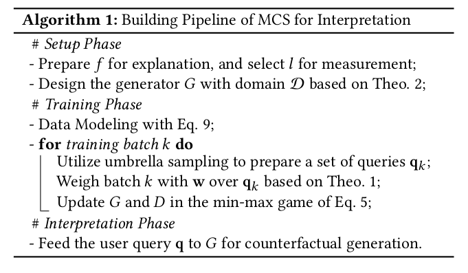
        
  

   - [The Intriguing Relation Between Counterfactual Explanations and Adversarial Examples](https://arxiv.org/pdf/2009.05487.pdf)
      - 

Maheep's Notes

        The paper provides the literature regarding the difference between the Counterfactual and Adverserial Example. Some of the points are:  
        1.) AEs are used to fool the classifier whereas the CRs are used to generate constructive explantions.   
        2.) AEs show where an ML model fails whereas the Explanations sheds light on how ML algorithms can be improved to make them more robust against AEs  
        3.) CEs mainly low-dimensional and semantically meaningful features are used, AEs are mostly considered for high-dimensional image data with little semantic meaning of individual features.  
        4.) Adversarials must be necessarily misclassified while counterfactuals are agnostic in that respect   
        5.) Closeness to the original input is usually a benefit for adversarials to make them less perceptible whereas counterfactuals focus on closeness to the original input as it plays a significant role for the causal interpretation
        
  

   - [Discriminative Attribution from Counterfactuals](https://arxiv.org/pdf/2109.13412.pdff)
      - 

Maheep's Notes

        The paper proposes a novel technique to combine feature attribution with counterfactual explanations to generate attribution maps that highlight the most discriminative features between pairs of classes. This is implemented as: 
         They use a cycle-GAN to translate real images x of class i to counterfactual images x'. Then both the images are fed into the Discriminative Attribution model which finds out the most discriminative features separting the 2 image. The most important part is masked out. The part is extracted from the original image x and is combined with the counterfactual image by intiallly masking the region to get the original image.  
      
        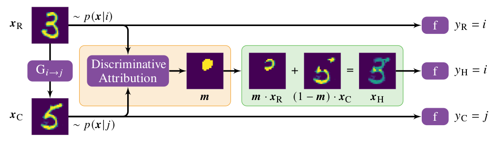  
        
  

   - [Causal Interventional Training for Image Recognition](https://ieeexplore.ieee.org/document/9656623)
      - 

Maheep's Notes

        The paper focuses on proposing an augmentaiton technique which focuses on eradicating the bias that is bad and keeping the bias that is good for the model. Therefore the author proposes a causal graph consisting of x:image; y:label; C:context; A:good bias and B:bad bias. The author considers B as the confounding variable b/w the x and C, therefore tries to remove it using the backdoor criteria. 
        
  

---

   - [Improving_Weakly_supervised_Object_Localization_via_Causal_Intervention](https://arxiv.org/pdf/2104.10351.pdf)
      - 

Maheep's Notes

        The paper proposes CI-CAM which explores the causalities among image features, contexts, and categories to eliminate the biased object-context entanglement in the class activation maps thus improving the accuracy of object localization. The author argues that in WSCOL context acts as a confounder and therefore eliminates it using backdoor-adjustment. The implement it by the following procedure: -  
        The architecture contains a backbone network to extract the features. The extracted features are then processed into CAM module where a GAP and classifier module outputs scores which are multipluied by weights to produce class activation maps.  
        The features are then passed through Causal Context Pool which stores the context of all images of every class, then other CAM module repeats the same procudure as of CAM1 and outputs image with class activation map.       

        
        
  

   - [COUNTERFACTUAL GENERATIVE NETWORKS](https://arxiv.org/abs/2101.06046)
      - 

Maheep's Notes

        The paper aims to propose a method so as to train the model having robustness on OOD data. To achieve this the author uses the concept of causilty, i.e. *independent mechanism(IM)* to generate counterfactual images. The author considers 3 IM's:  1.) One generates the object’s shape.  
        2.) The second generates the object’s texture. 
        3.) The third generates the background.  
        In this way the author makes a connection b/w the fields of causality, disentangled representaion, and invariant classifiers. The author uses cGAN with these learned IM to generate images based on the attributes given above.

        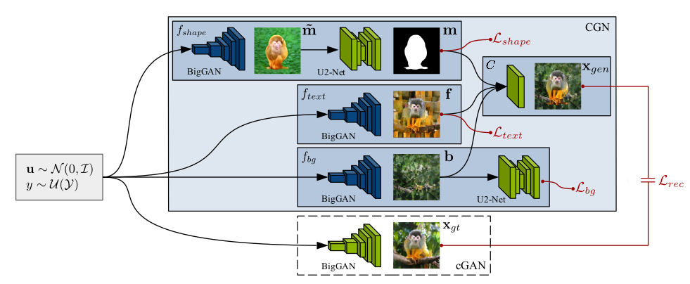
        
  

   - [Discovering Causal Signals in Images](https://arxiv.org/abs/1605.08179)
      - 

Maheep's Notes

        A classifier is proposed that focuses on finding the causal direction between pairs of random variables, given samples from their joint distribution. Additionally they use causal direction classifier to effectively distinguish between features of objects and features of their contexts in collections of static images. In this framework, causal relations are established when objects exercise some of their causal dispositions, which are sometimes informally called the powers of objects. Based on it the author provides two hypothesis:  
        1.) Image datasets carry an observable statistical signal revealing the asymmetric relationship between object categories that results from their causal dispositions. 
        2.) There exists an observable statistical dependence between object features and anticausal features, basically anticausal features are those which is caused by the presence of an object in the scene. The statistical dependence between context features and causal features is nonexistent or much weaker. 
        The author proposes a Neural Causation Coefficient (NCC), able to learn causation from a corpus of labeled data. The author argues that the for joint distributions that occur in the real world, the different causal interpretations may not be equally likely. That is, the causal direction between typical variables of interest may leave a detectable signature in their joint distribution. Additionally they assume that whenever

         `X causes Y` , the cause, noise and mechanism are independent but we can identify the footprints of causality when we try to `Y causes X` as the noise and Y will not be independent.

   - [Learning to Contrast the Counterfactual Samples for Robust Visual Question Answering](https://aclanthology.org/2020.emnlp-main.265/)
      - 

Maheep's Notes

        The paper proposes we introduce a novel self-supervised contrastive learning mechanism to learn the relationship between original samples, factual samples and counterfactual samples. They implement it by generating facutal and counterfactual image and try to increase the mutual information between the joint embedding of 
        
        `Q` and `V(mm(Q,V) = a)`, and joint embedding of `Q` and `V_+ (factual)(mm(Q,V+) = p)` by taking a cosine similarity b/w them. They also aim to decrease mutual information b/w `mm(Q,V-) = n` and `a` by taking cosine similarity`(s(a,n))`. The final formula becomes: 
        `L_c = E[-log(e^s(a,p)/e^s(a,p)+e^s(a,n))]`
         
        The total loss becomes `L = lambda_1*L_c + lambda_2*L_vqa` 
        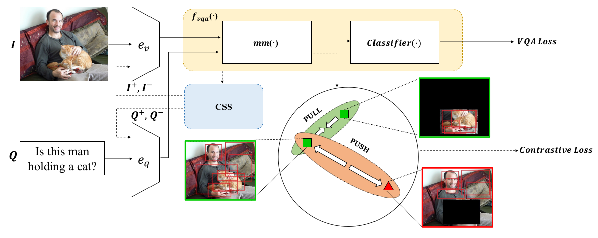
        
  

   - [Latent Causal Invariant Model](https://arxiv.org/abs/2011.02203)
      - 

Maheep's Notes

        The paper focus on issue of generalization and therefore propose Latent Causal Invariance Model(LaCIM). The author introduce variables that are separated into (a) output-causative factors, i.e. 
        
        `S` and (b) others that are spuriously correlated `Z` from V(latent variable). 
        There exists a spurious correlation b/w `S` and `Z`. The author argues that we will get a `p(y|do(s*)) = p(y|s*)` 
        
  

   - [Two Causal Principles for Improving Visual Dialog](https://arxiv.org/abs/1911.10496)
      - 

Maheep's Notes

        The paper focuses to eliminate the spurious correltaions in the task of Visual Dialogue and therfore proposes 2 principles: 
        1.) The dialog history to the answer model provides a harmful shortcut bias threfore the direct effect of history on answer should be eliminated. 
        2.) There is an unobserved confounder for history, question, and answer, leading to spurious correlations from training data which should be identified and be eliminated using the backdoor method.  
        Now the main crunch of the paper arises as the confounder is unobserved so how can we apply the backdoor method? To solve it the author argues that this confounder comes from the annotator and thus can be seen in the 
        
        `a_i`(answer) is a sentence observed from the “mind” of user u during dataset collection. Then, `sigma(P(A)*P(u|H))`, `H` is history and `A` is answer can be approximated as `sigma(P(A)P(a_i|H))`.They further use `p(a_i|QT)`, where `QT` is Question Type to approximate `P(a_i|H)` because of two reasons: First, `P (a_i|H)` essentially describes a prior knowledge about `a_i` without comprehending the whole `{Q, H, I} triplet`.
        
        
  

   - [Weakly-Supervised Video Object Grounding via Causal Intervention](https://arxiv.org/pdf/2112.00475.pdf)
      - 

Maheep's Notes

        The paper aims to localize objects described in the sentence to visual regions in the video by deconfounding the object-relevant associations given the video-sentence annotations. The author argues that the frame is made up of the content(C), i.e. factors that cause the object’s visual appearances in spatial and temporal throughout the video are grouped into a category and Style(S) is the background or scenes. The author argues that the S does not play any role in object grounding and only act a confounder. In addition to that there exist one more confounder, i.e 
        
        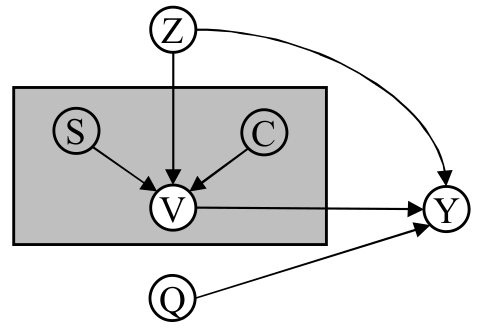

        `Z` that occurs due to some specific objects occuring frequently. The style confounder is replaced by using the contrastive learning, where the counterfactual examples are created by taking the vectors from a memory bank by taking the top sleected top regions for described object and then the selected regions and frames are grouped together into frame-level content(H_c) and region-level content(U_c), and the rest of the regions are grouped as U_s and H_s. These regions are the converted to counterfactual using these memory vectors which were created by taking the randomly selected regions in training set. The most similar one and replaces the original one, to generate examples to have them hard to distinguish from real ones contrastive learning is used. The equation looks like:  

        `IE(p|do(U_s = U_s_generated)) < IE(p|do(U_c = U_c_generated))` 
        `IE(p|do(H_s = H_s_generated)) < IE(p|do(H_c = H_c_generated))` 
        where the `IE` is Interventional Effect. As for the next confounder they uses the textual embedding of o_k(object) essentially provides the stable cluster center in common embedding space for its vague and diverse visual region embeddings in different videos. Therefore, by taking the textual embedding of the object as the substitute of every possible object z and apply backdoor adjustment. 
        
  

   - [Towards Unbiased Visual Emotion Recognition via Causal Intervention](https://arxiv.org/abs/2107.12096)   
      - 

Maheep's Notes

        The paper we propose a novel Interventional Emotion Recognition Network (IERN) to achieve
        the backdoor adjustment on the confounder, i.e. context of the image(C). The author implements it as: 

        IERN, which is composed of four parts: 
        1.) **Backbone** 
            > It extracts the feature embedding of the image. 
        2.) **Feature Disentanglement**  
            > It disentangles the emotions and context from the image, having emotion dicriminator(d_e) and context discriminator(d_c) which ensures that the extracted feature are separated and has the desired feature. The loss comprises as : 
            `L = CE(d_e(g_e(f_b(x))), y_e) + MSE(d_c(g_e(f_b(x))), 1/n)` where g_e is emotion generator and y_e is the emotion label and n is the number of counfounder and the same loss is for context replacing d_e, g_e and d_c by d_c, g_c and d_e, here n represents number of emotions. To ensure that the separated features fall within reason-able domains, IERN should be capable of reconstructing the base feature   f_b(x), i.e. `L =MSE(g_r(g_e(f_b(x)), g_c(f_b(x))), f_b(x))`   
        3.) **Confounder Builder** 
            > The purpose of the confounder builder is to combine each emotion feature with different context features so as to avoid the bias towards the observed context strata. 
        4.) **Classifier** 
            > It is simply used for prediciton.

        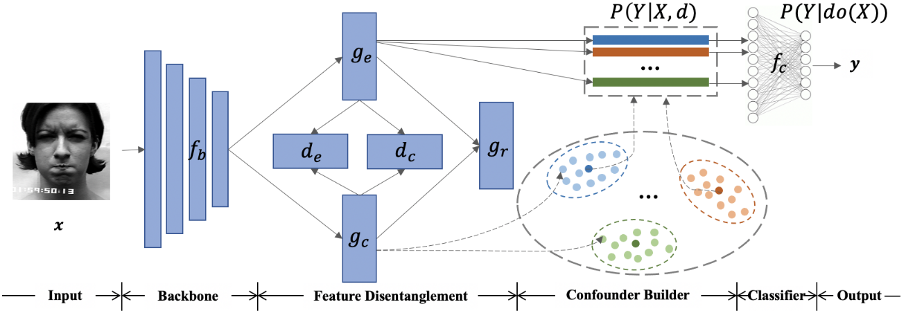
        
  

   - [Human Trajectory Prediction via Counterfactual Analysis](https://openaccess.thecvf.com/content/ICCV2021/papers/Chen_Human_Trajectory_Prediction_via_Counterfactual_Analysis_ICCV_2021_paper.pdf)
      - 

Maheep's Notes

        The paper propose a counterfactual analysis method for human trajectory prediction. They cut off the inference from environment to trajectory by constructing the counterfactual intervention on the trajectory itself. Finally, they compare the factual and counterfactual trajectory clues to alleviate the effects of environment bias and highlight the trajectory clues. 

        They Y_causal is defined as `Y_causal = Y_i - Y-i(do(X_i = x_i))` 
        They define a generative model which generates trajectory by a noise latent variable Z indicated by `Y*_i`. Finally the loss is defined as: 
        `Y_causal = Y*_i - Y*_i(do(X_i = x_i))` 
        `L_causalGAN = L2(Y_i, Y_causal) + log(D(Y_i)) + log(1-D(Y_causal))`, where D is the discriminator.
        
  

   - [Proactive Pseudo-Intervention: Contrastive Learning For Interpretable Vision Models](https://arxiv.org/abs/2012.03369)
      - 

Maheep's Notes

        The paper present a novel contrastive learning strategy called Proactive Pseudo-Intervention (PPI) that leverages proactive interventions to guard against image features with no causal relevance. The PPI consists of three main components:  
        (i) a saliency mapping module that highlights causally relevant features which are obtained using the WBP which backpropagates the weights through layers to compute the contributions of each input pixel, which is truly faithful to the model, and WBP tends to highlight the target objects themselves rather than the background 
        (ii) an intervention module that synthesizes contrastive samples 
        (iii) the prediction module, which is standard in recent vision models 
        The prediction module is encouraged to modify its predictions only when provided with causally-relevant synthetic interventions. 
        The saliency map wchich are uniquely determined by the 
        
        `f(theta)` are produced and the main features are masked out of the image giving us `x*`. Now the loss becomes `L = sigma(l(x*,not_y;f(theta)))` 
        A trivbial solution can be the saliency maps copvers the whole image therefore L1-norm of saliency map is used to encourage succinct (sparse) representations. The another problem that now arises is that the model can learn a shortcut that when it get a masked image then it has to always give `not_y` as prediction, so as to counter it the author proposes to send images with random masks on them, making the loss `L = sigma(l(x',y;f(theta)))`

        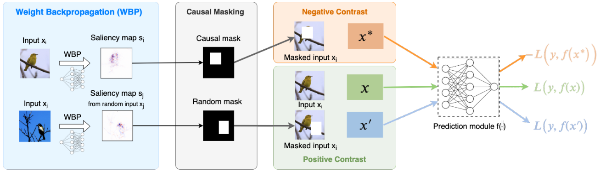 
        
 

   - [Interventional Video Grounding with Dual Contrastive Learning](https://arxiv.org/abs/2106.11013)
      - 

Maheep's Notes

        The paper proposes interventional video grounding (IVG) that leverages backdoor adjustment to deconfound the selection bias based on structured causal model.They introduce a dual contrastive learning approach (DCL) to better align the text and video by maximizing the mutual information (MI) between query and video clips so as to deconfounded video grounding that will aim to localize a moment from an untrimmed video for a given textual query after deconfounding it. The author implements the system in major 5 steps: 
        1) Given an input query and video, the two encoders output contextualized visual and textual representations respectively.  
        2) Then, these representations will be fed into two contrastive modules VV-CL and QV-CL respectively to learn high-quality representations with two contrastive losses L_vv and L_qv, where the QV-CL module focuses on increasing the Mutual information of the positive frames of video and the query. The VV-CL aims to increse the mutual information b/w the start and end boundaries of the video, which looks like as shown in the diagram below: 

        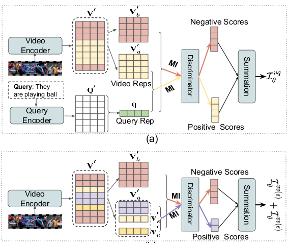

        3) The output of two feature encoders are fed to a fusion module with a context-query attention mechanism to capture the cross-modal interactions between visual and textual features.  
        4) Next, to mitigate the spurious correlations between textual and visual features, they use causal interventions P (Y |do(X)) with event as surrogate confounders to learn representations.  
        5) Finally, two losses L_s and L_e for the start and end boundaries are introduced. 
        
        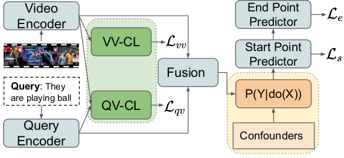
        
  

   - [Causality matters in medical imaging](https://www.nature.com/articles/s41467-020-17478-w)
      - 

Maheep's Notes

        The paper proposes the establishment of causal relationship between images and their annotations as it provides a clear and precise framework for expressing assumptions about the data. The author argues that when taking a look at different field like data scarcity, data-mismatch etc. We can easily find the generalization is not achieved and sometimes the performace becomes very poor due to some factors which are explained through causality in the research paper.  
        Taking a look at Data Scarcity Semi-supervised learning (SSL) aims to leverage readily available unlabelled data in the hope of producing a better predictive model than is possible using only the scarce annotated data but a model trained on image-derived annotations will attempt to replicate the (most often manual) annotation process, rather than to predict some pre-imaging ground truth therefore consisting of a confounding variable that comes from the annotator.  
        Data mismatch is the second issue the author discusses and argues that the mismatch between data distributions, typically between training and test sets or development and deployment environments, tends to hurt the generalisability of learned models and therefore it can be said that Dataset shift is any situation in which the training and test data distributions disagree due to exogenous factors. Moreover when analysing dataset shift, it is helpful to conceptualise an additional variable Z, representing the unobserved physical reality of the subject’s anatomy. There are also another types of shifts like manifestation shift(under which the way anticausal prediction targets (e.g. disease status) physically manifest in the anatomy changes between domains), acquisition shift which result from the use of different scanners or imaging protocols and Data mismatch due to sample selection bias where the indicator variables in sample selection concern alterations in the data-gathering process rather than in the data-generating process.
        
  

   - [TSMOBN GENERALIZATION FOR UNSEEN CLIENTS IN FEDERATED LEARNING](https://arxiv.org/abs/2110.09974)
      - 

Maheep's Notes

        The paper proposes TsmoBN method which can reduce divergence between training and testing feature distributions and also achieves a lower generalization gap than standard model testing. The author argues that in Federated Learning the performance degrades during the test phase as a global model trained on heterogeneous feature distributions fails to be an accurate estimation for a different distribution on the unseen client. Therefore the author propose to use test-specific and momentum tracked batch normalization (TsmoBN) to solve the unseen client generalization problem for varying feature distributions. The author implements it as: 
        The author takes the approach of causality and defines a SCM having the terms as 
        
        `D_s_i` for datasets of different domain, i.e. coming from different users but used in training, `X` are the samples, `R` are the raw extracted features of `X`, `F` is the normalized feature representaiton of `R` and `Y` is the classifier. To remove the confounding effects brought by `D_u` , a direct way is using causal intervention on normalized features (i.e., do(F)) to let the feature distribution similar to training distributions. This intervention by introducing the surrogate variable `S`, which is test-specific statistics of raw features `R` during testing by obtaining the test normalized features that have similar distributions as the training normalized features. More specifically by calculating the mean and variance pair at test time in BN to normalize features. Additionally they further propose to use momentum to integrate relations among different batches, thus reducing the variances. Precisely by giving the unseen client with M batches of data to be tested in sequential manner.

        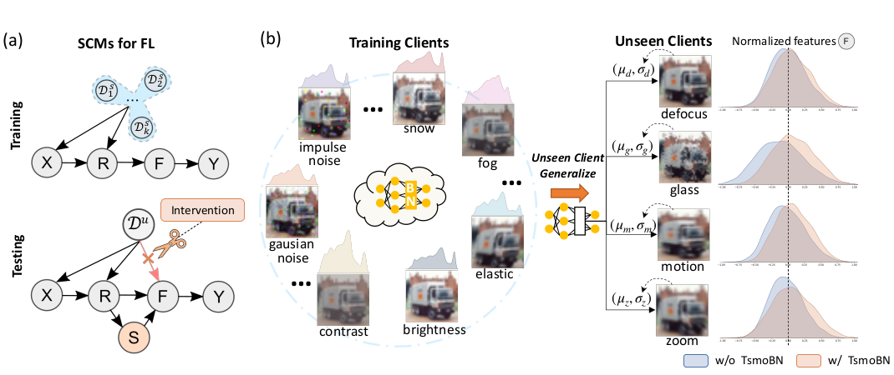
        
  

   - [Learning Domain Invariant Relationship with Instrumental Variable for Domain Generalization](https://arxiv.org/pdf/2110.01438.pdf)
      - 

Maheep's Notes

        The paper proposes an instrumental variable-based approach to learn the domain-invariant relationship between input features and labels contained in the conditional distribution as the input features of one domain are valid instrumental variables for other domains. Therefore they propose a model Domain-invariant Relationship with Instrumental VariablE (DRIVE) via a two-stage IV method.  
        1.) It learns the conditional distribution of input features of one domain given input features of another domain with Maximum Mean Discrepancy(MMD) that minimizes the distance b/w the feature representation of two different domains. 
        2.) In second step it estimates the domain-invariant relationship by predicting labels with the learned conditional distribution by sampling from the first step distribtion. 

        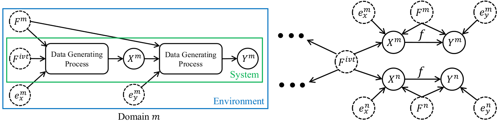
        
  

   - [Latent Space Explanation by Intervention](https://arxiv.org/abs/2112.04895)
      - 

Maheep's Notes

        The study in this R.P. aims to reveal hidden concepts by employing an intervention mechanism that shifts the predicted class based on discrete variational autoencoders based on the high concepts(human interpretale and not low level features like pixels). We could easily intervene on the latent space of the high concepts to find out the most discriminative concepts but they are not human interpretable therefore they use visualization to make it human interpretable. To accomplish the first step they use discrete variational autoencoder(DVAE). The boolean latent space cosnist of 
        
        `Z = {z1, z2,....., zn}` which is intervened to flip the output of the model and are finally vsualized from the hidden representation using the loss `L = l(g(phi'(x), x))`, where `phi'(x)` is the counterfactual model. The next goal is to ensure that the generated concepts follow the same concepts the discriminator employ. They achieve this by maximizing the amount of information that the explanatory learner (i.e., g) extracted from the latent representation with respect to the discriminative learner’s (i.e., f_K) information.  
        
  

   - [The Blessings of Unlabeled Background in Untrimmed Videos](https://arxiv.org/abs/2103.13183)
      - 

Maheep's Notes

         The paper propose a Temporal Smoothing PCA-based (TS-PCA) deconfounder, which exploits the unlabelled background to model an observed substitute for the unobserved confounder, to remove the confounding effect in Weakly-supervised Temporal Action Localization(WTAL), which aims to detect the action segments with only video-level action labels in training. The author proposes to take all different input video and argues that if by extracting the distribution of the input video features the if we have an unobsereved confounder "z", then we can identify it by using the equation 
         
         `P(x_1, x_2,....., x_n | Z = z) = TT P(x_t | Z = z)`, i.e. the features will become independent if we are able to obeserve `Z` but if there exists an unobserved confounder c, which affects multiple input video features within x and segment-level labels A. Then, x would be dependent, even conditional on z, due to the impact of c, in this case with the blessings of weak ignorability we can replace the expectation over C with a single z in `E[E[A|X = x, C = c]] = A`
        
  
        
   - [Selecting Data Augmentation for Simulating Interventions](https://arxiv.org/abs/2005.01856)
      - 

Maheep's Notes

        The paper argue that causal concepts can be used to explain the success of data augmentation by describing how they can weaken the spurious correlation between the observed domains and the task labels. The following can also be used to decide which augmentation to use so as to do intervention and achieve generalization. If one needs to do causal intervention using augmentaiton then he/she needs to make assumptions about the causal data generating process so as to identify hihg-level features h_d caused by a particular domain. To keep all this in mind they propose an algorithm that is able to select data augmentaion techniques that will improve domain genralization, i.e. Select Data Augmentaion(SDA). The proposed SDA consist of mainly 3 steps: 
        1.) Dividing all samples from the training domains into a training and validation set.  
        2.) By training a classifier to predict the domain d from input x. During training, apply the first    data augmentation in the list to the samples of the training set. Save the domain accuracy on the validation set after training. This step is repeated all data augmentations in the list. 
        3.) The data augmentation is slected with the lowest domain accuracy averaged over five seeds. If multiple data augmentations lie within the standard error of the selected one they are selected as well, i.e., there is no statistically significant difference between the augmentations.
        
  

   - [Counterfactual Attention Learning for Fine-Grained Visual Categorization and Re-identification](https://arxiv.org/abs/2108.08728)
      - 

Maheep's Notes

        The paper proposes counterfactual attention learning(CAL) to learn the attention with counterfactual causality. The author analyze the effect of the learned visual attention on network prediction through counterfactual intervention and maximize the effect to encourage the network to learn more useful attention for fine-grained image recognition. The basic idea is to quantitate the quality of attentions by comparing the effects of facts and the counterfactuals on the final prediction. The author implements it as : 
        They apply counterfactual intervention do(A= A') by imagining non-existent attention maps Ā to replace the learned attention maps and keeping the feature maps X unchanged using the random attention. uniform attention or reversed attention an then the evaluate the equation. 

        `Y_effect = E[Y(A = A, X = X)] - E[Y(A = A', X = X)]` 
        The loss comprises as:  
        `L = L_crossentropy(Y_effect, y) + L_others`, where L_others represents the original objective such as standard classification loss.
        
  

   - [Meaningful Explanations of Black Box AI Decision Systems](https://ojs.aaai.org//index.php/AAAI/article/view/5050)
      - 

Maheep's Notes

        The paper discusses about the Black-box models and how they can be used for explanation. The author proposes 2 different flavours of this problem. 
        1.) **eXplanation by Design (XbD)**: given a dataset of training decision records, how to develop a machine learning decision model together with its explanation; 
        2.) **Black Box eXplanation (BBX)**: given the decision records produced by an obscure black box decision model, how to reconstruct an explanation for it.  
        The author propose a new local-first explanation framework: expressive logic rule languages for inferring local explanations(by local they mean the explanation of data point), together with bottom-up generalization algorithms to aggregate an exhaustive collection of local explanations into a global one, optimizing jointly for simplicity and fidelity in mimicking the black box. The author argues that more informative causal explanation should be provided and the local level information availability can be quite beneficial for the progress of the field. Therefore the author cite it's previous work LORE, a local explanator that builds a focused exploration around the target point, and delivers explanations in the form of highly expressive rules together with counterfactuals, suggesting the changes in the instance’s features that would lead to a different outcome. The athor argues that a black box explanation framework should be:  
        1.) model-agnostic 
        2.) logic-based 
        3.) both local and global explanability 
        4.) high-fidelity: provides a reliable and accurate approximation of black-box behaviour.
        
  

   - [Are VQA Systems RAD? Measuring Robustness to Augmented Data with Focused Interventions](https://arxiv.org/abs/2106.04484)
      - 

Maheep's Notes

        The paper proposes a new robustness measure, Robustness to Augmented Data (RAD), which measures the consistency of model predictions between original and augmented examples. They define it as: 
        
        `RAD =|J(D;F) and J(D';F)|/|J(D;F)|`  , where `J(D;F)`
        as the set of example indices for which a model `f` correctly predicts `y`. `D'` represents the augmented example which is prepared as *VQA dataset there are three answer types: “yes/no”, “number” and “other”, and 65 question types. In augmentations, they generate “yes/no” questions from “number” and “other” questions, i.e. What color is the <Subj>? <Color> is changed to Is the color of <Subj> is <Color>?* 
        RAD is in [0, 1] and the higher the RAD of f is, the more robust f is.
        
 

   - [Adversarial Robustness through the Lens of Causality](https://arxiv.org/abs/2106.06196)
      - 

Maheep's Notes

        The paper propose the adversarial distribution alignment method to eliminate the difference between the natural distribution and the adversarial distribution by incorporating cauality into mitigating adverserial vulnerability. They define the adverserial example as  
        
        `P_theta(X, Y) = sigma(P_theta(Y,s|X)*P_theta(X))`,  
        where s is the spurious correlation. As we know that the distribtuion of `X` can be hardly changed therefore `P_theta(X) = P(X)`. Therefore it can be assumed that the difference b/w `P_theta(Y,s|X)` and `P(Y,s|X)` is the main reason of the adverserial inrobustness. Therefore they define the loss as: 
        `min CE(h(X + E_adv ; theta), Y) + CE(h(X; theta), Y) + CE[P(Y| g(X, s)), P(Y|g(X + E_edv, s))]` 
         where `E_adv` adverserail perturbation, theta are parameters of the model, and g represents the paramter optimized to minimize the `CE`, i.e. Cross Entropy loss.
        
  

   - [Causality-aware counterfactual confounding adjustment for feature representations learned by deep models](https://arxiv.org/abs/2004.09466)
      - 

Maheep's Notes

        The paper proposes that counterfactual approach developed to deconfound linear structural causal models can still be used to deconfound the feature representations learned by deep neural network (DNN) models, so as to implement it the author argues that in a learned DNN the second last layer(just behind the softmax layer) has a very linear realtionship with the labels and can be used to intervene and generate counterfactual example to make the model robust. The author develops the causal diagram having 4 variables, P_ix, Y, C, S which represent the data distribution, label, indicates the presence of a selection mechanism generating an association between Y and C. The C represents the confounder.

        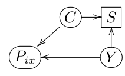

        In order to remove/reduce the influence of C on the predictive performance of the classifier, they apply the causality-aware adjustment proposed to generate counterfactual features, X'. These counterfactual examples are used to train a logistic regression classifier, and then use the same algorithm to generate counterfactual in test set X_test' to generate predictions that are no longer biased by the confounder.
        
  

   - [Domain Generalization using Causal Matching](https://arxiv.org/abs/2006.07500)
      - 

Maheep's Notes

        The paper proposes MatchDG is an iterative algorithm that starts with randomly matched inputs from the same class and builds a representation using contrastive learning such that inputs sharing the same causal features are closer to one another. It is a two-phase method that first learns a representation independent of the ERM loss, so that classification loss does not interfere with the learning of stable features. The author argues that the a common objective is to learn representations independent of the domain after conditioning on the class label. They show that this objective is not sufficient: there exist counter-examples where a model fails to generalize to unseen domains even after satisfying class-conditional domain invariance. If there are 3 data-points (x_d_i, y), (x_d'_j, y) and (x_d_k, y') then the distance in causal features between x_i and x_j is smaller than distance between x_i and x_k or x_j and x_k. Based on this they represent a contrastive loss which bring lables of same class closer and increases the distances b/w different class label.

        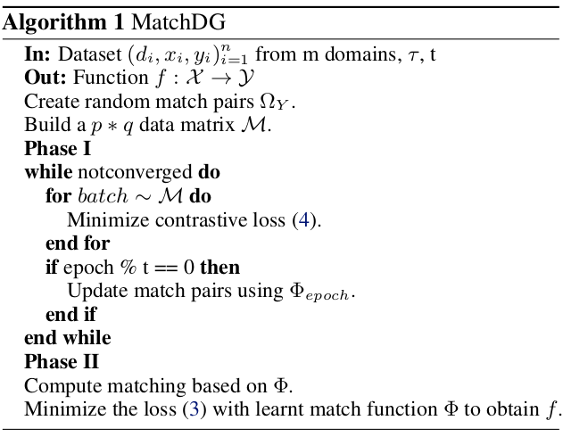 
        
  

   - [Counterfactual Debiasing Inference for Compositional Action Recognition](https://dl.acm.org/doi/abs/10.1145/3474085.3475472)
      - 

Maheep's Notes

        The paper proposes Counterfactual Debiasing Network (CDN) Compositional action recognition by inhibiting the co-occurrence bias in the same action with distinct objects and also to deconfound the direct effect of appearance. The model consist of only 2 simple steps: 
        1.) Building the model as usual by training it. 
        2.) Taking the prediction from only visual appearance and subtracting it from the output of the model considering both brances. 
        The only losses which gets constituted in the model are: Appearance loss, Structural Loss and fusion Loss by using the cross-entropy.

        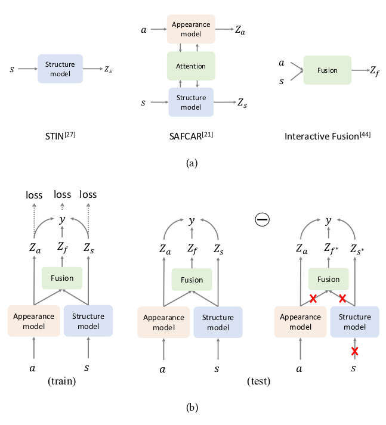
        
  

   - [Deconfounded Video Moment Retrieval with Causal Intervention](https://arxiv.org/abs/2106.01534)
      - 

Maheep's Notes

        The paper proposes
        
  

   - [Intervention Video Relation Detection](https://dl.acm.org/doi/pdf/10.1145/3474085.3475540)
      - 

Maheep's Notes

        The paper proposes
        
  

   - [Visual Commonsense R-CNN](https://arxiv.org/pdf/2002.12204.pdf)
      - 

Maheep's Notes

        The paper proposes 
        
  
