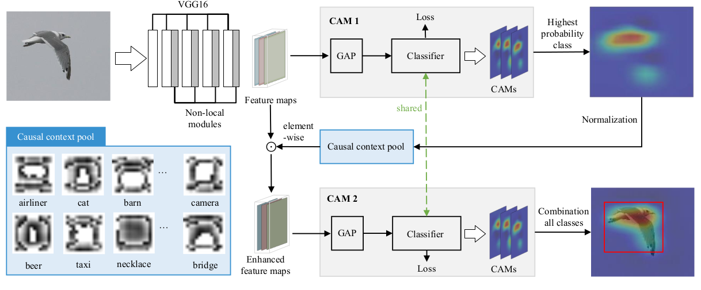
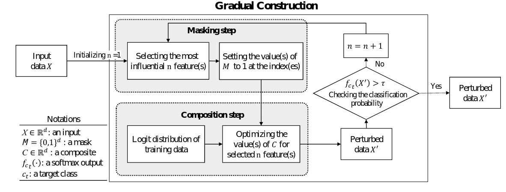

# Rise of Causality in Computer Vision

The repository contains lists of papers on causality and how relevant techniques are being used to further enhance deep learning era computer vision solutions. 

The repository is organized by [Maheep Chaudhary](https://maheepchaudhary.github.io/maheep.github.io/) and [Haohan Wang](http://www.cs.cmu.edu/~haohanw/) as an effort to collect and read relevant papers and to hopefully serve the public as a collection of relevant resources. 

## Causality 

  - [The Seven Tools of Causal Inference with Reflections on Machine Learning](https://ftp.cs.ucla.edu/pub/stat_ser/r481.pdf) 
      - 

Maheep's notes 

         The author proposes the 7 tools based on the 3 ladder of causation, i.e. Associaion, Intervention and Counterfactual. the paper proposes a diagram which describes that we have some assumptions from which we answer our query and from our data we validate our assumptions, i.e. "Fit Indices".The author proposes the 7 tools as :- 
          
         1. Transparency and Testability : Transparency indicates that the encoded form is easily usable and compact. The testability validates that the assumption encoded are compatible with the available data
          
         2. Do-Calculas and the control of Confounding : It is used for intervention, mainly used when we are trying to shift from 1st layer to 2nd. 
          
         3. The Algorithmization of Counterfactuals : When we can analyse the counterfactual reasoning using the experimental or observational studies. 
          
         4.  Mediation Analysis and the Assessment of Direct and  Indirect Effects : We find out the direct and indirect effects, such as what fraction of effect does X on Y mediated by variable Z.
          
         5.  Adaptability, External Validity and Sample Selection Bias : Basically it deals with the robustness of the model and offers do-calculas for overcoming the bias due to environmental changes.
          
         6. Recovering from Missing Data : The casual inference is made to find out the data-generating principles through probablisitic relationship and therefore promises to fill the missing data. 
          
         7. Causal Discovery : The d-separation can ebable us to detect the testable implications of the casual model therefore can prune the set of compatible models
         significantly to the point where causal queries can be estimated directly from that set.
        

  - [On Pearl’s Hierarchy and the Foundations of Causal Inference](https://causalai.net/r60.pdf) 
      - 

Maheep's notes 

        The pearl causal hierarchy encodes different concepts like : association. intervention and counterfactual.
         
        Corollary1 : It is genrally impossible to draw higher-layer  inferences using only lower-layer informatio but the authors claim that they have atleast developed a framework to move from layer 1 to layer 2 just from the layer 1 data using Causal Bayesian Network that uses do-calculas, i.e. intervention to get insight of layer 2 using the layer 1 data. 
         
        A SCM includes 4 variables, i.e. exongenous "U", endogneous "V", set of functions and P(U).
         
        A structural model is said to be markovian if the variable in the exogenous part are independent. 
         
        Observing : Joint porobability distribution for the Y(u) = y 
        Interventional SCM : SCM computed by fixing some varibales X = x. where X is in V. 
        Potential Response : It is the solution of Y caluclated thorugh the set of eqautions of SCM when we intervene on it.   
        Intervening : observing just when we do(X  = x)
        Effectiveness : P(v|do(x)) is effectiveness when for every v, P(v|do(x)) = 1 
        Collapse : The layers collapse when we can compute the results of the upper layer using the lower layer. For ex:- if Layer 2 collapses to layer 1, then it implies that we can draw all possible causal conculsion with mere correlation. 
         
        Theorem 1: PCH never collapses. 
         
        It could be  easily observed/seen that SCM agrees on all lower layers but disagrees on all higher layers.  A typical rdata-generating SCM encodes rich information at all threee layers but even very small changes might have substantial effect, which is generally seen in the higher layers.  
         
        Truncated Factorization Product is the equation stating P(v|do(x)) = pi P(v|pai)
         
        When two variables are correlated it does not mean that one is causing the other, i.e. P(y|do(x)) = P(y) and P(x|do(y)) =P(x), in this case what happens is there is another unobserved variable that is influencing both x and y variable which is often indicated by the bi-directed line in the graph.
         
        Factorization implied by the semi-markovian model does not act like chain rule, i.e. 
        P(e|a,b,c,d) = P(a)P(b|a)P(c|b,a)P(d|c,b,a)
        but the factorization looks something like: P(e|d,c,b,a) = P(a)P(b|a)P(c|a)P(e|b.c) which implies that b and c are only affected by a also seen by a direct edge in SCM. 
          
        

  - [Counterfactual Explanation and XAI](https://arxiv.org/abs/2201.13169)
      - 

Maheep's Notes 

         The author mainly discusses 3 main ideas: 

         * **Sufficient Explanations(SE)**

            > Conditions under which an action guarantees a particular output
         
         * **Counterfactual Explanations(CE)**
            
            > An action that changes an observed input to produce a change in an already observed output.
         
         * **Actual Causation(AC)**
            
            > They are very exciting as they consist b/w the Sufficient Explanations and Counterfactual Explanations. They consist of good SE conditions but the ones for which there exist a counterfactual value that would not have made the explanation better.

         As for the example in a regression model can be that a variable $P_{ai}$ in the past that has resulted in the observational data $X$ playing an important role in predicting the output $Y$. Here $X$ have counterfactual importance and also a SE but $P_{ai}$ will only have sufficient condition as $X$ has occured and no longer depends on $P_{ai}$ and not any CE, giving rise to AC. 

         If we think of an example in Computer Vision then what can be the AC?

         We were talking about the intervention on the event $P_{ai} \rightarrow X \rightarrow Y$ to convert it to $P_{ai} \not \rightarrow do(X = x) \rightarrow Y$ or cut off relations with the parents $P_{ai}$ and then observing the output $Y$. Now what i think this paper argues is that when we are doing an intervention on $P_{ai} \rightarrow do(X = x) \rightarrow Y$ then assign a value to that variable but do not cut off the effects from $P_{ai}$. 

         The author argues that under **Independence** a variety of causal notions becomes indistinguishable, also he claims that because of it 

         > *Work on action-guiding explanations in XAI has failed to take up the most relevant lesson that the literature on causation has to offer.*
         > 

         Now what can be comprehended by this sentence?

         > *Prediction in its most natural application is a forward-looking notion, meaning one predicts an event before it takes place. Explanation on the other hand is a backward-looking notion, meaning that one explains an event after it has happened. Yet as many papers on XAI clearly illustrate, explanations about past events are often required precisely to inform predictions about future events. Therefore a suitable notion of causal
         explanation, and thus also of actual causation, needs to specify how it relates to predictions.*
         > 

         Although the work is done by  `Hitchcock (2017)` but I am not able to find it as i think it is paid $$. 

         The author discusses about the counterfactual scenarios by focusing on the question, i.e. *What-if-things-had-been-different?* but focuses on those factors that *may not be manipulated* for the explanation to hold, i.e. they must state which variables are to be safeguarded from intervention **which clearly does not mean that they are held fixed**. 

         One of the important thing author writes in the paper is: 

         > *Contrary to counterfactual explanations, actual causes do not guide you towards actions that, under the same conditions, would ensure the output to be different. But they do guide you towards actions that would not ensure the actual output under the same conditions as the actual action.*
         > 

         A small example of AC by the author as *Salary*

         $$
         X_1(Salary) = 250,000 
         $$

         $$
         X_3(Deposit\_Box) = 50,000 
         $$

         $$
         X_2(Savings) = 125,000 
         $$

         $$
         Y = (X_1 + 5 \cdot X_2 - 225,000) > 0
         $$

         $$
         Y = (250,000 + 625,000 - 225,000) = True
         $$

         Obviously the salary does not matter in the counterfactual scenario, as he will get the loan regardless of his salary but is a good sufficient explanation. 

         The author discusses about the AC and Fairness, where he sets off from  forward-looking action-guiding explanations to explanations by backward-looking contexts. The backward-looking explanations do not mean that they are capable of inferring the future outputs as forward-looking explanations.

         Also the author claims that actual causation should be used to quantify the actual fairness rather than the counterfactual explanation. 

         > Interestingly though, there already is a growing consensus that counterfactual dependence is too strong a condition and should be replaced with counterfactual dependence along *unfair paths.*
         >

         

  - [Unit selection based on counterfactual logic](https://escholarship.org/content/qt8pw00989/qt8pw00989.pdf) 
      - 

Maheep's notes 

         The unit selection problem entails two sub-problems, evaluation and search. The evaluation problem is to find an objective function that, ensure a counterfactual behaviour when optimized over the set of observed characteristics C for the selected group. The search task is to devise a search algorithm to select individuals based both on their observed characteristics and the objective function devised above. 
           
         The paper only focuses on the evaluation sub-problem and focuses on the previous effort to solve this problem, i.e. A/B testing so as to maximizes the percentage of compliers and minimizes the percentages of defiers, always-takers, and never-takers. But the author argues that the proposed term for it does not satisfy the criteria as P(positive response|c, encouraged) - P(positive response|c, not encouraged) represents "compilers + always-takers" - "defiers + always-takers", therefore the author suggest to have two theorems, i.e. "monotonicity" and "gain equality" which can easily optimize the A/B testing. 
         Monotonicity expresses the assumption that a change from X = false to X = true cannot, under any circumstance make Y change from true to false.
         Gain-equality states that the benefit of selecting a complier and a defier is the same as the benefit of selecting an always-taker and a never-taker (i.e., β + δ = γ + θ).
         
         Taking into account the following theorems the author proposes a alternate term of A/B testing which stands for maximizing the benefit. 

         `argmax c βP (complier|c) + γP (always-taker|c) + θP (never-taker|c) + δP (defier|c)` 
         where benefit of selecting a complier is β, the benefit of selecting an always-taker is γ, the benefit of selecting a never-taker is θ, and the benefit of selecting a defier is δ. Our objective, then, should be to find c. 
         Theorem 4 says that if Y is monotonic and satisfies gain equallity then the benefit function may be defined as: - 
         `(β − θ)P (y,x |z) + (γ − β)P (y,x′ |z) + θ`
           
         "Third, the proposed approach could be used to evaluate machine learning models as well as to generate labels for machine learning models. The accuracy of such a machine learning model would be higher because it would consider the counterfactual scenarios."
        

  - [Unit Selection with Causal Diagram](https://arxiv.org/pdf/2109.07556.pdf) 
      - 

Maheep's notes 

         Same as above
          
         Additionoal content continues here..........
          
         After proposing the technioques to account for unit selection in general the author proposes a new kind of problem by introducing the confounders in the causal Diagram. The following discovery was partially made by the paper "Causes of Effects: Learning Individual responses from Population Data ". The author proposes a new equation to handle these scenarios.  

         `W + σU ≤ f ≤ W + σL if σ < 0`,
         `W + σL ≤ f ≤ W + σU if σ > 0`,
         where "f" is the objective function. Previously in normal case the objective fucntion is bounded by the equation: 
          
         `max{p 1 , p 2 , p 3 , p 4 } ≤ f ≤ min{p 5 , p 6 , p 7 , p 8 } if σ < 0,` 
         `max{p 5 , p 6 , p 7 , p 8 } ≤ f ≤ min{p 1 , p 2 , p 3 , p 4 } if σ > 0`, 
         In the extension of the same the author proposes the new situations which arise such as the when "z" is partially observable. and if "z" is  a pure mediator. 
           
         The author then discusses about the availablity of the observational and experimantal data. If we only have experimantal data then we can simply remove the observationa terms in the theorem  
         `max{p 1 , p 2 } ≤ f ≤ min{p 3 , p 4 } if σ < 0`, 
         `max{p 3 , p 4 } ≤ f ≤ min{p 1 , p 2 } if σ > 0`, 
         but if we have only onservational data then we can take use of the observed back-door and front-door variables to generate the experimental data, but if we have partially observable back-dorr and front-door variables then we can use the equation:  
         `LB ≤ P (y|do(x)) ≤ UB`
           
         The last topic which author discusses about is the reduciton of the dimensionality of the variable "z" which satisfies the back-door and front-door variable by substituting the causal graph by substiuting "z" by "W" and "U" which satisfies the condition that "no_of_states_of_W *  no_of_states_of_U = no_of_states_of_z". 

        

  - [The Causal-Neural Connection: Expressiveness, Learnability, and Inference](https://causalai.net/r80.pdf) 
      - 

Maheep's notes 

        
        The author proposes Neural Causal Models, that are a type of SCM but are capable of amending Gradient Descent. The author propses the network to solve two kinds of problems, i.e. "causal effect identification" and "estimation" simultaneously in a Neural Network as genrative model acting as a proxy for SCM.
         
        "causal estimation" is the process of identifying the effect of different variables 
        "Identification" is obtained when we apply backdoor criterion or any other step to get a better insight. The power of identification has been seen by us as seen in the papers of Hanwang Zhang.
         
        Theorem 1: There exists a NCM that is in sync with the SCM on ladder 3
        
        

  - [The Causal Loss: Driving Correlation to Imply Causation(autonomus)](https://arxiv.org/abs/2110.12066) 
      - 

Maheep's notes 

         The paper introduces a loss function known as causal loss which aims to get the intervening effect of the data and shift the model from rung1 to rung2 of ladder of causation. Also the authors propose a Causal sum Product Network(CaSPN).
           
         Basically the causal loss measures the prob of a variable when intervened on another variable. 
         They extend CaSPN from iSPN be reintroducing the conditional vaaribales, which are obtained when we intervene on the observational data. They argue that the CaSPN are causal losses and also are very expressive. 
         The author suggests a way(taken from iSPN) consitional variables will be passed with adjacency matrix while weight training and target varibales are applied to the leaf node. 
           
         They train the CaSPN, NN with causal loss, standard loss and standard loss + alpha*causal loss and produce the results. Also they train a Decision tree to argue that their technique also works on Non-Differential Networks, therefore they propose to  substitute the Gini Index with the Causal Decision Score which measures the average probability of a spit resulting in correct classification. 
        

  - [Double Machine Learning Density Estimation for Local Treatment Effects with Instruments](https://causalai.net/r75.pdf) 
      - 

Maheep's notes 

         The LTE measures the affect of among compilers under assumptions of monotonicity.  The paper focuses on estimating the LTE Density Function(not expected value) using the binary instrumental variable which are used to basically counteract the effect of unobserved confounders. 
           
         Instrumental Variables : These are the variables to counteract the affect of inobserved confounders. To be an instrumental varibale these are the following conditions it should consist of: 
           
         Relevance: The instrument Z has a causal effect on the treatment X. 
         Exclusion restriction: The instrument Z affects the outcome Y only through the treatment X. 
         Exchangeability (or independence): The instrument Z
         is as good as randomly assigned (i.e., there is no confounding for the effect of Z on Y). 
         Monotonicity: For all units i, Xi(z1)⩾Xi(x2) when z1⩾z2 (i.e., there are no units that always defy their assignment).
           
         The author develops two methods to approximate the density function, i.e. kernel - smoothing and model-based approximations. For both approaches the author derive double/deboased machine learning estimators. 
           
         Kernel Smoothing method: They smoothes the density by convoluting with a smooth kernel function............................ 
         Model-based approximators: It projects the density in the dfinite-dimenional density class basedon a distributional distance measure.......... 

         The author argues that by obtaining the PDF may give very valuable information as compared to only estimating the Cumlative Distribution Function. 
        

## Causality & Computer Vision

<!--- Week 1 --> 

  - [Counterfactual Samples Synthesizing and Training for Robust Visual Question Answering](https://arxiv.org/pdf/2003.06576.pdf) 
      - 

Maheep's notes 

         In this research paper the author focuses on 2 major questions, i.e.  
         1) Visual-explainable: The model should rely on the right visual regions when making decisions. 
         2) Question-sensitive: The model should be sensitive to the linguistic variations in questions. 
         The author proposes a technique, i.e. CSST which consist  of CSS and CST which do counterfactual in VQA as the CSS generates the counterfactual samples by masking critical objects  in the images and words. The CST model tackles the second challenge of sensitivity is handled by  the CST which make the model learn to distinguish between the origianl samples and counterfactal ones. Addtionally it trains the model to learn both kind of samples, i.e. origianl and counterfactual ones, making  the model robust. 
        

  - [How Should Pre-Trained Language Models Be Fine-Tuned Towards Adversarial Robustness?](https://openreview.net/pdf?id=pl2WX3riyiq) 
      - 

Maheep's notes 

         The fine-tuning of pre-trained language models has a great success in many NLP fields but it is strikingly vulnerable to adversarial examples, as it suffers severely from catastrophic forgetting: failing to retain the generic and robust linguistic features that have already been captured by the pre-trained model. The proposed model maximizes the mutual information between the output of an objective model and that of the pre-trained model conditioned on the class label. It encourages an objective model to continuously retain useful information from the pre-trained one throughout the whole fine-tuning process.  

         `I(S; Y, T ) = I(S; Y ) + I(S; T|Y ),`
          The author proposes by this equation that the two models overlap, i.e. the objective model and the pretrained model. S represents the features extracted the model by the objective model and T is the features extracted by the pretrained model.
        

  - [Counterfactual Zero-Shot and Open-Set Visual Recognition](https://arxiv.org/pdf/2103.00887.pdf) 
      - 

Maheep's notes 

         
         Generating novel samples within True Distribution has been the Holy Grail of Deep Learning. 
         It focuses on it to solve the challenge of *Zero Shot Learning*(ZSL) and *Open Set Recognition*(OSR) using *Counterfactual Faithfulness* which guarantee that counterfactual distribution is coherent with the ground-truth seen/unseen distribution. 
         
         The *Counterfactual Faithfulness* allows the use of *Consistency Rule* which states that if the counter-fact 
         
         $y$ is indeed the underlying ground-truth, the counterfactual 
         $\overline{x}$ equals to the factual 
         $x$, i.e. 
         $y_{c}(x) = \textbf{y} \rightarrow X_y[z(x)] = x$ and 
         $X_y[z(x)] \neq x \Rightarrow y_{c}(x) \neq \textbf{y}$. 
         
         Therefore to achieve *Counterfactual Faithfulness*, it disentangles the samples based on \textit{sample-specific} 
         $\tilde{z} = \tilde{Z}(X = x)$ and 
         *class-specific*  
         $y = Y(X = x)$ attributes, hence generating the counterfactual sample 
         
         $\overline{x} = X_y[\tilde{z}(x)]$. 
         It also gives the basis for generation of unseen classes samples by taking the basis as 
         $\tilde{Z} = \tilde{z}(x)$ where the effect of all attributes remains preserved due to disentanglement. The 
         $z(x)$ and 
         $y(x)$ can be obtained through posterior
         
         $Q_\phi(Z|X)$ and $Q_\gamma(Y|X)$, whereas 
         $\overline{x}$ can be generated via conditional distribution 
         $P_\theta(\overline{X}|Z = z,Y = y)$ after inferring 
         $y$ from 
         $X$ and 
         $z$ is the gaussian prior. 
         
         In a structural format it is done via three steps: 
         * *Abduction*: 
         $z(x)$ is inferred, 
         * *Action*: infers 
         $\textbf{y} \in \mathcal{Y_S} \cup \mathcal{Y_U}$
         , where 
         $\mathcal{Y}_{S}$ was dense embedding in-case of ZSL and one-hot encoding in-case of OSR. 
         * *Prediction*: 
         $\overline{x}$ is generated by inferred 
         $z(x)$ 
         and 
         $\textbf{y}$
         . ZSL(OSR) is evaluated in a closed(open) environment, where un-seen class is (not)available 
         $\mathcal{Y}_U$ 
         by the contraposition-if the feature 
         $x$ is *dissimilar* to $\overline{x}$ generated from unseen(seen)-classes, 
         $x$ belongs to seen(unseen) which could be easily measured using the minimum Euclidean Distance. To ensure the proper disentanglement of 
         $z(x)$ and 
         $y(x)$, the loss is constituted as

         $$
         L = \underset{\theta, \phi}{min} L_{\tilde{Z}} + vL_Y + \underset{w}{max} \rho L_{\mathcal{F}}
         $$

         $$         
         L_{\tilde{Z}} = - \mathbb{E}*{Q*\phi(Z|X)}[P(X|Z,Y)] + \beta D_{KL}(Q_\phi(Z|X)||P(Z))
         $$

         $$
         L_Y = -\log \frac{exp(-dist(x,x_y))}{\sum_{\overline{x} \in \overline{X} \cup \{x_y\}}exp(-dist(x,\overline{x}))}
         $$

         $$
         L_{\mathcal{F}} = \mathbb{E}[D(x,y)] - \mathbb{E}[D(\overline{x},y)] - \lambda \mathbb{E}[(||\nabla_{\widehat{x}}D(\widehat{x}, y)||*2 - 1)^2]
         $$

         where 
         $D_{KL}$ 
         represents KL Divergence Loss and 
         
         $\widehat{x} = \alpha x + (1 - \alpha)\overline{x}$.

         
        

  - [Counterfactual VQA: A Cause-Effect Look at Language Bias](https://arxiv.org/pdf/2006.04315.pdf) 
      - 

Maheep's notes 

         Besides, counterfactual training samples generation [12, 1, 58, 19, 31] helps to balance the training data, and outperform other debiasing methods by large margins on VQA-CP.
          
         The statement specifies the reason why the author in the origianl paper mentioned that we can generate missing labels with that  process in Machine Leanring. They formulate the language bias as the direct causal effect of questions on answers, and mitigate the bias by subtracting the direct language effect from the total causal effect. They  proposed a very simple method to debias the  NLP part in VQA using  the Causal Inference, i.e. they perform VQA using different layers for different part, i.e. for visual, question and visual+question which is denoted by Knowledge base K. They argue that if we train a model like this then we would have result with Z_q,k,v, then to get the Total Indirect Effect, they train another model with parameters as Z_q,v*k* and are subtracted from each other. to eliminate the biasness of the language model.     
        

  - [CONTERFACTUAL GENERATIVE ZERO-SHOT SEMANTIC SEGMENTATION](https://arxiv.org/pdf/2106.06360.pdf)
      - 

Maheep's Notes

        
         Zero-shot semantic segmentation methods is based on the generative model, where the word embedding and visual feature of the images are mapped together for seen classes. This mapping helps to generate fake features of the classes by their word using the generator. The generator learns from the real features by generating fake features for the samples that are present in the training set. As a result it becomes capable of generating close to real features, also for the samples that were not present in the training set. 

         The 
         $C$ gets created as a result of influence of $\psi(I;\theta) \rightarrow G(W)$. 
         Therefore, to de-bias the model they separate the 
         $\psi(I;\theta) \rightarrow Y$ and 
         $W \rightarrow G(W) \rightarrow Y$ outputs and fuse them together in the last. It is done by intervention and quantifying different effects by intervening on the conditional probability 

         $$
         P\{Y = y|T = w, \psi(I;\theta) = r, F = G(W = w, \psi(I;\theta) = r)\}
         $$
         
         $$
         L_{w,r,f} = L(W = w, \psi(I;\theta) = r, F = G(W = w))
         $$
         
         $$
         TE = L_{w, r, f} - L_{w*, r*, F^{*}}
         $$
         
         $$
         NDE = L_{w*, r, f*} - L_{w*, r*, F^*} 
         $$
         
         $$
         NIE = L_{w*, r*, F} - L_{w*, r*, F^*}
         $$
         
         Therefore the branch for the unbiased path 
         $W \rightarrow G(W) \rightarrow L$ is denoted by 
         $\mathcal{Out}_{FL}$, i.e. 

         $$
         \mathcal{Out}_{RL} = TE - NDE - NIE
         $$

         output the total loss as: 

         $$
         L_{pred} = L(\mathcal{Out}_{FL}) + L(\mathcal{Out}_{FL}) + L(h(\mathcal{Out}_{FL}, \mathcal{Out}_{FL}))
         $$

         where 

         $$
         h(\mathcal{Out}_{FL}, \mathcal{Out}_{FL}) = \frac{var(\psi(I;\theta))\cdot\mathcal{Out}_{FL} + var(G(W)\cdot\mathcal{Out}_{RL}}{var(\psi(I;\theta)) + var(G(W)}
         $$

         But the relationship between the text and image is based on statistical relationship rather than causal relationship. 
        

  - [Adversarial Visual Robustness by Causal Intervention](https://arxiv.org/abs/2106.09534) 
      - 

Maheep's notes 

         The paper focuses on adverserial training so as to prevent from adverserial attacks. The author use instrumental variable to achieve casual intervention.            The author proposes 2 techniques, i.e. 
         
         1) Augments the image with multiple retinoptic centres
         
         2) Encourage the model to learn causal features, rather than local confounding patterns.
         
         They propose the model to be such that max P (Y = ŷ|X = x + delta) - P(Y = ŷ|do(X = x + delta)), 
         subject to P (Y = ŷ|do(X = x + delta)) = P (Y = ŷ|do(X = x)), in other words they focus on annhilating the confounders using the retinotopic centres as the instrumental variable.
        

  - [What If We Could Not See? Counterfactual Analysis for Egocentric Action Anticipation](https://vipl.ict.ac.cn/homepage/jsq/publication/2021-Zhang-IJCAI.pdf) 
      - 

Maheep's notes 

         Egocentric action anticipation aims at predicting the near future based on past observation in first-person vision. In addition to visual features which capture spatial and temporal representations, semantic labels act as high-level abstraction about what has happened. Since egocentric action anticipation is a vision-based task, they consider that visual representation of past observation has a main causal effect on predicting the future action. In the second stage of CAEAA, we can imagine a counterfactual situation: “what action would be predicted if we had not observed any visual representation?" 

         They ask this question so as to only get the effect of semantic label. As the visual feature is the main feature the semantic label can act as a confouder due to some situations occuring frequently. Therfore the author proposes to get the logits "A" from the pipeline without making any changes to the model and then also getting the logits "B" when they provide a random value to visual feature denoting the question of counterfactual, i.e. “what action would be predicted if we had not observed any visual representation?" getting the unbiased logit by: 

         Unbiased logit = A - B
        

  - [Transporting Causal Mechanisms for Unsupervised Domain Adaptation](https://openaccess.thecvf.com/content/ICCV2021/papers/Yue_Transporting_Causal_Mechanisms_for_Unsupervised_Domain_Adaptation_ICCV_2021_paper.pdf) 
      - 

Maheep's notes 

         
         Existing **Unsupervised Domain Adaptation(UDA)** literature focuses to tackle the challenges of *covariate shift*, i.e. $P(X|Domain = d) \neq P(X|Domain = d')$ and *conditional shift*, i.e. $P(Y|X, Domain = d) \neq P(Y|X, Domain = d')$ during the adjustment of model trained on dataset $D_1$ and inferenced on data $D_2$ which may belong to another domain. 

         Consequently the work proposes to solve using it by:

         * It proposes 
         $k$ functions 
         ${f_i(.)}_{i = 1}^{k}$ that converts $f(X_d) = X_{d'}$ and $f^{-1}(X_{d'}) = X_{d}$, where $P(X_d) \in P(D_1); P(X_{d'}) \in P(D_2)$.
            
            *  

         * Although $\{f_i(\cdot)\}_{i = 1}^{k}$ represents different confounders $C$ that makes the features of $D_1$ and $D_2$ invariant/same. But are unable to get the vector representation, therefore its characteristics to delineate $C$.
         * The characteristic of $C$(denoted by $U$ in the image) can be observed by the $X$ and the latent variable $Z$ of $X$, as shown in the image below, both containing the information encoded about $C$. 
            
            * 
         * Therefore it defines the standard equation to solve the issue, i.e. 
         $P(Y|do(X), Domain) = \sum_u P(Y|X,C = c)P(C|Domain)$
         * to the equation 
         $P(|X,Domain,Z) = \sum_{\hat{x}}h_y(X,\hat{x})P(\hat{X} = \hat{x}|Z,X,Domain)$
      

  - [WHEN CAUSAL INTERVENTION MEETS ADVERSARIAL EXAMPLES AND IMAGE MASKING FOR DEEP NEURAL NETWORKS](https://arxiv.org/pdf/1902.03380.pdf) 
      - 

Maheep's notes 

         To study the intervention effects on pixel-level features for causal reasoning, the authors introduce pixel-wise masking and adversarial perturbation. The authors argue that the methods such as Gradient information from a penultimate convolutional layer was used in GradCAM are good to provide  the saliency map of the image but it is not justifiable inmany situaitons as the Saliency maps onlyCAM  establish a correlation for interpretability while it is possible to trace a particular image region that is responsible for it to be correctly classified; it cannot elucidate what would happen if a certain portion of the image was masked out. 

         Effect(xi on xj , Z) = P (xj |do(xi_dash ), Z_Xi) -  P (xj |Z_Xi ) ......................................(1)
         The excepted casual effect has been defined as:
         E_Xi[Effect(xi on xj , Z)] = (P(Xi = xi |Z)*(equation_1))

         The author proposes three losses to get the above equaitons, i.e. the effect of pixels. The losses are interpretability loss, shallow reconstruction loss, and deep reconstruction loss. Shallow reconstruction loss is simply the L 1 norm of the difference between the input and output of autoencoder to represent the activations of the network. For the second equation they applied the deep reconstruction loss in the form of the KL-divergence between the output probability distribution of original and autoencoder-inserted network.

         These losses are produced afer perturbtaing the images by maksing the images and inserting adverserial noise. 
        

  - [Interventional Few-Shot Learning](https://arxiv.org/pdf/2009.13000.pdf) 
      - 

Maheep's notes 

         In  this paper the author argues that in the prevailing Few-Shot Learning (FSL) methods: the pre-trained knowledge of the models is used which is indeed a confounder that limits the performance. They develop three effective IFSL algorithmic implementations based on the backdoor adjustment, the fine-tuning only exploits the D’s knowledge on “what to transfer”, but neglects “how to transfer”. Though stronger pretrained model improves the performance on average, it
         indeed degrades that of samples in Q dissimilar to S. The deficiency is expected  in the meta-learning paradigm, as fine-tune is also used in each meta-train episode

         The author proposes  the solution by proposing 4 variables, i.e. "D", "X", "C", "Y" where D is the pretrained model, X is the feature representaiton of the image, C is the low dimesion representation of X and Y are the logits. The author says the D affects both the X and C, also X affects C, X and C affects the logit Y. The autho removes the affect of D on X using backdoor.  
        

  - [CLEVRER: COLLISION EVENTS FOR VIDEO REPRESENTATION AND REASONING](https://arxiv.org/pdf/1910.01442.pdf) 
      - 

Maheep's notes 

         It Generate video reasoning dataset using the concepts of causality by doing some simple perturbations, i.e. specifically by asking the 4 major questions, i.e. 

         * *Descriptive (e.g., ‘what color’)*
         * *Explanatory (‘what’s responsible for’)*
         * *Predictive (‘what will happen next?’)*
         * *Counterfactual (‘what if’)*

         and generating data from it. The data is created with the help of simulated motion traces and based on the counterfactual scenario where an object is replaced by another object to different size/shape/color to generate a counterfactual scenario.

        

  - [Towards Robust Classification Model by Counterfactual and Invariant Data Generation](https://openaccess.thecvf.com/content/CVPR2021/papers/Chang_Towards_Robust_Classification_Model_by_Counterfactual_and_Invariant_Data_Generation_CVPR_2021_paper.pdf) 
      - 

Maheep's notes 

         The paper is about augmentaiton using the counterfactual inference by  using the human annotations of the subset of the features responsible (causal) for the labels (e.g. bounding boxes), and modify this causal set to generate a surrogate image that no longer has the same label (i.e. a counterfactual image). 
         Also they alter non-causal features to generate images still recognized as the original labels, which helps to learn a model invariant to these features. 

         They augment using the augmentaions as: None, CF(Grey), CF(Random), CF(Shuffle), CF(Tile), CF(CAGAN) 
         and the  augmentaions which alter the invariant features using: F(Random) F(Shuffle) F(Mixed-Rand) F(FGSM)
        
        
---
<!--- ### Week 2 -->

  - [Unbiased Scene Graph Generation from Biased Training](https://arxiv.org/pdf/2002.11949.pdf)
      - 

Maheep's Notes

        The paper focuses on scene graph generation (SGG) task based on causal inference. The author use Total Direct Effect for an unbiased SGG. The author proposes the technique, i.e. 
         
         1) To take remove the context bias, the author compares it with the counterfactual scene, where visual features are wiped out(containing no objects). 
         
         The author argues that the true label is influenced by Image(whole content of the image) and context(individual objects, the model make a bias that the object is only to sit or stand for and make a bias for it) as confounders, whereas we only need the Content(object pairs) to make the true prediction. 
         The author proposes the TDE = y_e - y_e(x_bar,z_e), the first term denote the logits of the image when there is no intervention, the latter term signifies the logit when content(object pairs) are removed from the image, therfore giving the total effect of content and removing other effect of confounders.    
        

        

   - [Counterfactual Vision and Language Learning](https://openaccess.thecvf.com/content_CVPR_2020/papers/Abbasnejad_Counterfactual_Vision_and_Language_Learning_CVPR_2020_paper.pdf)
      - 

Maheep's Notes

         The paper tackles the issue in VQA to make it more robust by doing counterfactual in the training. It encounters the problem of alternate answer to a question may not be wrong, known as *bandit feedback*. 
         It learns the distribution of an *exogenous variable* using the prior distribution 
         $P(U|D)$. 
         “*What would be the minimum alternation to change the answer to a question.”*   using the exogenous variable to generate it.
         - Since the intervention can degrade the model’s performance, we “reason” about these counterfactual instances by formulating an alternative to conventional empirical risk minimization, allowing the model to learn both from observational and counterfactual instances.

         - Intervenes upon the embedding functions by their counterfactual, i.e. $f_v(\cdot)$  is converted to $\tilde{f}_v(v, u^v) = \tilde{v}$, where $u$  is the exogenous variable.
         - The exogenous variable distribution is obtained with the help of observational data which is a posterior
            
            $$
            p(u|\textbf{D}) \propto p(u) \prod_{i = 1}^{n} p(a_i|q_i,v_i)p(v_i, u^v)p(q_i|u^q)
            $$
            
         - The counterfactual are generated by posterier of $\mathcal{U}$ $\underset{u}{max}$    $log(P^{do(I)|Q,I}(\tilde{Q},\tilde{I}|\mathcal{U}))$, so as to alter the answer $A' = \underset{\overline{A}}{argmax} \ P^{do(I)|(Q,I)}(\overline{A}|\overline{Q}, \overline{I})$  and to so as to have the  minimum perturbation in the image, it is guaranteed by the function
         - $\underset{u}{max}$      $||u||^2 - \lambda log(p^{do(I)|q,v}(a|\tilde{q}, \tilde{v}))$

        

        
   - [Counterfactual Vision-and-Language Navigation via Adversarial Path Sampler](https://arxiv.org/pdf/1911.07308.pdf)
      - 

Maheep's Notes

        The paper focuses on Vision-and-Language Navigation (VLN). The author combine the adversarial training with counterfactual conditions to guide models that might lead to robust model. To do this, the author proposes the defined techniques: - 
         
         1) The author APS, i.e. adversarial path sampler which samples batch of paths P after augmenting them and reconstruct instructions I using Speaker. With the pairs of (P,I), so as to maximize the navigation loss L_NAV. 
         2) The NAV, i.e. navigation model trains so as to minimize the L_Nav making the whole process more robust and increasing the performance. 
         
        The APS samples the path based on the visual features v_t which are obtained using the attention on the feature space f_t and history h_t-1 and previous action taken a_t-1 to output the path using the predicted a_t and the features f_t.
        

              
     
                 
---        
<!--- Week 3 -->

   - [Introspective Distillation for Robust Question Answering](https://arxiv.org/pdf/2111.01026.pdf)
      - 

Maheep's Notes

        The paper focuses on the fact that the present day systems to make more genralized on OOD(out-of-distribution) they sacrifice their performance on the ID(in-distribution) data. To achieve a better performance in real-world the system need to have accuracy on both the distributions to be good. Keeping this in mind the author proposes: - 
         
         1) The author proposes to have a causal feature to teach the model both about the OOD and ID data points and take into account the `P_OOD` and `P_ID`, i.e. the predictions of ID and OOD.  
         2) Based on the above predictions the it can be easily introspected that which one of the distributions is the model exploiting more and based on it they produce the second barnch of the model that scores for `S_ID` and `S_OOD` that are based on the equation `S_ID = 1/XE(P_GT, P_ID)`, where `XE` is the cross entropy loss. further these scores are used to compute weights `W_ID` and `W_OOD`, i.e. `W_OOD = S_OOD/(S_OOD + S_ID)` to train the model to blend the knowledge from both the OOD and ID data points. 
         3) The model is then distilled using the knowledge distillation manner, i.e. `L = KL(P_T, P_S)`, where `P_T` is the prediction of the teacher model and the `P_S` is the prediction of the student model. 
        

        
                
   - [CX-ToM: Counterfactual Explanations with Theory-of-Mind for Enhancing Human Trust in Image Recognition Models](https://arxiv.org/pdf/2109.01401.pdf)
      - 

Maheep's Notes

        The paper is kind of an extension of the above paper(CoCoX), i.e. it also uses fault-lines for explainability but states a dialogue between a user and the machine. The model is made by using the fault-lines and the Theory of Mind(ToM).   
        The proposed is implemented by taking an image and the same image is blurred and given to a person, then the machine take out the crucial features by thinking what the person may have understood and what is the information it should provide. The person is given more images and then the missing parts are told to be predicted after the dialogue, if the person is able to predict the parts that it was missing before then the machine gets a positive reward and functions in a RL training technique way.  

        
        

        
        
   - [Designing Counterfactual Generators using Deep Model Inversion](https://arxiv.org/pdf/2109.14274.pdf)
      - 

Maheep Notes

        The paper focues on the scenario when the we have access only to the trained deep classifier and not the actual training data. The paper proposes a goal to develop a deep inversion approach to generate counterfactual explanations. The paper propses methods to preserve metrics for semantic preservation using the different methods such as ISO and LSO. The author also focuses on manifold consistency for the counterfactual image using the Deep Image Prior model. -

        `argmin(lambda_1*sigma_on_l(layer_l(x'), layer_l(x)) + lambda_2*L_mc(x';F) + lambda_3*L_cf(F(x'), y'))` 
         
        where,  
        `layer_l` :The differentiable layer "l" of the neural network, it is basically used for semantic preservation.  
        `L_mc`: It penlaizes x' whcih do not lie near the manifold. L_mc can be Deterministic Uncertainty Quantification (DUQ). 
        `L_fc`: It ensures that the prediction for the counterfactual matches the desired target
        

        
        
        
   - [EXPLAINABLE IMAGE CLASSIFICATION WITH EVIDENCE COUNTERFACTUAL](https://arxiv.org/pdf/2004.07511.pdf)
      - 

Maheep's Notes

        The author proposes a SDEC model that searches a small set of segments that, in case of removal, alters the classification 
        The image is segemented with l segments and then the technique is implemented by using the best-first search avoid a complete search through all possible segment combinations. The best-first is each time selected based on the highest reduction in predicted class score. It continues until one or more same-sized explanations are found after an expansion loop. An additional local search can be performed by considering all possible subsets of the obtained explanation. If a subset leads to a class change after removal, the smallest set is taken as final explanation. When different subsets of equal size lead to a class change, the one with the highest reduction in predicted class score can be selected.

        
        
      
        
        
   - [Explaining Visual Models by Causal Attribution](https://arxiv.org/pdf/1909.08891.pdf)
      - 

Maheep Notes

        The paper focuses on the facts that there are limitations of current Conditional Image Generators for Counterfactual Generation and also proposes a new explanation technique for visual models based on latent factors.  
        The paper is implemented using the Distribution Causal Graph(DCG) where the causal graph is made but the nodes is represented the MLP, i.e. 
        `logP(X = (x1,x2,x3...xn)) = sigma(log(P(X = xi|theta_i)))` and the Counterfactual Image Generator which translate the latent factor into the image using the original image as anchor while genrating it which is done using Fader Networks which adds a critic in the latent space and AttGAN adds the critic in the actual output. 
        
      
                
        
   - [Explaining the Behavior of Black-Box Prediction Algorithms with Causal  Learning](https://arxiv.org/pdf/2006.02482.pdf)
      - 

Maheep's Notes

        The paper using proposes causal graphical models so as to  indicate which of the interpretable features, if any, are possible causes of the prediction outcome and which may be merely associated with prediction outcomes due to confounding. The choose causal graphs consistent with observed data by directly testing focus on type-level explanation rather token-level explanations of particular events. The token-level refers to links between particular events, and the type-level refers to links between kinds of events, or equivalently, variables. Using the causal modelling they focus on obtaining a model that is consistent with the data.   
        They focus on learning a Partial Ancestral Graph(PAG) G, using the FCI algorithm and the predicted outcome Y' whereas Z are the high-level which are human interpretable and not like pixels.  

        `V = (Z,Y')` 
        `Y' = g(z1,.....zs, epsilon)` 
        On the basis of possible edge types, they find out which high level causes, possible causes or non-causes of the balck-box output Y'. 
        
         
        
        
   - [Explaining Classifiers with Causal Concept Effect (CaCE)](https://arxiv.org/pdf/1907.07165.pdf)
      - 

Maheep's Notes

        The paper proposes a system CaCE, which focuses on confounding of concepts, i.e higher level unit than low level, individual input features such as pixels by intervening on concepts by taking an important assumption that intervention happens atomically. The effect is taken as 

        `Effect = E(F(I)|do(C = 1)) - E(F(I)|do(C = 0))` where F gives output on image I and C is the concept. This can be done at scale by intervening for a lot of values in a concept and find the spurious corrlation. But due to the insufficient knowlegde of the Causal Graph teh author porposes a VAE which can calculate the precise CaCE by by generating counterfactual image by just changing a concept and hence computing the difference between the prediction score.  
        
         

  - [Generative_Counterfactuals_for_Neural_Networks_via_Attribute_Informed_Perturbations](https://arxiv.org/pdf/2101.06930.pdf)
      - 

Maheep's Notes

        The paper focues on generating counterfactuals for raw data instances (i.e., text and image) is still in the early stage due to its challenges on high data dimensionality, unsemantic raw features and also in scenario when the effictive counterfactual for certain label are not guranteed, therfore the author proposes Attribute-Informed-Perturbation(AIP) which convert raw features are embedded as low-dimension and data attributes are modeled as joint latent features. To make this process optimized it has two losses: Reconstruction_loss(used to guarantee the quality of the raw feature) + Discrimination loss,(ensure the correct the attribute embedding) i.e.  

        `min(E[sigma_for_diff_attributes*(-a*log(D(x')) - (1-a)*(1-D(x)))]) + E[||x - x'||]` where D(x') generates attributes for counterfactual image.  To generate the counterfactual 2 losses are produced,one ensures that the perturbed image has the desired label and the second one ensures that the perturbation is minimal as possible, i.e.   `L_gen = Cross_entropy(F(G(z, a)), y) + alpha*L(z,a,z_0, a_0)` 
        The L(z,a,z0,a0) is the l2 norm b/w the attribute and the latent space.
        
        
        
   - [Question-Conditioned Counterfactual Image Generation for VQA](https://arxiv.org/pdf/1911.06352.pdf)
      - 

Maheep's Notes

        The paper on generating the counterfactual images for VQA, s.t.  
        i.) the VQA model outputs a different answer 
        ii.) the new image is minimally different from the original  
        iii) the new image is realistic  
        The author uses a LingUNet model for this and proposes three losses to make the perfect.  
        1.) Negated cross entropy for VQA model.   
        2.) l2 loss b/w the generated image and the original image.
        3.) Discriminator that penalizes unrealistic images.  
        
           
        

   - [FINDING AND FIXING SPURIOUS PATTERNS WITH EXPLANATIONS](https://arxiv.org/pdf/2106.02112.pdf)
      - 

Maheep's Notes

        The paper proposes an augmeting technique taht resamples the images in such a way to remove the spurious pattern in them, therfore they introduce their framework Spurious Pattern Identification and REpair(SPIRE). They view the dataset as Both, Just Main, Just Spurious, and Neither. SPIRE measures this probability for all (Main, Spurious) pairs, where Main and Spurious are different, and then sorts this list to find the pairs that represent the strongest patterns. After finding the pattern the dataset is redistributes as:  

        `P(Spurious | Main) = P(Spurious | not Main) = 0.5` 
        The second step consist of minimizing the potential for new SPs by setting the  `P(Main|Artifact) = 0.5)`.  
        SPIRE moves images from {Both, Neither} to {Just Main, Just Spurious} if p > 0.5, i.e. p = P(Main|Spurious) but if p < 0.5 then SPIRE moves images from {Just Main, Just Spurious} to {Both, Neither}. 
        
  

   - [Contrastive_Counterfactual_Visual_Explanations_With_Overdetermination](https://arxiv.org/pdf/2106.14556.pdf)
      - 

Maheep's Notes

        The paper proposes a system CLEAR Image that explains an image’s classification probability by contrasting the image with a corresponding image generated automatically via adversarial learning. It also provides an event with a label of "*overdetermination*", which is given when the model is more than sure that the label is something. CLEAR Image segments x into different segments S = {s1 ,...,sn } and then applies the same segmentation to x' creating S' = {s'1,...., s'n}. CLEAR Image determines the contributions that different subsets of S make to y by substituting with the corresponding segments of S'. This is impelmeted by:  
        A counterfactual image is generated by GAN which is then segmented and those segments by a certian threshold replace the segment in the original image and therfore we get many perturbed images. Each perturbed image is then passed through the model m to identify the classification probability of all the classes and therfore the significance of every segment is obtained that is contributing in the layer. If the
        
 

   - [On Causally Disentangled Representations](https://arxiv.org/pdf/2112.05746.pdf)
      - 

Maheep's Notes

        The paper focuses on causal disentanglement that focus on disentangle factors of variation and therefore proposes two new metrics to study causal disentanglement and one dataset named CANDLE. Generative factors G is said to be disentangled only if they are influenced by their parents and not confounders. The system is implemented as:    
        A latent model M (e,g, pX ) with an encoder e, generator g and a data distribution pX , assumes a prior p(Z) on the latent space, and a generator g is parametrized as p(X|Z), then posterior p(Z|X) is approzimated using a variational distribution q (Z|X) parametrized by another deep neural network, called the encoder e. Therefore we obtain a z for every g and acts as a proxy for it.  
        1.) **Unconfoundess metric**: If a model is able to map each Gi to a unique ZI ,the learned latent space Z is unconfounded and hence the property is known as unconfoundedness.  
        2.)**Counterfactual Generativeness**: a counterfactual instance of x w.r.t. generative factor Gi , x'(i.e., the counterfactual of x with change in only Gi) can be generated by intervening on the latents of x corresponding to Gi , ZIx and any change in the latent dimensions of Z that are x not responsible for generating G i , i.e. Z\I, should have no influence on the generated counterfactual instance x' w.r.t. generative factor Gi. It can be computed using the Avergae Causal Effect(ACE).  
        
  

   - [Model-Based Counterfactual Synthesizer for Interpretation](https://arxiv.org/pdf/2106.08971.pdf)
      - 

Maheep's Notes

        The paper focues on eridicating the algorithm-based counterfactual generators which makes them ineffcient for sample generation, because each new query necessitates solving one specific optimization problem at one time and propose Model-based Counterfactual Synthesizer. Existing frameworks mostly assume the same counterfactual universe for different queries. The present methods do not consider the causal dependence among attributes to account for counterfactual feasibility. To take into account the counterfactual universe for rare queries, they novelly employ the umbrella sampling technique, i.e. by using the weighted-sum technique, calculating the weight of each biased distribution, we can then reconstruct the original distribution and conduct evaluations with the umbrella samples obtained. The counterfactual can be generated by giving a specific query q0, insttead of a label using the hypthetical distribution.

        
        
  

   - [The Intriguing Relation Between Counterfactual Explanations and Adversarial Examples](https://arxiv.org/pdf/2009.05487.pdf)
      - 

Maheep's Notes

        The paper provides the literature regarding the difference between the Counterfactual and Adverserial Example. Some of the points are:  
        1.) AEs are used to fool the classifier whereas the CRs are used to generate constructive explantions.   
        2.) AEs show where an ML model fails whereas the Explanations sheds light on how ML algorithms can be improved to make them more robust against AEs  
        3.) CEs mainly low-dimensional and semantically meaningful features are used, AEs are mostly considered for high-dimensional image data with little semantic meaning of individual features.  
        4.) Adversarials must be necessarily misclassified while counterfactuals are agnostic in that respect   
        5.) Closeness to the original input is usually a benefit for adversarials to make them less perceptible whereas counterfactuals focus on closeness to the original input as it plays a significant role for the causal interpretation
        
  
 

   - [Causal Interventional Training for Image Recognition](https://ieeexplore.ieee.org/document/9656623)
      - 

Maheep's Notes

        The paper focuses on proposing an augmentaiton technique which focuses on eradicating the bias that is bad and keeping the bias that is good for the model. Therefore the author proposes a causal graph consisting of x:image; y:label; C:context; A:good bias and B:bad bias. The author considers B as the confounding variable b/w the x and C, therefore tries to remove it using the backdoor criteria. 
        
  

---

   - [Improving_Weakly_supervised_Object_Localization_via_Causal_Intervention](https://arxiv.org/pdf/2104.10351.pdf)
      - 

Maheep's Notes

        The paper proposes CI-CAM which explores the causalities among image features, contexts, and categories to eliminate the biased object-context entanglement in the class activation maps thus improving the accuracy of object localization. The author argues that in WSCOL context acts as a confounder and therefore eliminates it using backdoor-adjustment. The implement it by the following procedure: -  
        The architecture contains a backbone network to extract the features. The extracted features are then processed into CAM module where a GAP and classifier module outputs scores which are multipluied by weights to produce class activation maps.  
        The features are then passed through Causal Context Pool which stores the context of all images of every class, then other CAM module repeats the same procudure as of CAM1 and outputs image with class activation map.       

        
        
  

   - [COUNTERFACTUAL GENERATIVE NETWORKS](https://arxiv.org/abs/2101.06046)
      - 

Maheep's Notes

        The paper aims to propose a method so as to train the model having robustness on OOD data. To achieve this the author uses the concept of causilty, i.e. *independent mechanism(IM)* to generate counterfactual images. The author considers 3 IM's:  1.) One generates the object’s shape.  
        2.) The second generates the object’s texture. 
        3.) The third generates the background.  
        In this way the author makes a connection b/w the fields of causality, disentangled representaion, and invariant classifiers. The author uses cGAN with these learned IM to generate images based on the attributes given above.

        
        
  

   - [Discovering Causal Signals in Images](https://arxiv.org/abs/1605.08179)
      - 

Maheep's Notes

        A classifier is proposed that focuses on finding the causal direction between pairs of random variables, given samples from their joint distribution. Additionally they use causal direction classifier to effectively distinguish between features of objects and features of their contexts in collections of static images. In this framework, causal relations are established when objects exercise some of their causal dispositions, which are sometimes informally called the powers of objects. Based on it the author provides two hypothesis:  
        1.) Image datasets carry an observable statistical signal revealing the asymmetric relationship between object categories that results from their causal dispositions. 
        2.) There exists an observable statistical dependence between object features and anticausal features, basically anticausal features are those which is caused by the presence of an object in the scene. The statistical dependence between context features and causal features is nonexistent or much weaker. 
        The author proposes a Neural Causation Coefficient (NCC), able to learn causation from a corpus of labeled data. The author argues that the for joint distributions that occur in the real world, the different causal interpretations may not be equally likely. That is, the causal direction between typical variables of interest may leave a detectable signature in their joint distribution. Additionally they assume that whenever

         `X causes Y` , the cause, noise and mechanism are independent but we can identify the footprints of causality when we try to `Y causes X` as the noise and Y will not be independent.

   - [Learning to Contrast the Counterfactual Samples for Robust Visual Question Answering](https://aclanthology.org/2020.emnlp-main.265/)
      - 

Maheep's Notes

        The paper proposes we introduce a novel self-supervised contrastive learning mechanism to learn the relationship between original samples, factual samples and counterfactual samples. They implement it by generating facutal and counterfactual image and try to increase the mutual information between the joint embedding of 
        
        `Q` and `V(mm(Q,V) = a)`, and joint embedding of `Q` and `V_+ (factual)(mm(Q,V+) = p)` by taking a cosine similarity b/w them. They also aim to decrease mutual information b/w `mm(Q,V-) = n` and `a` by taking cosine similarity`(s(a,n))`. The final formula becomes: 
        `L_c = E[-log(e^s(a,p)/e^s(a,p)+e^s(a,n))]`
         
        The total loss becomes `L = lambda_1*L_c + lambda_2*L_vqa` 
        
        
  

   - [Latent Causal Invariant Model](https://arxiv.org/abs/2011.02203)
      - 

Maheep's Notes

        The paper focus on issue of generalization and therefore propose Latent Causal Invariance Model(LaCIM). The author introduce variables that are separated into (a) output-causative factors, i.e. 
        
        `S` and (b) others that are spuriously correlated `Z` from V(latent variable). 
        There exists a spurious correlation b/w `S` and `Z`. The author argues that we will get a `p(y|do(s*)) = p(y|s*)` 
        
  

   - [Two Causal Principles for Improving Visual Dialog](https://arxiv.org/abs/1911.10496)
      - 

Maheep's Notes

        The paper focuses to eliminate the spurious correltaions in the task of Visual Dialogue and therfore proposes 2 principles: 
        1.) The dialog history to the answer model provides a harmful shortcut bias threfore the direct effect of history on answer should be eliminated. 
        2.) There is an unobserved confounder for history, question, and answer, leading to spurious correlations from training data which should be identified and be eliminated using the backdoor method.  
        Now the main crunch of the paper arises as the confounder is unobserved so how can we apply the backdoor method? To solve it the author argues that this confounder comes from the annotator and thus can be seen in the 
        
        `a_i`(answer) is a sentence observed from the “mind” of user u during dataset collection. Then, `sigma(P(A)*P(u|H))`, `H` is history and `A` is answer can be approximated as `sigma(P(A)P(a_i|H))`.They further use `p(a_i|QT)`, where `QT` is Question Type to approximate `P(a_i|H)` because of two reasons: First, `P (a_i|H)` essentially describes a prior knowledge about `a_i` without comprehending the whole `{Q, H, I} triplet`.
        
        
  

   - [Weakly-Supervised Video Object Grounding via Causal Intervention](https://arxiv.org/pdf/2112.00475.pdf)
      - 

Maheep's Notes

        The paper aims to localize objects described in the sentence to visual regions in the video by deconfounding the object-relevant associations given the video-sentence annotations. The author argues that the frame is made up of the content(C), i.e. factors that cause the object’s visual appearances in spatial and temporal throughout the video are grouped into a category and Style(S) is the background or scenes. The author argues that the S does not play any role in object grounding and only act a confounder. In addition to that there exist one more confounder, i.e 
        
        

        `Z` that occurs due to some specific objects occuring frequently. The style confounder is replaced by using the contrastive learning, where the counterfactual examples are created by taking the vectors from a memory bank by taking the top sleected top regions for described object and then the selected regions and frames are grouped together into frame-level content(H_c) and region-level content(U_c), and the rest of the regions are grouped as U_s and H_s. These regions are the converted to counterfactual using these memory vectors which were created by taking the randomly selected regions in training set. The most similar one and replaces the original one, to generate examples to have them hard to distinguish from real ones contrastive learning is used. The equation looks like:  

        `IE(p|do(U_s = U_s_generated)) < IE(p|do(U_c = U_c_generated))` 
        `IE(p|do(H_s = H_s_generated)) < IE(p|do(H_c = H_c_generated))` 
        where the `IE` is Interventional Effect. As for the next confounder they uses the textual embedding of o_k(object) essentially provides the stable cluster center in common embedding space for its vague and diverse visual region embeddings in different videos. Therefore, by taking the textual embedding of the object as the substitute of every possible object z and apply backdoor adjustment. 
        
  

   - [Towards Unbiased Visual Emotion Recognition via Causal Intervention](https://arxiv.org/abs/2107.12096)   
      - 

Maheep's Notes

        The paper we propose a novel Interventional Emotion Recognition Network (IERN) to achieve
        the backdoor adjustment on the confounder, i.e. context of the image(C). The author implements it as: 

        IERN, which is composed of four parts: 
        1.) **Backbone** 
            > It extracts the feature embedding of the image. 
        2.) **Feature Disentanglement**  
            > It disentangles the emotions and context from the image, having emotion dicriminator(d_e) and context discriminator(d_c) which ensures that the extracted feature are separated and has the desired feature. The loss comprises as : 
            `L = CE(d_e(g_e(f_b(x))), y_e) + MSE(d_c(g_e(f_b(x))), 1/n)` where g_e is emotion generator and y_e is the emotion label and n is the number of counfounder and the same loss is for context replacing d_e, g_e and d_c by d_c, g_c and d_e, here n represents number of emotions. To ensure that the separated features fall within reason-able domains, IERN should be capable of reconstructing the base feature   f_b(x), i.e. `L =MSE(g_r(g_e(f_b(x)), g_c(f_b(x))), f_b(x))`   
        3.) **Confounder Builder** 
            > The purpose of the confounder builder is to combine each emotion feature with different context features so as to avoid the bias towards the observed context strata. 
        4.) **Classifier** 
            > It is simply used for prediciton.

        
        
  

   - [Human Trajectory Prediction via Counterfactual Analysis](https://openaccess.thecvf.com/content/ICCV2021/papers/Chen_Human_Trajectory_Prediction_via_Counterfactual_Analysis_ICCV_2021_paper.pdf)
      - 

Maheep's Notes

        The paper propose a counterfactual analysis method for human trajectory prediction. They cut off the inference from environment to trajectory by constructing the counterfactual intervention on the trajectory itself. Finally, they compare the factual and counterfactual trajectory clues to alleviate the effects of environment bias and highlight the trajectory clues. 

        They Y_causal is defined as `Y_causal = Y_i - Y-i(do(X_i = x_i))` 
        They define a generative model which generates trajectory by a noise latent variable Z indicated by `Y*_i`. Finally the loss is defined as: 
        `Y_causal = Y*_i - Y*_i(do(X_i = x_i))` 
        `L_causalGAN = L2(Y_i, Y_causal) + log(D(Y_i)) + log(1-D(Y_causal))`, where D is the discriminator.
        
  

   - [Proactive Pseudo-Intervention: Contrastive Learning For Interpretable Vision Models](https://arxiv.org/abs/2012.03369)
      - 

Maheep's Notes

        The paper present a novel contrastive learning strategy called Proactive Pseudo-Intervention (PPI) that leverages proactive interventions to guard against image features with no causal relevance. The PPI consists of three main components:  
        (i) a saliency mapping module that highlights causally relevant features which are obtained using the WBP which backpropagates the weights through layers to compute the contributions of each input pixel, which is truly faithful to the model, and WBP tends to highlight the target objects themselves rather than the background 
        (ii) an intervention module that synthesizes contrastive samples 
        (iii) the prediction module, which is standard in recent vision models 
        The prediction module is encouraged to modify its predictions only when provided with causally-relevant synthetic interventions. 
        The saliency map wchich are uniquely determined by the 
        
        `f(theta)` are produced and the main features are masked out of the image giving us `x*`. Now the loss becomes `L = sigma(l(x*,not_y;f(theta)))` 
        A trivbial solution can be the saliency maps copvers the whole image therefore L1-norm of saliency map is used to encourage succinct (sparse) representations. The another problem that now arises is that the model can learn a shortcut that when it get a masked image then it has to always give `not_y` as prediction, so as to counter it the author proposes to send images with random masks on them, making the loss `L = sigma(l(x',y;f(theta)))`

         
        
 

   - [Interventional Video Grounding with Dual Contrastive Learning](https://arxiv.org/abs/2106.11013)
      - 

Maheep's Notes

        The paper proposes interventional video grounding (IVG) that leverages backdoor adjustment to deconfound the selection bias based on structured causal model.They introduce a dual contrastive learning approach (DCL) to better align the text and video by maximizing the mutual information (MI) between query and video clips so as to deconfounded video grounding that will aim to localize a moment from an untrimmed video for a given textual query after deconfounding it. The author implements the system in major 5 steps: 
        1) Given an input query and video, the two encoders output contextualized visual and textual representations respectively.  
        2) Then, these representations will be fed into two contrastive modules VV-CL and QV-CL respectively to learn high-quality representations with two contrastive losses L_vv and L_qv, where the QV-CL module focuses on increasing the Mutual information of the positive frames of video and the query. The VV-CL aims to increse the mutual information b/w the start and end boundaries of the video, which looks like as shown in the diagram below: 

        

        3) The output of two feature encoders are fed to a fusion module with a context-query attention mechanism to capture the cross-modal interactions between visual and textual features.  
        4) As the confounder is unobserved, therefore to mitigate the spurious correlations between textual and visual features, the author develops a surrogate confounder. It includes the vocabulary of roles, actions and objects extracted from captions. Based on these, it computes the prior probability of every phrase z in each set and incoporates every phrase uniformly using the Normalized Geometric Mean(NWGM).  
        5) Finally, two losses L_s and L_e for the start and end boundaries are introduced. 
        
        
        
  

   - [Causality matters in medical imaging](https://www.nature.com/articles/s41467-020-17478-w)
      - 

Maheep's Notes

        The paper proposes the establishment of causal relationship between images and their annotations as it provides a clear and precise framework for expressing assumptions about the data. The author argues that when taking a look at different field like data scarcity, data-mismatch etc. We can easily find the generalization is not achieved and sometimes the performace becomes very poor due to some factors which are explained through causality in the research paper.  
        Taking a look at Data Scarcity Semi-supervised learning (SSL) aims to leverage readily available unlabelled data in the hope of producing a better predictive model than is possible using only the scarce annotated data but a model trained on image-derived annotations will attempt to replicate the (most often manual) annotation process, rather than to predict some pre-imaging ground truth therefore consisting of a confounding variable that comes from the annotator.  
        Data mismatch is the second issue the author discusses and argues that the mismatch between data distributions, typically between training and test sets or development and deployment environments, tends to hurt the generalisability of learned models and therefore it can be said that Dataset shift is any situation in which the training and test data distributions disagree due to exogenous factors. Moreover when analysing dataset shift, it is helpful to conceptualise an additional variable Z, representing the unobserved physical reality of the subject’s anatomy. There are also another types of shifts like manifestation shift(under which the way anticausal prediction targets (e.g. disease status) physically manifest in the anatomy changes between domains), acquisition shift which result from the use of different scanners or imaging protocols and Data mismatch due to sample selection bias where the indicator variables in sample selection concern alterations in the data-gathering process rather than in the data-generating process.
        
  

   - [TSMOBN GENERALIZATION FOR UNSEEN CLIENTS IN FEDERATED LEARNING](https://arxiv.org/abs/2110.09974)
      - 

Maheep's Notes

        The paper proposes TsmoBN method which can reduce divergence between training and testing feature distributions and also achieves a lower generalization gap than standard model testing. The author argues that in Federated Learning the performance degrades during the test phase as a global model trained on heterogeneous feature distributions fails to be an accurate estimation for a different distribution on the unseen client. Therefore the author propose to use test-specific and momentum tracked batch normalization (TsmoBN) to solve the unseen client generalization problem for varying feature distributions. The author implements it as: 
        The author takes the approach of causality and defines a SCM having the terms as 
        
        `D_s_i` for datasets of different domain, i.e. coming from different users but used in training, `X` are the samples, `R` are the raw extracted features of `X`, `F` is the normalized feature representaiton of `R` and `Y` is the classifier. To remove the confounding effects brought by `D_u` , a direct way is using causal intervention on normalized features (i.e., do(F)) to let the feature distribution similar to training distributions. This intervention by introducing the surrogate variable `S`, which is test-specific statistics of raw features `R` during testing by obtaining the test normalized features that have similar distributions as the training normalized features. More specifically by calculating the mean and variance pair at test time in BN to normalize features. Additionally they further propose to use momentum to integrate relations among different batches, thus reducing the variances. Precisely by giving the unseen client with M batches of data to be tested in sequential manner.

        
        
  

   - [Learning Domain Invariant Relationship with Instrumental Variable for Domain Generalization](https://arxiv.org/pdf/2110.01438.pdf)
      - 

Maheep's Notes

        The paper proposes an instrumental variable-based approach to learn the domain-invariant relationship between input features and labels contained in the conditional distribution as the input features of one domain are valid instrumental variables for other domains. Therefore they propose a model Domain-invariant Relationship with Instrumental VariablE (DRIVE) via a two-stage IV method.  
        1.) It learns the conditional distribution of input features of one domain given input features of another domain with Maximum Mean Discrepancy(MMD) that minimizes the distance b/w the feature representation of two different domains. 
        2.) In second step it estimates the domain-invariant relationship by predicting labels with the learned conditional distribution by sampling from the first step distribtion. 

        
        
  

   - [The Blessings of Unlabeled Background in Untrimmed Videos](https://arxiv.org/abs/2103.13183)
      - 

Maheep's Notes

         The paper propose a Temporal Smoothing PCA-based (TS-PCA) deconfounder, which exploits the unlabelled background to model an observed substitute for the unobserved confounder, to remove the confounding effect in Weakly-supervised Temporal Action Localization(WTAL), which aims to detect the action segments with only video-level action labels in training. The author proposes to take all different input video and argues that if by extracting the distribution of the input video features the if we have an unobsereved confounder "z", then we can identify it by using the equation 
         
         `P(x_1, x_2,....., x_n | Z = z) = TT P(x_t | Z = z)`, i.e. the features will become independent if we are able to obeserve `Z` but if there exists an unobserved confounder c, which affects multiple input video features within x and segment-level labels A. Then, x would be dependent, even conditional on z, due to the impact of c, in this case with the blessings of weak ignorability we can replace the expectation over C with a single z in `E[E[A|X = x, C = c]] = A`
        
  
        
   - [Selecting Data Augmentation for Simulating Interventions](https://arxiv.org/abs/2005.01856)
      - 

Maheep's Notes

        The paper argue that causal concepts can be used to explain the success of data augmentation by describing how they can weaken the spurious correlation between the observed domains and the task labels. The following can also be used to decide which augmentation to use so as to do intervention and achieve generalization. If one needs to do causal intervention using augmentaiton then he/she needs to make assumptions about the causal data generating process so as to identify hihg-level features h_d caused by a particular domain. To keep all this in mind they propose an algorithm that is able to select data augmentaion techniques that will improve domain genralization, i.e. Select Data Augmentaion(SDA). The proposed SDA consist of mainly 3 steps: 
        1.) Dividing all samples from the training domains into a training and validation set.  
        2.) By training a classifier to predict the domain d from input x. During training, apply the first    data augmentation in the list to the samples of the training set. Save the domain accuracy on the validation set after training. This step is repeated all data augmentations in the list. 
        3.) The data augmentation is slected with the lowest domain accuracy averaged over five seeds. If multiple data augmentations lie within the standard error of the selected one they are selected as well, i.e., there is no statistically significant difference between the augmentations.
        
  

   - [Counterfactual Attention Learning for Fine-Grained Visual Categorization and Re-identification](https://arxiv.org/abs/2108.08728)
      - 

Maheep's Notes

        The paper proposes counterfactual attention learning(CAL) to learn the attention with counterfactual causality. The author analyze the effect of the learned visual attention on network prediction through counterfactual intervention and maximize the effect to encourage the network to learn more useful attention for fine-grained image recognition. The basic idea is to quantitate the quality of attentions by comparing the effects of facts and the counterfactuals on the final prediction. The author implements it as : 
        They apply counterfactual intervention do(A= A') by imagining non-existent attention maps Ā to replace the learned attention maps and keeping the feature maps X unchanged using the random attention. uniform attention or reversed attention an then the evaluate the equation. 

        `Y_effect = E[Y(A = A, X = X)] - E[Y(A = A', X = X)]` 
        The loss comprises as:  
        `L = L_crossentropy(Y_effect, y) + L_others`, where L_others represents the original objective such as standard classification loss.
        
  

   - [Meaningful Explanations of Black Box AI Decision Systems](https://ojs.aaai.org//index.php/AAAI/article/view/5050)
      - 

Maheep's Notes

        The paper discusses about the Black-box models and how they can be used for explanation. The author proposes 2 different flavours of this problem. 
        1.) **eXplanation by Design (XbD)**: given a dataset of training decision records, how to develop a machine learning decision model together with its explanation; 
        2.) **Black Box eXplanation (BBX)**: given the decision records produced by an obscure black box decision model, how to reconstruct an explanation for it.  
        The author propose a new local-first explanation framework: expressive logic rule languages for inferring local explanations(by local they mean the explanation of data point), together with bottom-up generalization algorithms to aggregate an exhaustive collection of local explanations into a global one, optimizing jointly for simplicity and fidelity in mimicking the black box. The author argues that more informative causal explanation should be provided and the local level information availability can be quite beneficial for the progress of the field. Therefore the author cite it's previous work LORE, a local explanator that builds a focused exploration around the target point, and delivers explanations in the form of highly expressive rules together with counterfactuals, suggesting the changes in the instance’s features that would lead to a different outcome. The athor argues that a black box explanation framework should be:  
        1.) model-agnostic 
        2.) logic-based 
        3.) both local and global explanability 
        4.) high-fidelity: provides a reliable and accurate approximation of black-box behaviour.
        
  

   - [Are VQA Systems RAD? Measuring Robustness to Augmented Data with Focused Interventions](https://arxiv.org/abs/2106.04484)
      - 

Maheep's Notes

        The paper proposes a new robustness measure, Robustness to Augmented Data (RAD), which measures the consistency of model predictions between original and augmented examples. They define it as: 
        
        `RAD =|J(D;F) and J(D';F)|/|J(D;F)|`  , where `J(D;F)`
        as the set of example indices for which a model `f` correctly predicts `y`. `D'` represents the augmented example which is prepared as *VQA dataset there are three answer types: “yes/no”, “number” and “other”, and 65 question types. In augmentations, they generate “yes/no” questions from “number” and “other” questions, i.e. What color is the <Subj>? <Color> is changed to Is the color of <Subj> is <Color>?* 
        RAD is in [0, 1] and the higher the RAD of f is, the more robust f is.
        
 

   - [Adversarial Robustness through the Lens of Causality](https://arxiv.org/abs/2106.06196)
      - 

Maheep's Notes

        The paper propose the adversarial distribution alignment method to eliminate the difference between the natural distribution and the adversarial distribution by incorporating cauality into mitigating adverserial vulnerability. They define the adverserial example as  
        
        `P_theta(X, Y) = sigma(P_theta(Y,s|X)*P_theta(X))`,  
        where s is the spurious correlation. As we know that the distribtuion of `X` can be hardly changed therefore `P_theta(X) = P(X)`. Therefore it can be assumed that the difference b/w `P_theta(Y,s|X)` and `P(Y,s|X)` is the main reason of the adverserial inrobustness. Therefore they define the loss as: 
        `min CE(h(X + E_adv ; theta), Y) + CE(h(X; theta), Y) + CE[P(Y| g(X, s)), P(Y|g(X + E_edv, s))]` 
         where `E_adv` adverserail perturbation, theta are parameters of the model, and g represents the paramter optimized to minimize the `CE`, i.e. Cross Entropy loss.
        
  

   - [Causality-aware counterfactual confounding adjustment for feature representations learned by deep models](https://arxiv.org/abs/2004.09466)
      - 

Maheep's Notes

        The paper proposes that counterfactual approach developed to deconfound linear structural causal models can still be used to deconfound the feature representations learned by deep neural network (DNN) models, so as to implement it the author argues that in a learned DNN the second last layer(just behind the softmax layer) has a very linear realtionship with the labels and can be used to intervene and generate counterfactual example to make the model robust. The author develops the causal diagram having 4 variables, P_ix, Y, C, S which represent the data distribution, label, indicates the presence of a selection mechanism generating an association between Y and C. The C represents the confounder.

        

        In order to remove/reduce the influence of C on the predictive performance of the classifier, they apply the causality-aware adjustment proposed to generate counterfactual features, X'. These counterfactual examples are used to train a logistic regression classifier, and then use the same algorithm to generate counterfactual in test set X_test' to generate predictions that are no longer biased by the confounder.
        
  

   - [Domain Generalization using Causal Matching](https://arxiv.org/abs/2006.07500)
      - 

Maheep's Notes

        The paper proposes MatchDG is an iterative algorithm that starts with randomly matched inputs from the same class and builds a representation using contrastive learning such that inputs sharing the same causal features are closer to one another. It is a two-phase method that first learns a representation independent of the ERM loss, so that classification loss does not interfere with the learning of stable features. The author argues that the a common objective is to learn representations independent of the domain after conditioning on the class label. They show that this objective is not sufficient: there exist counter-examples where a model fails to generalize to unseen domains even after satisfying class-conditional domain invariance. If there are 3 data-points (x_d_i, y), (x_d'_j, y) and (x_d_k, y') then the distance in causal features between x_i and x_j is smaller than distance between x_i and x_k or x_j and x_k. Based on this they represent a contrastive loss which bring lables of same class closer and increases the distances b/w different class label.

         
        
  

   - [Counterfactual Debiasing Inference for Compositional Action Recognition](https://dl.acm.org/doi/abs/10.1145/3474085.3475472)
      - 

Maheep's Notes

        The paper proposes Counterfactual Debiasing Network (CDN) Compositional action recognition by inhibiting the co-occurrence bias in the same action with distinct objects and also to deconfound the direct effect of appearance. The model consist of only 2 simple steps: 
        1.) Building the model as usual by training it. 
        2.) Taking the prediction from only visual appearance and subtracting it from the output of the model considering both brances. 
        The only losses which gets constituted in the model are: Appearance loss, Structural Loss and fusion Loss by using the cross-entropy.

        
        
  

   - [Deconfounded Video Moment Retrieval with Causal Intervention](https://arxiv.org/abs/2106.01534)
      - 

Maheep's Notes

         .
         
         The paper proposes to handle the location $L$ acting as the confounder in the Video-Moment Retrieval. 
         It creates a spurious correaltion b.w. itself and the query $Q$, atimes completely ignoring the core visual cues $V$. 

         The author eradicates the effect of $L \rightarrow Y$ using two steps: 
            
         * By disentangling it from $V$ using the functions for obtaining location $g_l(v)$ and content $g_c(v)$. 
         Also to ensure the proper disentanglement, the reconstruction loss is used to construct original $v$ using the $g_l(v)$ and $g_v(v)$.

         * To eliminate the discrimination b.w. locations, such as high-frequency and low-frequency are made to interact fairly with the query using the backdoor adjustment

            $$
            P(Y|do(Q,V)) = P(Y|Q,do(V)) = \underset{l \in L}{\sum} P(Y|Q,V,l)P(l)
            $$ 

            where $P(l) =  \frac{1}{N}$ and $N$ total number of proposed candidates. 
            It is implemented using the Normalized Weighted Geometric Mean(NWGM).

         
        
        
  

   - [Intervention Video Relation Detection](https://dl.acm.org/doi/pdf/10.1145/3474085.3475540)
      - 

Maheep's Notes

        The paper proposes Interventional video Relation Detection(IVRD) approach that aims just not only to improve the accuracy but to improve the robustness of the model for Video Visual Relation Detection (VidVRD). It contains of 2 components: 
        1.) They first learn the set of predicate prototype where each prototype describes a set of relation references with the same predicate. 
        2.) They apply a causality-inspired intervention to model input <subject,object>, which forces the model to fairly incorporate each possible predicate prototype into consideration using the backdoor method. 
        The model only consist of only 2 types of losses:  
        
        `L = L_obj + lambda*L_pred`, where `L_obj` is the cross entropy loss function to calculate the loss of classifying video object trajectories and `L_pred` is binary cross entropy loss used for predicate prediciton.

        
        
  

   - [Visual Commonsense R-CNN](https://arxiv.org/pdf/2002.12204.pdf)
      - 

Maheep's Notes

        The paper proposes VC R-CNN which uses causal intervention for the prediction of label "Y". The author implements it as: 
        The possible confounders are put into a dictionary. From the image objects are detected by Faster R-CNN, where each RoI is then fed into two sibling branches: a Self Predictor to predict its own class, e.g., x_c , and a Context Predictor to predict its context labels, e.g., y_c, where it is used to caluculate the 

        `E[g(z)]` to get the top confounders from the dictionary. Now there is a complexity arise where the confounder is the doctionary act as the colliders therefore they are eridacted through the use of Neural Causation coefficient(NCC).

   
        
        
  

---

   - [Causal Attention for Vision-Language Tasks](https://openaccess.thecvf.com/content/CVPR2021/papers/Yang_Causal_Attention_for_Vision-Language_Tasks_CVPR_2021_paper.pdf)
      - 

Maheep's Notes

        The paper proposes to eradicate unobserved confounder using the front-door adjustment. The author implements the same using the two methods, i.e. **In-Sample Attention** and **Cross-Sample Attention**. The causal effect from the input set X to the target Y through a mediator Z. The attention mechanism can be split into two parts: a selector which selects suitable knowledge Z  from X, i.e. 
        
        `P(Z = z|X)` known as **In-Sampling** and a predictor which exploits Z to predict Y.  
        `P(Y|X) = sigma P(Z = z|X)P(Y|Z = z)` 
        But the predictor may learn the spurious correlation brought by the backdoor path from X to Z, and thus the backdoor method is used to block the path from X to Z, making it:  
        `P(Y|do(Z)) = sigma P(X = x)P(Y|X = x,Z)` 
        where `P(X = x)` is known as **Cross-Sampling** and making the whole equation:  
        `P(Y|do(X)) = sigma P(Z = z|X) sigma P(X = x)P(Y|Z = z, X = x)`

   
   
        
        
  

   - [Causal Attention for Unbiased Visual Recognition](https://openaccess.thecvf.com/content/ICCV2021/papers/Wang_Causal_Attention_for_Unbiased_Visual_Recognition_ICCV_2021_paper.pdf)
  
      - 

Maheep's Notes

        Background plays a very common role as confounder and demands to train the model in way such as all the objectys come with various background so as to prevent bias in the model, e.g., a “dog” model is learned within “grass+dog” and “road+dog” respectively, so the “grass” and “road” contexts will no longer confound the “dog” recognition. But it faces with two types of problem:  
        1.) Such annotation is not only prohibitively expensive, but also inherently problematic, as the confounders are elusive in nature. 
        2.) Such coarser contexts will lead to the over-adjustment problem. The intervention not only removes the context, but also hurts beneficial causalities.  
        Also splitting the context split, to merge the ground-truth contexts into bigger splits to include all classes also faces problem as this kind of intervention removes the non-causal features of different contexts. Therefore the author proposes a causal attention module(CaaM) that self-annotates the confounders in unsupervised fashion which the causal features 
        
        `M` are retained while the non-causal features `S` are eradicated as shown in the figure below. Therefore to disentangle the the `S` and `M`, the equation can be derived as: 
        `P(Y|do(X)) = sigma_for_s sigma_for_m P(Y|X, s, m)P(m|X,s)P(s)`
        
        `P(Z = z|X)` known as **In-Sampling** and a predictor which exploits Z to predict Y.  
        `P(Y|X) = sigma P(Z = z|X)P(Y|Z = z)` 
        But the predictor may learn the spurious correlation brought by the backdoor path from X to Z, and thus the backdoor method is used to block the path from X to Z, making it:  
        `P(Y|do(Z)) = sigma P(X = x)P(Y|X = x,Z)` 
        where `P(X = x)` is known as **Cross-Sampling** and making the whole equation:  
        `P(Y|do(X)) = sigma P(Z = z|X) sigma P(X = x)P(Y|Z = z, X = x)`

   
   
        
        
  

   - [Causal Intervention for Weakly-Supervised Semantic Segmentation](https://openaccess.thecvf.com/content/ICCV2021/papers/Wang_Causal_Attention_for_Unbiased_Visual_Recognition_ICCV_2021_paper.pdf)
      - 

Maheep's Notes

         In Weakly-Supervised Semantic Segmentation(WSSS) the confounder creates a major problem as the non-causal features gets associated with positively correlated pixels to labels, and also disassociates causal but negatively correlated ones. The author proposes to eradicate it using the backdoor adjustment. The Ground Truth(GT) is extracted using the CAM and therefore pseudo-labels with is used to train the model. The author proposes 4 main varibales for the SCM, i.e. Confounder "C", Mediator "M" which act as the image-specific representation, Input "X" and Output "Y", where the direct effect of "C" is cutoff from "X", by using class-specific average mask to approzimate the confounder 

         `C = {c1, c2, c3,.....,cn}` where `n` is the class size to finally compute the equation. 
        

        
        
        
  

   - [Confounder Identification-free Causal Visual Feature Learning](https://arxiv.org/abs/2111.13420)
      - 

Maheep's Notes

         It obviates the confounders using Front-Door Criteria on individual samples and **approximates the global-scope intervening effect upon the instance level** intervention from the perspective of optimization. 

         It results to find a reliable intervention direction to intervene on the effects of confounders. 

         There are two challenges we will address for CICF

         - How to model the intervening effects from other samples on a given sample in the training process?
         - How to estimate the global-scope intervening effect across all samples in the training set to find a suitable optimization direction?

         It focuses on the gradients as they are the ones, that really intervene upon different samples based on the previous sample that shifted the direction of gradient during training. 

         But it is intractable to involve such modelled global-scope intervening effects, therefore they use an efficient cluster-then-sample approach to approximate the global-scope intervening effects on feasible optimization. 

         The aim is to approximate the term, where the param of $\phi$ are fixed, therefore $z = h(x)$.

         $$
         P(Y|do(X = x)) = \underset{\tilde{x} \in X}{\sum}P(Y|Z = h(x))P(\tilde{x})
         $$

         They propose to explicitly model the intervening effects of another sample $\tilde{x}$ on  $Z = h(x) \rightarrow Y$ by instantiating $P(Y|Z = h(x), \tilde{x})$ with the calculated gradients of the sample $\tilde{x}$ with respect to $f$.

         To make it computationally inexpensive they use the cluster-sample algorithm, that cluster statistically similar samples and computes gradient for each cluster using weighted average.

         $$
         g_+ = \frac{1}{M}\overset{K}{\underset{k = 1}{\sum}}\overset{N_k}{\underset{j = 1}{\sum}}g_{\tilde{x}_{j,k \in K}}
         $$

         
        
  

   - [Comprehensive Knowledge Distillation with Causal Intervention](https://proceedings.neurips.cc/paper/2021/file/b9f35816f460ab999cbc168c4da26ff3-Paper.pdf)
      - 

Maheep's Notes

        The paper proposes CID for an efficient biased free knowledge distillation, which is able to transfer the class representations which are largely ignored by the existing literature and by using softened logits as sample context information removes biases with causal intervention. The author implements it as: 
        1.) They distill the feature vector in the last layer. 
        2.) They use MSE on noramlized vectors so as to get the MSE not to get biased towards the samples that have large-norm features. 
        3.) They integrate the class representations using the class shapes to incorporate it into the student model as so not to only transfer the sample representation. 
        4.) By using the backdoor adjustment the effect of the prior knowledge of the teacher model because of the object and background co-occurences by setting each item to the prior knowledge to a class.  

        
        
  

   - [Counterfactual Contrastive Learning for Weakly-Supervised Vision-Language Grounding](https://papers.nips.cc/paper/2020/file/d27b95cac4c27feb850aaa4070cc4675-Paper.pdf)
      - 

Maheep's Notes

        
        MIL-based or reconstruction-based paradigms are recently used for **WSVLG** but the former heavily depends on the quality of randomly-selected negative samples and the latter cannot directly optimize the visual-textual alignment score.

        Therefore they use three type of counterfactual transformations using feature-level, interaction-level and relation-level to generate counterfactual examples to train it robustly. 

         * Feature-level strategy damages the features (i.e. endogenous clues) of selected proposals
         by the memory-based replacement
         * Interaction-level strategy confuses the vision-language
         interaction by destroying the multi-modal fusion
         * Relation-level strategy perturbs the
         context relations (i.e. exogenous clues) of chosen proposals by counterfactual relation construction

         They firstly employ the MIL-based pre-training grounding network to estimate the given vision-language pairs to produce original results. By the gradient-based selection method, build a critical proposal set and an inessential proposal set.

         Robust Counterfactual Transformations (RCT) is devised based on the inessential set and Destructive Counterfactual Transformations (DCT) according to the critical set.

         Finally the ranking loss is used to focus on the score-based difference b.w. positive and negative results. 

         

         $\psi(I,Q;\theta)$ is trained to detect most relevant proposals 
         $p$ 
         with annotations. 
         $\psi(I,Q;\theta)$ is composed into 3 modules: 

         * **Encoder Module(EM):**  It learns the *sentence feature* $q$ and *word features*,  
         $S = \{s_n\}_{n = 1}^N$ 
  
         from the query 
         $Q$, where 
         $N$ is the word number. It also extracts 
         $T$ proposal features 
         $H = \{h_t\}^T_{t = 1}$
         from the instance 
         $C$
         , i.e. moment or region features with their corresponding proposal scores 
         $\textbf{K} = \{k_t\}_{t = 1}^T$ 
         to obtain 
         $Agg(\textbf{K})$.
         Based on which thing it extracts the proposed features?
         * **Interaction Module(IM):** vision-language interaction and outputs multi-modal output using attention aggregation. 
         $Y_z = \{l_t\}_{t = 1}^T$
         * **Relation Module(RM):** It ****outputs relation reasoning between proposals features, 
         $P = \{p_t\}_{t = 1}^T$.
         
         It is trained using the conventional **MIL** based method using the triplet loss. 

         The gradient-based method is used to select the critical and inessential proposals. 

         Randomly samples were used to construct the negative and positive scenarios, i.e. 
         $(\overline{C}, Q)$ 
         and 
         $(C, \overline{Q})$ 
         to obtain the 
         $Agg({\textbf{K}_{\overline{C}}})$ 
         
         and 
         $Agg({\textbf{K}_{\overline{Q}}})$ 
         using MIL-based triplet loss.

         Although, top 
         $\textbf{P}$ can be identified using the MIL but they use Grad-CAM to do so. 

         Doing this 
         $\textbf{P}^+$ 
         
         and 
         $\textbf{P}^-$, i.e. important and unimportant features are identified.  Based on which **DCT** and **RCT**  work. 

         **DCT** generates proposal scores for counterfactual negative results, i.e. 
         $\textbf{K}^{dj} = \{k_t^{dj}\}_{t = 1}^T$ by  doing $J$ destructive transformations.

         **RCT**  generates proposal scores for counterfactual positive results, i.e. 
         $\textbf{K}^{rj} = \{k_t^{rj}\}_{t = 1}^T$by doing $J$  positive transformations.

         The author develops margin-based ranking loss, such that  the positive results should have higher alignment score than negative results and consistency loss to maintain the consistency of the score distributions on the original and
         positive results, and pull the distributions of original and negative results. 

         $$
         L_{rank} = max(0, \triangle_{rank} - \frac{1}{J}\overset{J}{\underset{j = 1}{\sum}}Agg(\textbf{K}^{rj})) + \frac{1}{J}\overset{J}{\underset{j = 1}{\sum}}Agg(\textbf{K}^{dj}))
         $$

         $$
         L_{cons} = \frac{1}{J}\overset{J}{\underset{j = 1}{\sum}}(- \overset{T}{\underset{t = 1}{\sum}}\tilde{k_t}log(\tilde{k_t}^{rj}) + \overset{T}{\underset{t = 1}{\sum}}\tilde{k_t}log(\tilde{k_t}^{dj}))
         $$

         where $\tilde{k_t^{rj}}$ is the normalized result. 

         $$
         L_{ccl} = L_{rank} + \lambda L_{cons}
         $$

        
        
  

   - [C_3 : Compositional Counterfactual Constrastive Learning for Video-grounded Dialogues](https://arxiv.org/abs/2106.08914)
      - 

Maheep's Notes

        The paper focuses on the video-grounding using the diaglouges and inputs, where the author inlcudes the turn based events which let the model give high priority to some instances rather than uniformly giving to all. Also the author separates the dialogue context and video input into object and action, through which they are able to parse through if the query is about object or any action taken, as shown in the figure below.  
        
        

        Also they generate counterfactual scenarios by removing irrelavant objects or actions to create factual data and by removing relevant object or actions, they generate counterfactual data, finally making the equations as: 

        `H_t^- = H_{t, obj}^- + H_{t, act}` 
        `H_t^+ = H_{t, obj}^+ + H_{t, act}` 
        `I^- = I_obj + I_act^-` 
        `I^+ = I_obj + I_act^+` 

        where `H_t^-` denotes counterfactual dialogue context in instance `t` and `I^-` represents the counterfactual image input.

        
        
  

   - [Causal Intervention for Object Detection](https://ieeexplore.ieee.org/document/9643182)
      - 

Maheep's Notes

        The paper proposes to remove bias from the object detection models using the intervention, where the author uses the idea of two-stage detectors and apply backdoor adjustment to virtually obtain 

        `P(Y|do(X))` where the author proposes 4 variables namely input `X`, output `Y`, context confounder `C` and mediator `M` affected by both `X` and `C`, where the `C = {c1. c2, ..., cn}` belonging to different `n` categories in the dataset. The output `P(Y|do(X))` is represented as: 

        `P(Y|do(X)) = sigma P(c)P(Y|X,M = f(X,c))` where `M` is represented as  
        `M = sigma a_i*c_i*P(c_i)` 
        where `a_i` is the attention for category specific entry `c_i`.  

        
        
 

   - [Efficient Counterfactual Debiasing for Visual Question Answering](https://openaccess.thecvf.com/content/WACV2022/papers/Kolling_Efficient_Counterfactual_Debiasing_for_Visual_Question_Answering_WACV_2022_paper.pdf)
      - 

Maheep's Notes

        The paper proposes a novel model-agnostic counterfactual training procedure, namely Efficient Counterfactual Debiasing (ECD). The author implements the technique by defining the three modules in this work: 
        1.) **ECD-V**: The module focuses on creating the counterfactual and factual scenes in the the visual regions which are identified by extracting the nouns using POS tagger from questions and similarity is defined between the nouns and object categories. The ones with highest scores are removed from the image.  
        2.) **ECD-Q**: The module focuses on creating the counterfactual and factual questions in the question regions by separating *question-type words* and *stop-words* to identify the critical words, which are removed to create counterfactual questions and factual are created by removing the inessential words, i.e. *question-type words* or *stop-words*. 
        3.) **Negative Answer Assignment**: The module assign ground-truth answers to counterfatual pairs. To make this effective the author analyzes the number of occurrences of each answer and normalize the number of occurrences of an answer for a specific question by the total number of occurrences of that question type in the training set. The top-N answers with the highest predicted probabilities are selected as A+ and the Ground-truth answers(GT) and the negative answers A- as all answers of GT but those in A+.

        
        
 

   
   - [Causality-inspired Single-source Domain Generalization for Medical Image Segmentation](https://arxiv.org/pdf/2111.12525.pdf)
      - 

Maheep's Notes

         The paper proposes solve the problem of Domain Generalization for image segementation using the two modules:

         * **GIN**: It promotes to preserve the shape of information as it is one of the most improtant information that remains invariant while domain shift and also is intuitively causal to segmentation results. This is implemented by augmenting the image to have diverse appearances via randomly-weighted shallow convolutional networks, as shown in the diagram below.

         * **IPA**: It focuses on removing the confounding factors from the image like the background and also the acquisiton process, where different tissues are given different color. The author uses $do(\cdot)$ to remove the confouning nature of acquisition process $A$ on domain-invariant representation $S$ by transforming the $A$ using the $T_i(\cdot)$ photometric transformation. 

         The backdoor method cannot be used in this scenario as:
            
         * All the confounders are not oberved
         * There can be more than 1 confounder $X_b$ and also their effect is entangled with the causal feature $X_f$.
         * $do(X_f = x_f)$ make $x_f$ to naturally stand out, providing a shortcut to the network. 

         Consequently, it does the $T_i(\cdot)$ using both the **GIN**, i.e. $g_{\theta}(\cdot)$ and **IPA** to obtain psuedo correlation maps $b$, which act as surrogate of label maps of $x_b$'s. But is applied on overall image including $x_f$ to avoid any shortcuts by fixing $x_f$. It is obtianed using the equaiton:

         $$
         T_1(x;\theta_1, \theta_2, b) = g_{\theta_1} \odot b +  g_{\theta_2} \odot (1 - b)
         $$

         This operation can also be interpreted as an extension to AugMix which is designed for image classification. Different from AugMix, **IPA** necessities strict spatial correspondence between pixels and labels to ensure accuracy of this pixel-wise prediction.

         
      
 

   - [Distilling Causal Effect of Data in Class-Incremental Learning](https://arxiv.org/abs/2103.01737)
      - 

Maheep's Notes

        The paper proposes to immune the forgetfull nature of NN while shifting to new data from old data. The author discusses the three main methods which are used now to mitigate this problem. 
        1.) **Data Replay**: This focus on to include a small percentage of old data in the new data. 
        2.) **Feature Distillation** and **Logit Distillation**: This focuses on to the effect is the features/logits extracted from the new data by using the old network, which is imposed on the new training by using the distillation loss, regulating that the new network behavior should not deviate too much from the old one. 

        The paper focuses on to explain the causal effect of these methods. The work proposes to calculate the effect of old data on the current predicition  
        
        `Y`, making the equation `Effect = P(Y|D = d) - P(Y|D = 0)`, which comes `0` when the old data has no influence on `Y`, while if we calculate the impact in replay or distillation, will not be `0`. The work proposes to further enhace the replay method by passing down the causal effect of the old data, rather than the data. Therefore making the whole process computationally inexpensive by conditioning on `Xo`, i.e. the old data representaiton and therefore making the equation: 
        `Effect = P(Y|I, Xo)(P(I|Xo, D = d) - P(I|Xo, D = 0))`  
        further defining it as:  
        `Effect = P(Y|I, Xo)W(I = i, Xo, D)` 
        The paper aims to increase the value of `W(.)` expression as it depends the close similarity between the representation of the similar image in old model and new model.
        
         
        

        
 

   - [How Well do Feature Visualizations Support Causal Understanding of CNN Activations?](https://arxiv.org/abs/2106.12447)
      - 

Maheep's Notes

        The paper proposes to identify the benefits of providing users with visualization of unit's activation based on different features of the input, so as to provide humnas with precise information about the image features that casuse a unit to be activated.  
        The author uses the counterfactually inspired task to evaluate how well do feature visualization support causal understanding of CNN activations. The author implements it by using 5 kiond of images, namely:  

        1.) **Synthetic Reference** : These are image that are generated from optimized result of feature visualization method. 
        2.) **Natural Reference** : Most strong actiavted samples are taken from the dataset. 
        3.) **Mixed Reference** : 4 synthetic and 5 Natural refernce are taken, to take the best of both worlds 
        4.) **Blurred Reference** : Everything is blurred, except a patch. 
        5.) **No Reference** : Only query image is given and no other image. 

        The author concludes the research by concluding that the performance of humans with visualization and no visualization did not have very significant differences.

        
        
                

   - [CausalAF__Causal_Autoregressive_Flow_for_Goal_Directed_Safety_Critical](https://arxiv.org/abs/2110.13939)
      - 

Maheep's Notes

        The paper proposes to generate goal-direceted data satisfying a given goal for safety-critical situations. The author argues that the 
        
        **Behavioural Graph** unearths the causality from the **Causal Graph** so as to include in the generated samples. This is done using two methods namely: 
        1.) **COM** : It maintians the **Q** , to ensure that the cause is generated in terms of nodes only after the effect. It is also noted that the node have many parents, therefore the node is considered valid only when all of it's parents have been generated.  
        2,) **CVM** : The correct order of causal order is not sufficient for causality therefore CVM is proposed so as to only consider the nodes when the information of it's parents are available and the information only flow to a node from it's parents. 

        

        
                

   - [Counterfactual Attention Learning for Fine-Grained Visual Categorization and Re-identification](https://arxiv.org/abs/2108.08728)
      - 

Maheep's Notes

        The paper proposes to improve attention using a counterfactual attention learning method based on causal inference. The author argues that the most existing methods learns the attention in a weakly-supervised way. The basic idea is to quantitate the quality of attentions by comparing the effects of facts (i.e., the learned attentions) and the counterfactuals (i.e., uncorrected attentions) on the final prediction (i.e., the classification score). Then, we propose to maximize the difference to encourage the network to learn more effective visual attentions and reduce the effects of biased training set. The author implements it by: 
        1.) The attention maps are extracted from the image, 

        `A = {A1, A2, A3,....., An}`, the attention maps are used to extract the respective feature from the image. `hi = gamma(X*Ai)`, where all the `hi` are normalized to get the `h = normalize(h, h2,...., hn)` which is used to predict. 
        2.) The attention is intervened to get the effect on the output of the model, i.e.  
        `Y_effect = E[Y(A = A, X = X) - Y(do(A = bar(A))), X = X]` 
        It is expected to achieve two-conditions using this method:  
        a. ) The attention model should improve the prediction based on wrong attentions as much as possible, which encourages the attention to dis- cover the most discriminative regions and avoid sub-optimal results  b.) The prediction based on wrong attentions is penalized, which forces the classifier to make decision based more on the main clues instead of the biased clues and reduces the influence of biased training set.

        

        
   

   - [Improving Users’ Mental Model with Attention-directed Counterfactual Edits](https://arxiv.org/abs/2110.06863)
      - 

Maheep's Notes

        The paper show that showing controlled counterfactual image-question examples are more effective at improving the mental model of users as compared to simply showing random examples. The statement is evaluated by asking the users to predict the model’s performance on a test counterfactual image. It is noted that, overall an improvement in users’ accuracy to predict answer change when shown counterfactual explanations. The counterfactual image is generated either by retrieving an image where the answer is different or by removing the visually important patch from the image, which is identified using the attention maps, using a GAN network. The patch with high and low attention are removed to evaluate the decision of VQA. Based on it a user can hypothetically learn whether the VAQ model is behaving rationally or not. 

        

        
      

   - [Free Lunch for Co-Saliency Detection: Context Adjustment](https://arxiv.org/abs/2108.02093)
      - 

Maheep's Notes

        The paper focus on collecting dataset for co-saliency detection system called Context Adjustment Training. The author introduces counterfactual training to mitigate the finite dataset to achieve the true data distribution. Based on it the author proposes to use context adjustment using the 
        
        **group-cut-paste** method to imporve the data distribution. GCP turns image `I` into a canvas to be completed and paint the remaining part through the following steps:  
        (1) classifying candidate images into a semantic group Z (e.g., banana) by reliable pretrained models 
        (2) cutting out candidate objects (e.g., baseball, butterfly, etc.)  (3) pasting candidate objects into image samples as shown in the figure below. 
        To make the process more robust the author proposes to have three metrics, namely: 
        a.) **Abduction**: In the new generated data the co-saliency image should remina unchanged. 
        b.) **Action**: The mask sould remain unchanged from the GT of the image and should be optimal for it's value. 
        c.) **Prediction**: The probability distribution of the image should remian unchanged. 

        

        
           

       
   - [Using Causal Analysis for Conceptual Deep Learning Explanation](https://arxiv.org/abs/2107.06098)
      - 

Maheep's Notes

         The work proposes to explain the model's decision using the hidden unit cells of the network in radiology. The author uses the associating the hidden units of the classifier to clinically relevant concepts using a linear sparse logistic regression. But to evaluate that the identified units truly influence the classifier’s outcome, they use mediation analysis through counterfactual interventions. A low-depth decision tree is constructed so as to translate all the discovered concepts into a straightforward decision rule, expressed to the radiologist. Technically the author implements it by using: 
         1.) **Concept Associations**: The network is divided into 
         
         `phi1(.)` and `phi2(.)`, where the `phi1(.)` gives different concept in terms of features and `phi2(.)` do prediction. The output of `phi1(.)` gives a vector of `lbh` dimension with each unit having a binary prediction, i.e. if concept is present or absent.
          
         2.) **Causal concept ranking**: A counterfactual `x'` for the input   `x` is generated for causal inference using a cGAN, where the concepts are denoted with `Vk(x)` and the left over hidden units are denoted by `bar(Vk(x))` and the effect is measured by:  
         `A = phi2(phi1(do(Vk(x)), bar(Vk(x'))))`  
         `B = phi2(phi1(Vk(x), bar(Vk(x))))` 
         `Effect = E[A/B - 1]` 
         3.) **Surrogate explanation function**: A function `g(·)` is introduced as a decision tree because many clinical decision-making procedures follow a rule-based pattern, based on the intial classifier `f(.)` based on the logits produced for different concepts. 

        

        
    

   - [Learn-Explain-Reinforce: Counterfactual Reasoning and Its Guidance to Reinforce an Alzheimer’s Disease Diagnosis Model](https://arxiv.org/abs/2108.09451) <!--- Not able to understand properly --> 
      - 

Maheep's Notes

         The work proposes to unify diagnostic model learning, visual explanation generation using the counterfactual explanation using a target class, and trained diagnostic model reinforcement guided by the visual explanation on the discriminative features extracted by the counterfactual explanation on the mSRI data for the muti-class classification. The author implements the system by learning the counterfactual map for explanation which consist of three modules **Counterfactual Map Generator(CMG)**, **Reasoning Evaluator(RE)** and a **Discriminator(DC)**, where CMG generates the counterfactual image using the U-net technique giving a Mask and adding it to the input as given in the image below. RE directly evaluates the effect of the generated counterfactual map in producing the targeted label, and Discriminator makes it sure that the generated image look realistic. The **Reinforcement Representation Learning** tries to create a guide map using the above counterfactual map which highlight the extreme regions, i.e. the normal and the regions that have high probability that are abnormal.

        

        
    

   - [Causal affect prediction model using a facial image sequence](https://arxiv.org/abs/2107.03886) 
      - 

Maheep's Notes

         The work proposes to learn the causal affect prediction network (CAPNet), which uses only past facial images to predict corresponding affective valence and arousal, after learning the causal inference between the past images facial-expressions and the current affective state. The author implements it as: 
         The system mainly consist of 2 modules: 
         1.) **Feature Extractor**: The module consist of REsNeXt and SENet to extract the features from the image using the FER model as it is and output the valence and arousal of the subject. 
         2.) **Causality Extractor**: It consist of a LSTM layer and two FC layers. During the integration of sequential data into the single hidden state, the LSTM layer learn the causal inference between the past facial images and the affective state. The FC layers eventually convert the single hidden state to the predicted affective state.  

        

        
  

---

   - [iReason: Multimodal Commonsense Reasoning using Videos and Natural Language with Interpretability](https://arxiv.org/abs/2107.10300) 
      - 

Maheep's Notes

         The work proposes to extract the causal events using the videos and text. The author claimes that objects in the video and time-ordered nature of events promotes causality, therefore removing bias. The author implememnts by using the architecture given below. 

        

        The CFDM module localize the said events in the video and outputs a pair of images, i.e. 
        
        `I1` and `I2` from the video. The aim is to infer causality from the event in `I1` into `I2`. The **Causality Rationalization Module** outputs a string explaining the commonsense reasoning using natural language for causal events `e1` from `I1` and `e2` from `I2`.

        
  

   - [CausalCity: Complex Simulations with Agency for Causal Discovery and Reasoning](https://arxiv.org/abs/2106.13364) 
      - 

Maheep's Notes

         The work proposes to generate a data with rare events in substantial amount for safety-critical decisions of driving using a simulated environment having the ability to introduce confounders, observed and unobserved using the agency or high-level controls, that define the agents behaviour in an abstract format. The author implements it as: 

         The author introduces two main things that totallly build up the whole simulated environment, i.e. 
         
         **JSON** file that contains the vehicles that should be present, their start location, and high-level features which are flexible and can be regulated using the **Python API**. To make the whole enviroment 6 types of varibales are introduced, namely:  
         1.) **Environment Features**: It contains the information about the basic objects in the environment like trees, pole, etc.  
         2.) **Vehicles**: It contains the vehicle positions, their velocities and information about the collision.  
         3.) **Traffic Lights**: It contains the information where the traffic lights will be and how will they react at different time frame. 
         4.) **Environment**: It contains the information about the weather, from which the confounders can be easily added.  
         5.) **Views/Cameras**: It has the ability where to place the camera for recording, therefore providing the dataset with third person or bird eye view.  
         6.) **Logging**: The log of different vehicles and state of traffic lights are recorded in it. Although other things can also be included.    

         Using the author prepares two types of dataset: 
         a.) **Toy Dataset**: It contains no confounders, agency but only causal relationship. 
         b.) **CausalityCity**: It contains confounders, agency and also causal relationship.

        

        
  

   - [Driver-centric Risk Object Identification](https://arxiv.org/abs/2106.13201) 
      - 

Maheep's Notes

         The work proposes to preapre the dataset for identifying risk objects using the Intention and Response of the driver, where a model is deployed to match the response prediction from the driver prediction. The author implements by having the modules of 

         **Perception**, which represents different embeddings of the objects present, **Comprehension** which evaluates the interaction between the driver and thing or stuff using the Ego-Thing Graph and Ego-Stuff Graph, where Ego-Thing Graph have the embedding of how the driver react with the things such as the car, person, bicycle and the Ego-Stuff Graph have the embedding of how the driver reacts with the Stuff in the envionment such as roads, footpath, and Traffic Sign. The last module is of **Projection**  which is used to predict the future forecasts.  

         The Causal reasoning module is added to the model so as to augment the data only in "GO" scenarion, i.e. no risk objects are present to remove the non-causal features by randomly selecting top k ransdom objects. It is also used in "STOP" scenarios, to identify the risk object identification by using the same intervention maethod of inpainting. The "GO" score is computed by removing the different object and the one object with removal that gives the highest "GO" score is identified as the risk object.  
        
  

   - [Dependent Multi-Task Learning with Causal Intervention for Image Captioning](https://arxiv.org/abs/2105.08573) 
      - 

Maheep's Notes

         The work proposes to enhance the capability of Image Captioning systems by creating the content consistency to have non-contradicting views and provide informative information. The author implements it by eradicating the counfounder, cutting the link between the visual features and possible confounders. This is done by introducing a mediator 

         `m` and the proxy confounder `c` to eradicate the real confounder `z_c`. In these type of systems it is to be considered that the mediator is not affected by the counfounder after the intervention. 

        

        
  

   - [Structure by Architecture: Disentangled Representations without Regularization](https://arxiv.org/abs/2006.07796) 
      - 

Maheep's Notes

         The work focuses on the problem of self-supervised structured representation learning using autoencoders for generative modeling. The author proposes the structural autoencoder architecture inspired by structural causal models, which orders information in the latent space, while also, encourages independence. Notably, it does so without additional loss terms or regularization. The SAE architec- ture produces high quality reconstructions and generated samples, improving extrapolation, as well as achieving a significant degree of disentanglement across a variety of datasets.

        
      

   - [EXTRACTING CAUSAL VISUAL FEATURES FOR LIMITED LABEL CLASSIFICATION](https://arxiv.org/abs/2103.12322) 
      - 

Maheep's Notes

         The work focuses to extract causal features
         
         `C`, separating them from context features `B` while computed from Grad-CAM using the Huffman encoding which increases the performance by 3% in terms of accuracy and also retains 15% less size in bit size.  
         The author implements it by arguing that given the just features `G = C U B` are given. By taking the analogy of the sets given below, the author extracts `B` as given in the following equations below: 

        

         `C_p = G_p - B_p`,.....................(1) i.e. for prediciton `p` 
         `B_p = C_(p,q) - C_(bar(p),bar(q)) - C_(bar(p),p)` ...................(2) 
         which denotes the following things: 
         `C_(p,q)`: "Why p or q?" 
         `C_(bar(p),bar(q))`: "Why neither P nor Q" 
         `C_(bar(p),p)`: "Why not P with 100% confidence?" 

         Therefore (1) can be eaily be obtained after substituting the value of (2) in it. 
        
  

   - [ALIGN-DEFORM-SUBTRACT: AN INTERVENTIONAL FRAMEWORK FOR EXPLAINING OBJECT DIFFERENCES](https://arxiv.org/abs/2203.04694) 
      - 

Maheep's Notes

         The work focuses to define the differences betwen the objects by intervening on the image of the source object 

         `X_s` converting into the target object image `X_t`, by modifying it and quantifying the parameters via changing it's **affnity** by changing the scaling `s`, translation `∆t` and in-plane rotation `∆θ`. **Shape** acts as the second parameter by which the image is changed. The transformation takes place in the same order as if shape is changed before that it will also have the effect of changing the pose of the image. **Subtract** act as the third module to change the image via removing the background using a segmentaion model to see the apperance difference using MSE.  

         
        
  

   - [CRAFT: A Benchmark for Causal Reasoning About Forces and inTeractions](https://arxiv.org/abs/2012.04293) 
      - 

Maheep's Notes

         The work proposes a dataset named CRAFT visual question answering dataset that requires causal reasoning about physical forces and object interactions. It contains three question categories, namely:  

         1.) **Descriptive Questions** : It requires extracting the attributes of objects, especially those involving counting, need temporal analysis as well 
         2.) **Counterfactual Questions** : It requires understanding what would happen if one of the objects was removed from the scene. For ex: *“Will the small gray circle enter the basket if any of the other objects are removed?”*  
         3.) **Causal Questions** : It involves understanding the causal interactions between objects whether the object is causing, enabling, or preventing it.   

        
  

   - [Explanatory Paradigms in Neural Networks](https://arxiv.org/pdf/2202.11838) 
      - 

Maheep's Notes

          The work present a study on explainability in Neural Networks. The author explores the Observed Explanatory Paradigms through reasoning especially the 
          
          **Abductive Reasoning** from the three reasoning methods, including **Deductive Reasoning** and **Inductive Reasoning**. The author explains the **Abductive Reasoning** hypothesises to support a prediction and if seen abstractly defines it into three major fields, explained clearly by taking manifold into the picture, dealing with:  
          1.) **Observed Correlation**: It majorly deals with the question *Why P?*, where *P* is a class. The goal here is find all the dimensions of the manifold, denoted by 
          `T_f` from the constructerd manifold, denoted by `T` that justifies the class *P* classification from the network, denoted by `M_cu(.)` 
          2.) **Observed Counterfactual**: It majorly deals with the counterfactual question, i.e. *What if not P?*. It deals with interventions so as to change the direction of some of the dimensions by  intervention using `do(.)` calculus to indetify the most non-trivial features a specific attribute of *P* denoted by `M_cf(.)` 
          3.) **Observed Contrastive Explanations**: It majorly deals with the counterfactual question, i.e. *What P rathre than Q?*. It deals with interventions so as to change the direction of some of the dimensions to chenge the prediciton of network from `P` to `Q`, to identify the most non-trivial features separating class from *P* and *Q* denoted by `M_ct(.)` 
          The authors discusses **Probabalistic Components of Explanations** that can take into consideration the questions defined above and make explanation more substatial by: 
          `M_c(x) = M_cu(x) + M_ct(x) + M_cf(x)` 
          Besides this the author discusses about the **Contrast-CAM**, **Counterfactual-CAM**, **Grad-CAM** technique which is generally used for observing Observed Correlations. The **Counterfactual-CAM** is used for **Observed Counterfactual** negates the gradient to decrease the effect of the predicted class resulting in highlighted regions in case when the object used to make the decision were not present intially. The **Contrast-CAM** is used for third scenario of **Observed Contrastive Explanations** where a loss between class *P* and *Q* is constructed to backpropogate it and find contrastive features. 

         
        
  

   - [A Closer Look at Debiased Temporal Sentence Grounding in Videos: Dataset, Metric, and Approach](https://arxiv.org/pdf/2203.05243.pdf) 
      - 

Maheep's Notes

          The work focuses on Temporal Sentence Grounding in Videos, where SOTA models are being proposed but harness correlated features to increase the accuracy as tested by the author by creating a new dataset via merging two datasets and making the test data out of OOD examples. The author also argues on the metrics used by the previous works to get to optimal performance as the traditional metrics often fails when dataset contains over-long ground-truth moments get hit especialy with the small IOU threshold. Therefore the author proposes a new metric, i.e. *dR@n, IOU@m* that takes temporal distances between the predicted moments and ground-truth. To de-confound the network they propose to cut the different confounders effects on the label using the backdoor method and also to get the good/robust feature on language they exploit a semantic role labeling toolkit to parse the sentence into a three-layer semantic role tree, and a more fine-grained sentence feature is obtained by adopting hierarchical attention mechanism on the tree. For visual information, in order to discriminate video moments and distinguish different temporal relationships, a reconstruction loss function is created to enhance the video moment features.  

        
  

   - [Causal Intervention for Subject-deconfounded Facial Action Unit Recognition](https://arxiv.org/pdf/2203.05243) 
      - 

Maheep's Notes

          The work focuses on Facial expressions and the confounging factors that come due to individual's subject particular a slight variant in style to express an expression. The author solves this problem with a very unique method by taking into account the **Action Unit**, i.e. different sub-parts or muscles in a face where an individual may have some other mucles also getting activated than the muscles that are universal for that expression. The author proposes a model-agnostic system that not only considers the low-level facial-appearance features but also high level semantics relations among Action Units as they depend upon each other. The author builds and SCM by proposing 4 varibales, i.e. Image 
          
          *X*, Subject(Confounder) *S*, Latent Representation *R* and output *Y*, where the author eradicates the effect of *S* on *X*. The author implements it by having three modules: 
          1.) **Attention Module**: It takes the attention of the extracted feature and the different AU for each Subject which are computed by taking the average of all the samples of the Subject, denoted by `s_i` 
          2.) **Memory Module**: It consist `s_i` as defined above 
          3.) **Confounder Priors**:  It consist of the sample distribution of different `s_i` by taking the number of (samples in that subject)/(total samples)  

         
        
  

   - [Causal Scene BERT: Improving object detection by searching for challenging groups of data](https://arxiv.org/pdf/2202.03651) 
      - 

Maheep's Notes

          The work is based on the rare scenarios that occur in the self-driving where the model is built and then when it fails for a group, the dataset is collected, annotated and the model is trained on that, which is a very time-consuming and risky process. The author proposes to identify these groups during the training of the model such as specific 

          *weather patterns*, *Vehicle types* and *Vehicle positioning*. The author harnesses the Simulation and **MLM**(Masked Language Model) to apply causal intervention so as to generate counterfactual scenarios while **MLM**, acts as a Denoising Autoencoder to generate data near true distribution. The different tokens represent different groups such as *weather*, *agent asset*, *rotations*, etc. and are masked to generate counterfactual image. The author uses the score function `f(phi, I, L)` where `phi` is the model, `I` is the image and `L` is the label. The score function is used to identify the vulnerable groups using the `rho` function:  
          `rho` =  `f(phi, I', L')` - `f(phi, I, L)` 
          if `|rho| >= t`, where `t` is the threshold, which defines if the `rho` is very negative or positive then the modified group is vulnerable.

        
  

---

<!-- I am not able to grasp the methodology of what is multiway counterfactual mechanism -->

   - [SCOUT: Self-aware Discriminant Counterfactual Explanations](https://arxiv.org/pdf/2004.07769.pdf)
      - 

Maheep's Notes

         The paper focuses to tackle the challenges of interpretable ML, where it tries to answer the questions: 

         > *Why the image of a class $Y^i$ does not belong to a counterfactual class $Y^j$?*

         The author proposes connect attributive explanations, which are based on a single heat map, to counterfactual explanations, which seek to highlight the regions that are informative of the $Y^i$ class but uninformative of the counterfactual class $Y^j$. It proposes three functions that may solve the problem efficiently:

         * $A = a(f(h_{y^i}(x)))$: It gives the heatmaps that are informative of the class $Y^i$.
         * $B = a(f(h_{y^j}(x)))$: It gives the heatmaps that are informative of the counterfactual class $Y^j$.
         * $C = a(s(x))$: It is a function that gives the score for a region, w.r.t to the confidence a model has about a region importance to predict the class.

         > 
         
         The $a(s(x))$ is produced as the conventional methods used the methodology of $A(1 - B)$ to highlight the discriminant features of a class w.r.t. counterfactual class. Although, this is able to highlight the desired features but only when *The classes are non-trivially different*, but fails when *they are similar*.

         Therefore, it harness the three functions $A, B$ and  $C$ to extract the discriminatory function using the equaiton: $d(h_{y^i}(x), h_{y^j}(x)) = a(f(h_{y^i}(x)))a'(f(h_{y^j}(x)))a(s(x))$, 

         where $a_{ij}' = max_{ij}a_{ij} - a_{ij}$.

         
         

   - [GENERATIVE_COUNTERFACTUAL_INTROSPECTION_FOR_EXPLAINABLE_DEEP_LEARNING](https://arxiv.org/pdf/1907.03077.pdf)
      - 

Maheep's Notes

         The paper propose to discover key attributes that are used to associate a sample with a class. The author implements it by:

         It intervenes $do(A = A')$ minimally $min ||I - I(A')||$ on the attribue $A = \{a_1, a_2, ...., a_n\}$ of original image to generate counterfactual image $I(A')$. Consequqently, unravelling the key attribute features. 

         > 
         
          
   
   
   - [Discriminative Attribution from Counterfactuals](https://arxiv.org/pdf/2109.13412.pdf)
      - 

Maheep's Notes

        
        The paper proposes a novel technique to combine feature attribution with counterfactual explanations to generate attribution maps that highlight the most discriminative features between pairs of classes. This is implemented as:

        They use a *cycle-GAN* to translate real images $X$ of class $Y^i$ to counterfactual images $X'$. Then both the images are fed into the *Discriminative Attribution model* which finds out the most discriminative features separting the 2 image. The most important part is masked out. The part is extracted from the original image $X$ and is combined with the counterfactual image by intiallly masking the region to get the original image. 
      
          
        
 

   - [Born Identity Network: Multi-way Counterfactual Map Generation to Explain a Classifier’s Decision](https://arxiv.org/pdf/2011.10381.pdf)
      - 

Maheep's Notes

        The paper focuses on interpretability of medical image classification and mainly focuses on 2 main problems, i.e.
        * Focuses to eradicate the negative correlation b.w. the performance and interpretability of the network. 
        * Generates multi-way counterfactuals reasoning, where the aforementioned works only generates counterfactual map w.r.t. to only 1 class.

        The author proposes 
        $M_{x,y}$ 
        counterfactual map that transforms an input image 
        $X$ 
        to 
        $\tilde{X} = X + M_{x,y}$
        
        where $y$ is the counterfactual class, i.e. 
        $F(\tilde{X}) = y$
        
        It uses a U-net network consisting of Encoder $E$, Generator $G$ and Discriminator $D$. 
        The combination of $E$ and $G$ produces $M_{x}$ as shown in the figure below:

        > 

        The above process is guided by *Target Attribution Network*(TAN), which guides the generator to produce counterfactual maps that transform an input sample to be classified as a target class.

        $M$ generates the image counterfactual image which is compared from the dataset distribution $P_{X}$, aiming to generate image of the same distribution, for which it uses Adversarial loss. 

        > 

        The *Cycle Consistency loss*(CCL) is used to regulate the "multi-way" counterfactual maps.

        $$
            L_{cyc} = E_{X \sim P_X, Y \sim P_Y}[||(\tilde{X} + M_{\tilde{x},y'}) - X||_1]
        $$

        

   - [Counterfactual Explanation Based on Gradual Construction for Deep Networks](https://arxiv.org/pdf/2008.01897.pdf)
      - 

Maheep's Notes

        
        The paper focuses on tackling the challenge of network interpretability, concentrating on the issue of avoiding generation of samples within the dataset distribution for interpretability, rather than generating adversarial samples. 
        
        The work employs it in two steps:
        * **Masking Step**: It extracts the sensitive features in the sample, which are to be modified to generate the counterfactual samples.
        * **Composition Step**: It modifies the features extracted by the **Masking Step**, s.t. it does not lie out of the current dataset distribution, which is identified using the *logits* of sample of available dataset and the counterfactual dataset. 
        The following diagram gives a more brief idea of the overall algorithm.

        > 

        In terms of algorithm it can be seen as: 

        > 

        In the algorithm, $K$ is the number of classes, 
        $f_{k}'$ represents a logit score for a class $k$, 
        $X_{i,ct}$ denotes $i^{th}$ training data that is classified into
        a target class $c_t$. 
        
        The overall equation looks like: 
        
        $$
        X' = (1 - M) \odot X + M \odot C
        $$

        

   - [Counterfactual Explanation of Brain Activity Classifiers using Image-to-Image Transfer by Generative Adversarial Network](https://arxiv.org/abs/2110.14927)
      - 

Maheep's Notes

        <!-- Although the paper was not quite understood by me, can be modified in the end again. -->
        The work mainly focuses for multi-way counterfactual class explanation. It provides the explanation for failed decision by dissecting:
            * The features $A$ harnessed for wrong classification.
            * The minimal features $B$ changed to generate the counterfactual image, so that model predicts as correct/true class.
            * Find the reason for failed decision by $B - A$, highlighting positive and negative contribution. 
        * It aims to have very less difference b.w. the generated counterfactual image and input image.

        

        
 

   - [Counterfactual Visual Explanations](https://arxiv.org/pdf/1904.07451.pdf)
      - 

Maheep's Notes

      
        The paper focuses to increase the interpretability of the network by generating counterfactual sample from the input while ensuring minimal perturbation. 
        
        The author ask a very signifiant question while developing the technique proposed in the paper, i.e. '' *How could I minimally change the existing features of image* 
        $I$ 
        *of class* 
        $C$ 
        *using the features of image* 
        $I$
        *of distractor class*
        $C'$ *to change the label of image* $I$ **as* $C'$
        .'' The analogy can be more understood by dissecting the figure below:

        > 

        The author implements it by: 
        * The key discriminatory features are identified b.w. the 
        $I$ 
        and 
        $I'$
        using a CNN to get the feature space using 
        $f(I)$
        and 
        $g(f(I))$
        acting as the classification function.

        >     

        The author proposes two approaches to achieve the above scenario, keeping the equation below as base equation: 
        
        $$
        f(I^{*}) = (1-a) \odot f(I) + a \odot P(f(I')) 
        $$

        $P(f(\odot))$ 
        represents a permutation matrix that rearranges the spatial cells of 
        $f(I')$ 
        to align with spatial cells of 
        $f(I)$.
      
        >

        The approaches that the paper takes are:
        * *Greedy Sequential Exhaustive Search*: It is an exhaustive search approach keeping $a$ and $P$ binary resulting in the below equation.

        $$
         maximize_{P,a} \ \ g_{c'}((1-a) \odot f(I) + a \odot P(f(I'))) 
        $$

        $$
         s.t. \ \ ||a||_1 = 1, \ \ a_i \in \{0,1\} \ \forall i \\
        $$
      
        $$
         P \in \mathcal{P}
        $$
        
        * *Continous Relaxation*: The restriction of 
        $a$ 
        and 
        $P$ 
        are relaxed from binary value to have point on the simplex, in case of 
        $a$
        and a stochastic matrix in-case of
        
        $$
         maximize_{P,a} \ \ g_{c'}((1-a) \odot f(I) + a \odot P(f(I'))) \\ \\
        $$

        $$
         s.t. \ \ ||a||_1 = 1, \ \ a_i \geq \forall i \\
        $$

        $$
         ||p_i||_1 = 1,  \forall i \ \  P_{i,j} \geq 0 \ \ \forall i,j
        $$
        

                
   - [Fast Real-time Counterfactual Explanations](https://arxiv.org/pdf/2007.05684.pdf)
      - 

Maheep's Notes

         The paper focuses to build a transformer, i.e. trained as a residual generator conditional on a classifier constrained under a proposal perturbation loss which maintains the content information of the query image, but just the class-specific semantic information is changed as shown in the figure below:

         >

         The technique is implemented using several losses: 

         * **Adverserial loss**: It measures whether the generated image is indistinguishable from the real world images.

         $$
         L_{adv} = \mathbb{E}_x [logD(x)] + \mathbb{E}_{x,y^c}[log(1 - D(x + G(x,y^c)))] 
         $$

         * **Domain classification loss**: It is used to render the generate image 
         $x + G(x,y^c)$ 
         conditional on 
         $y^c$. 

         $$
         L = \mathbb{E}[-log(D(y^c|x + G(x,y^c)))]
         $$ 

         where $G(x, y^c)$ is the perterbuation introduced by generator to convert image from $x$ to $x^c$.

         * **Reconstruction loss**: The loss focuses to have generator work propoerly so as to produce the image need to be produced as defined by the loss. 

         $$
         L = \mathbb{E}[x - (x + G(x,y^c) + G(x + G(x,y^c), y))]
         $$

         * **Explanation loss**: This is to gurantee that the generated fake image produced belongs to the distribution of $H$ 

         $$
         L = \mathbb{E}[-logH(y^c|x + G(x,y^c))]        
         $$

         * **Perturbation loss**: To have the perturbation as small as possible it is introduced. 

         $$
         L = \mathbb{E}[G(x,y^c) + G(x + G(x,y^c),y)]
         $$

         All these 5 losses are added to make the final loss with different weights.
        
         

   - [Generating Natural Counterfactual Visual Explanations](https://www.ijcai.org/proceedings/2020/0742.pdf)
      - 

Maheep's Notes

        The paper proposes to generate counterfactual image explanation.

        The author creates a dataset with the class 
        $I_A$ 
        image with corresponding text 
        $T_A$
        . The images are compared using their corresponding text, i.e.
        $D = Compared(T_A, T_B)$
        and therefore producing the disciminatory features 
        $D$. 
        The $D$ is used by a text-to-image GAN model  $G$
        generate a counterfactual image. 
        
        $$
         I' = G(T_A, D)
        $$
        
        They use AttGAN and StackGAN and they take the image using the function. 

        > 
        
 

   - [Interpretability through invertibility: A deep convolutional network with ideal counterfactuals and isosurfaces](https://openreview.net/pdf?id=8YFhXYe1Ps)
      - 

Maheep's Notes

         
         The paper proposes a model that generates meaningful, faithful, and ideal counterfactuals. It also focuses to create “*isofactuals*”, i.e. image interpolations with the same outcome but visually meaningful different features. 
         The author argues that a system should provide power to the users to discover hypotheses in the input space themselves with faithful counterfactuals that are ideal. 
         
         They author implements it using an invertible deep neural network 
         $z = \psi(x)$ 
         
         and 
         $x = \psi^{-1}(x)$

         with a linear classifier $Y = W^Tz + b$
         . They generate a counterfatual by altering a feature representation of $X$ along the direction of weight vector, 
         $z' = z + \alpha*w$ 

         where 
         $\tilde{x} = \psi^{-1}(z + \alpha*W)$ 
         
         To obtain *ideal counterfactuals*, the condition of no-change to unrealted properties w.r.t. to output should be ensured. 
         In this work the author ensures it by developing a function that extracts unrelated properties.
         $\mathcal{E}(x) = v^{T}z$

         where $v$ is orthogonal to $w$ and ensuring using the equation below:
         
         $$
            \mathcal{E}(\tilde{x}) = v^T(z + \alpha w) = v^Tz = \mathcal{E}(x)
         $$

         Also, to increase the transparency of the model it creates isofactual surfaces which provides variation in the feature distribution of samples of same label. 
         The author discovers it by removing variation from $W$
         , using applying PCA on the simple projection
         $Z_{p} = Z - (W^TZ/W^TW)W$

         to get various principal components $e_i$ which are used to create a hyperplane 
         
         $$
         \alpha W + \sum_{i}^{m-1}\beta_i e_i
         $$

         This hyperplane can also be used to create hyperplanes using
         $\psi^{-1}(e_i + \alpha w)$.
        
  

   - [GANterfactual - Counterfactual Explanations for Medical Non-Experts using Generative Adversarial Learning](https://arxiv.org/abs/2012.11905)
      - 

Maheep's Notes

         The work proposes to create counterfactual explanation images for medical images by taking in two measures: 
         * There should be minimal change in the original image 
         * The classifier predicts it in to the target class. 
         
         The author accomplishes this goal using the image-to-image translation using StarGAN as shown in the picture below, using 2 functions, i.e. 
         $F(\cdot)$ to convert image of domain/class $Y$ to $X$ 
         and
         $G(\cdot)$ to convert image of domain/class $X$ to $Y$.

         > 

         It accomplishes it using the $GAN$ loss for functions $F$ and $G$ with other losses defined below:
         * *Cycle-Consistency Loss*: It monitors the convertability quality of both the functions using the equation:

         $$
            L_{cycle}(G,F) = \mathbb{E}[||F(G(X)) - X||_{1}] + \mathbb{E}[||G(F(Y)) - Y||_{1}]
         $$

         * *Counter Loss*: It monitors the confidence prediciton of generated counterfactual image w.r.t. to the target class.

         $$
            L_{counter}(G,F,C) = \mathbb{E}[||Classification(G(X)) - Logits(Y)||] + \mathbb{E}[||Classification(F(Y)) - Logits(X)||]
         $$

         * *Identity Loss*: It forces the input images to remain same after transformation, using th equation:

         $$
            L_{identity}(G,F) = \mathbb{E}[||G(Y) - Y||_1] + \mathbb{||F(X) - X||_1}
         $$
        
           

   - [Beyond Trivial Counterfactual Explanations with Diverse Valuable Explanations](https://arxiv.org/pdf/2103.10226.pdf)
      - 

Maheep's Notes

         The paper proposes to learn explainability method that has the following capabilities:
         * It can interpret an ML model by identifying the attributes that have the most effect on its output.
         * Find spurious features that produce
         non-trivial explanations.  
         * Uncover multiple distinct valuable explanation about the model
               
         
         The author proposes: 
         * DiVE uses an encoder, a decoder, and a fixed-weight ML model.
         * Encoder and Decoder are trained in an unsupervised manner to approximate the data distribution on which the ML model was trained. 
         * They optimize a set of vectors 
         $E_i$ to perturb the latent representation z generated by the trained encoder.

         >
            
         The author proposes 3 main losses to achieve the aforementioned objectives: 
         * *Counterfatual loss* : It identifies a change of latent attributes that will cause the ML model f to change it’s prediction.
         * *Proximity loss* : The goal of this loss function is to have minimum dis-similarity b.w.the reconstructed sample by the decoder
         $\tilde{x}$ 
         and the input $x$ in terms of appearance and attributes. It achieves this using the equation:

         $$
            L_{prox}(x,e) = ||x - \tilde{x}||_1 + \gamma \cdot ||e||_1
         $$
         
         &nbsp; &nbsp; &nbsp; &nbsp; &nbsp; &nbsp;
         The second term forces the model to identify a 
         sparse perturbation to the latent space so as to produce sparse explanations. 
         * *Diversity loss* : This loss prevents the multiple explanations of the model from being identical and reconstructs different images modifing the different spurious correlations and explaing through them.

         $$
         L_{div}(\{e_i\}_{i = 1}^N) = \sqrt{\sum_{i \neq j}(\frac{e_i^T}{||e_i||_2} \cdot \frac{e_j}{||e_j||_2})^2}
         $$

         The model harnesses the Fisher information to identify the importance score of different latent factors with the basic assumption that the less important features are highly eigible to produce non-trivial features to get surprising explanations, as highly influential features are likely to be related to the main attribute used by the classifier. 
        
       

   - [COIN: Counterfactual Image Generation for VQA Interpretation](https://arxiv.org/pdf/2201.03342.pdf)
      - 

Maheep's Notes

        The paper focuses on interpretability approach for VQA models. 
        The author tries to tackle 3 major questions during the process of counterfactual image generation. 
        
        * How to change the answer of a VQA model with the minimum possible edit on the input image?
        * How to alter exclusively the region in the image on which the VQA model focuses to derive an answer to a certain question?
        * How to generate realistic counterfactual images?

        This question-critical region is identified using the Grad-CAM, acting as an attention map. It guides the counterfactual generator to apply the changes on specific regions. 
        
        Moreover, a weighted reconstruction loss is introduced in order to allow the counterfactual generator to make more significant changes to question-critical spatial regions than the rest of the image. 

        This is implemented by instead of generating a counterfactual image         
        $I' = G(I \odot M, A)$
        based on the original image $I$, 
        attention map $M$ and generator $G$.
        The discriminator $D$ ensures that image looks realistic and reconstruction loss is used to do minimal changes. The whole process happens as shown in the figure.  

        
        
  

- [Training_calibration‐based_counterfactual_explainers_for_deep_learning](https://www.nature.com/articles/s41598-021-04529-5)
   - 

Maheep's Notes

      The paper proposes TraCE which mainly tackles the challenge of irrelevant feature manipulation for counterfactual generation in case of models' prediction are uncertain.
      
      The author focuses to some of the conditions to generate counterfactual:
      * It should have the minimal features modification to generate counterfactual image 
      $d(x, \hat{x})$.
      * It should lie close to the original data manifold $M(x)$.
      * Takes uncertainity into account while generating counterfactual explanation. 

      The author implements it using 3 modules:
      * *Autoencoder*: It encodes the 
      * A predictive model that takes as input the latent representations and outputs the desired target attribute (e.g., diagnosis state, age etc.) along with its prediction uncertainty 
      * A counterfactual optimization strategy that uses an uncertainty-based calibration objective to reliably elucidate the intricate relationships between image signatures and the target attribute

      >
      
      TraCE works on the following metrics to evaluate the counterfactual images, i.e. 

      * **Validity**: ratio of the counterfactuals that actually have the desired target attribute to the total number of counterfactuals  
      * The confidence of the **image** and **sparsity**, i.e. ratio of number of pixels altered to total no of pixels. The other 2 metrcs are **proximity**, i.e. average $l_2$ distance of each counterfactual to the K-nearest training samples in the latent space and **Realism score** so as to have the generated image is close to the true data manifold.
      * TraCE reveals attribute relationships by generating counterfactual image using the different attribute like age $A$ and diagnosis predictor $D$. 

      $$
         \delta_{A_x} = x - x_a 
      $$

      $$
         \delta_{D_x} = x - x_d
      $$

      The $x_a$ is the counterfactual image on the basis for age and same for $x_d$. 

      $$
         x' = x + \delta_{A_x} + \delta_{D_x}
      $$ 
      
      and hence atlast we evaluate the sensitivity of a feature by 
      
      $$
      F_d(x') - F_d(x_d')
      $$

      , i.e. $F_d$ is the classifier of diagnosis. 

      
  

- [ECINN: Efficient Counterfactuals from Invertible Neural Networks](https://arxiv.org/pdf/2103.13701.pdf)
   - 

Maheep's Notes

        The paper utilizes the generative capacities of invertible neural networks for image classification to generate counterfactual examples efficiently. 
        
        The authors proposes 3 major points as a contribution to this paper:
        * The methodology is fast and invertible, i.e. it has full information preservation between input and output layers, where the other networks are surjective in nature, therfore also making the evaluation easy. 
        * It only class-dependent features while ignoring the class-independence features succesfully. Therfore creates two types of counterfactuals: -
            * *Tipping-point counterfactuals*: The counterfactuals that are on the border of the two classes, they give surpirising explanation and increases the interpretability property immensely.
            * *Convincing counterfactuals*: The counterfactuals that have high confidence when classified for the counterfactual class.
        * It generate heatmaps to define the features responsible for the altered prediction. 

        >

        The author implements it by: 
        * Generating the clusters on the basis of the classes and clusters, extracted using INN 
        $f(X)$ 
        using the equations given below:

        $$
         C(x) = arg max_y P_x(y|x)
        $$

        $$
         G_j = \{x|C(x)\}
        $$

        $$
         \overline{\mu}_j = \frac{1}{|G_j|} \sum z_j
        $$

        $$
         \Delta_{p,q} = \overline{\mu}_q - \overline{\mu}_p
        $$

        $$
         \hat{x} = f^{-1}(f(x) + \alpha \Delta_{p,q})
        $$

        As for *tipping-pint counterfactuals* we use $\alpha_o$ and for *convincing counterfactuals* we use $\alpha_1$, where, it is interpolated by heuristic that 
        $\alpha_1 = \frac{4}{5} + \frac{\alpha_o}{2}$

        The $\alpha_o$ can be find out by conditioning on the equation below:

        $$
         ||z + \alpha_o \Delta_{p,q} - \mu_p|| = ||z + \alpha_o \Delta_{p,q} - \mu_q||
        $$

        As for the heatmap the difference b.w. the pixels of counterfactual and original input might do the trick:

        $$
         H(x,q) = \hat{x}^q - x
        $$
        

- [Latent Space Explanation by Intervention](https://arxiv.org/abs/2112.04895)
   - 

Maheep's Notes

      The paper focuses to shift the prediction of the sample using the *Discrete Variational Autoencoder*(DVAE). 
      
      It proposes the following items as its prime contribution:
      * Identifies discrete global concepts in a trained layer and intervene upon them.
      * Novel Explanatory approach for explaining a given layer in human interpretable form.
      * It proposes a regularization term that encourage high shared information b.w. discriminative and explanatory features. 

      >

      The author implements it mainly using 2 major modules:
      * Concepts are detected using a clustering upon the neural network 
      $\phi(x)$
      * Visual explanation are given by intervening upon the 
      $Z = \{Z_1,.....,Z_n\}$
      to get
      $Z = \{\tilde{Z}_1,....., \tilde{Z}_n\}$
      where different $Z_i$ represents a human interpretable concept. 
      The DVAE learns these discrete concepts is ensured using the equation below:

      $$
         - log \ p(\phi(x)) \leq \mathbb{E}[(log \ p(\phi(x))|z)] - KL(q(z|\phi(x))||p(z))
      $$ 

      where $q(\cdot)$ is the probability distribution of $n$ dimensional boolean variable. 

      The minimal reconstruction loss is ensured using:

      $$
         min \ l(g(\phi'(x)), x)
      $$

      where $g(\psi(x))$ makes it human interpretable.

      The information b.w. the classifier $f(\cdot)$ and generator $g(\cdot)$ is maximized using the *Fisher Information*.

      
  

- [Translational Lung Imaging Analysis Through Disentangled Representations](https://arxiv.org/abs/2203.01668) 
   - 

Maheep's Notes

      The work focuses on causal representation learning and interpretability focused on logical lung infected by Tuberculosis for animals. 

      The works orders its contribution by:
      * Generate suitable mask and produce very accurate prediciton of the image.
      * Generate counterfactul image of healthy version w.r.t to a damaged lung image. 
      * Generate realistic images, controlling lung damage on each. 

      > 

      The author implements the same using the DAG, which harness 3 differnet kind of animal models, namely: 
      animal model, 
      $A$
      , the realtive position of axial slice, 
      $S$ and estimated lung damage, $D$, via the hierarchy at different resolution scales $k$, where *shape* and *texture* act as the low level features. 
      It ensures the disentangled feature representation using the *Independent Causal Mechanism*(ICM).
      By using the Noveau VAE to extract the latent space $z$ variables to generate the mask $y$ and image $x$. 
      The mask $y$ is generated using the shape features while the CT image $x$ is generated using botht the *shape* and *texture* features. 
      
      It optimizes the construction using the following equation: 

      $$
         L(x,y) = \mathbb{E}[log \ p(x|z_1)] - KL(q(z_o|x)||p(z_o)) + \mathbb{E}[log \ p(y|z_2)] - \mathbb{E}_{z_1}(KL_{z_1}) - \mathbb{E}_{z_2}(KL_{z_2}) 
      $$

      where 

      $$
         \mathbb{E}_z[KL_z] = \sum_m^M \mathbb{E}[KL(q(z_m|z_{m-1},x)||q(z_m|z_{m-1}))] 
      $$
      
      
  

- [CoCoX: Generating Conceptual and Counterfactual Explanations via Fault-Lines](https://ojs.aaai.org/index.php/AAAI/article/view/5643/5499)
   - 

Maheep's Notes

      The paper focuses to increase the interpretability of the network by generating counterfactual images 
      $I'$ 
      by minimally perturbing the changes in the original image
      $I$

      The author accounts for its contribution as:
      * Generates fault-line explanation, which are a set of xconcepts that are used to alter the prediction of the image using a CNN 
      $M$
      . The xconcepts can be classified into two types:
         * *Positive Fault-lines* : These are xconcepts that are added to the input image 
         
         $$
         I' = I + \psi_{I,c_{alt},c_{pred}}^+
         $$

         * *Negative Fault-lines* : These are xconcepts that are subtracted from the input image to generate the counterfactual image.

         $$
         I' = I - \psi_{I,c_{alt},c_{pred}}^-
         $$

      
      * It mines the fault-lines using the CNN of different 
      $C$
      classes in the dataset
      $\mathcal{X}$ 
      
      >

      When a query $Q = <I,c_{pred}, c_{alt}>$ is passed to the image the model optimizes using the equation below:

      $$
         arg \ \underset{\psi}{max} P(\psi, \epsilon_{pred}, \epsilon_{alt}, \epsilon| Q) 
      $$

      where $\epsilon$ represents the all xconcepts, which is retrieved using the posterier 
      $P(\epsilon|\mathcal{X}, M)$
      Similarly 
      $\epsilon_{pred}$
      and 
      $\epsilon_{alt}$ 
      are obtained by:

      $$
         P(\epsilon_{pred}|\epsilon, X, I, c_{pred}, M)
      $$

      $$
         P(\epsilon_{alt}|\epsilon, X, I, c_{alt}, M)
      $$

      >

      The process of mining of the xconcepts include: 
      * The feature extractor 
      $f(\cdot)$ 
      and
      classifier 
      $g(\cdot)$
      are used to build the xconcepts.
      * Different feature maps are extracted using 
      $f(I)$
      which are seen as an instance of xconcept.
      * The feature maps are then used to obtain localized maps, which are super-pixel of feature maps and are obtained using Grad-CAM, suing equation 1 in the figure below.
      * Top-$p$ pixels are selected for each class, making a total of $p*C$ super-pixels.
      * These are clustered using K-mean into different xconcepts into 
      $G$ 
      groups.

      >

      To get the importance of the concepts for a target class $C$
      . They compute directional derivatives 
      $S_{c,X}$ 
      to produce estimates of how important the concept X was for a CNN’s prediction of a target class $C$, as defined in the $III^{rd}$ step.

      The fault lines are detected using the $4^{th}$ step, where 
      >

      

- [Explaining the Black-box Smoothly-A Counterfactual Approach](https://arxiv.org/pdf/2101.04230.pdf)
   - 

Maheep's Notes

      The paper focuses on increasing the interpretability of medical imaging classification by generating counterfactual image by perturbing the original image. 
      
      >

      It modifies the image using pre-trained function 
      $f(\cdot) \in [0,1]$
      The work aims to learn the *explanatory function* 
      $I_f(\cdot)$ 
      using the equation:

      $$
      x_{\delta} \approx I_f(x,\delta)
      $$

      where 

      $$
      f(x_{\delta}) - f(x) = \delta
      $$

      It optimizes the overall process using 3 loss functions with 
      $\phi(\cdot)$
      defining a feature extractor,
      $\psi$ 
      computes a scalar loss value,
      $\textbf{c}$ 
      defining the one-hot vector of condition, which is 
      $\textbf{c} = c_f(x, \delta)$
      and
      $V$ 
      is the embedding metrics modulated on 
      $\textbf{c}$ 
      as :

      * *Data Consistency*: It evaluates the correspondence between the generated image and the conditioner,defining the loss as:
      
      $$
      L_{cGAN} =  \psi(\phi(G(z);\theta_{\phi});\theta_{\psi}) + c^T V \phi(x;\theta_{\phi})
      $$

      >

      * **Classification model consistency**: To ensure that the generated image should give desired output, the loss is introduced as:

      $$
         L := c^T V \phi(x;\theta_{\phi}) + D_{KL}(f(x')||f (x) + \delta)
      $$

      >

      * **Context-aware self-consistency**: The loss is defined so as to preserve the features using the reconstruction loss:

      $$
         L = L_{rec}(x,\mathcal{I}_f(x,0)) + L_{rec}(x,\mathcal{I}_f({I}_f(x,\delta),-\delta))
      $$

      where 

      $$
         L_{rec}(x,x') = \sum_j \frac{S_j(x)\odot||x-x'||_1}{\sum S_j(x)} + D_{KL}(O(x)||O(x'))
      $$

      where 
      $S(\cdot)$ is a pretrained semantic segmentation network that produces a label map for different regions in the input domain. 
      $O(x)$ is a pre-trained object detector that, given an input image 
      $x$
      , output a binary mask 
      $O(x)$
         
      The author argues that there is a chance that the GAN may ignore small or uncommon details therfore the images are compared using semantic segmentation 
      $S(\cdot)$ 
      with object detection combined in identity loss.   
      
      >

   
      

- [DeDUCE: Generating Counterfactual Explanations At Scale](https://arxiv.org/pdf/2111.15639.pdf)
   - 

Maheep's Notes

   
      The paper focues to generate counterfactuals to discover and modify the features that corrects the erroneous prediction by the model and output the correct label. 
      The author accomplishes it w/o using any Generative model as used by many previous works.

      > 

      The author accomlishes it by using the ''*[Epistemic Uncertianity](https://link.springer.com/article/10.1007/s10994-021-05946-3)*'' to generate samples similar to training data and maximizing the target class-density to minimize it.

      The authors accomplishes the aim to generate counterfactual by modifying the pixels that are salient for the gradient of the loss and are changed using the equation:

      $$
         g_k = \frac{\nabla_{x_k}l_c(f(x_k), t)}{l_c(f(x_k),t)} - \frac{\nabla_{x_k}log \ p_t(f_Z(x_k))}{|log \ p_t(f_Z(x_k))|} + m \cdot g_{k-1}
      $$    

      where 
      $l_c(f(x_k),t)$ 
      and
      $|log \ p_t(f_Z(x_k))|$
      are used to normalize the both terms as they may have non-trivial difference in their magnitude, annhiliating the effect of one term.
      The last term signifies the momentum and 
      $l_c$ 
      is the cross-entropy loss.

      The author iteratively perturbs the input in small steps in a way that makes it more and more similar to the target class until it crosses the decision boundary. 
      The algorithm stops when the softmax output for the target class is above 
      $50%$ 
      as this corresponds to the model choosing 
      ‘*in target class*’ over ‘*not in target class*’.  

      >
      
     

- [Counterfactual Explanation and Causal Inference In Service of Robustness in Robot Control](https://arxiv.org/pdf/2009.08856.pdf)
   - 

Maheep's Notes

   
      The paper focuses on the generating the features using counterfactual mechanism so as to make the model robust. The author proposes to generate the features which are minimal and realistic in an image so as to make it as close as the training image to make the model work correctly making the model robust to adverserial attacks, therfore robust. The generator has two main components, a discriminator which forces the generator to generate the features that are similar to the output class and the modification has to be as small as possible.     

      The additonal component in the model is the predictor takes the modified image and produces real-world output. The implementation of it in mathematics looks like: 

      `min d_g(x, x') + d_c(C(x'), t_c)`, where d_g is the distance b/w the modified and original image, d_c is the distance b/w the class space and C is the predictor that x' belongs to t_c class. 

      The loss defines as: `total_loss = (1-alpha)*L_g(x, x') + (alpha)*L_c(x, t_c)`, where L_c is the loss `x` belongs to `t_c` class   

        
