Backdoor
--- 
<!-- Simple islolation -->
   - [Causal Attention for Vision-Language Tasks](https://openaccess.thecvf.com/content/CVPR2021/papers/Yang_Causal_Attention_for_Vision-Language_Tasks_CVPR_2021_paper.pdf)
      - 

Maheep's Notes

        The paper proposes to eradicate unobserved confounder using the front-door adjustment in Visual Image Captioning. The author implements the same using the two methods, i.e. 
        
        **In-Sample Attention** and **Cross-Sample Attention**. The selector separates the `Z`(suitable knowledge, known as **IS-Sampling**) from `X`(Input) and predictor predicts the `Y` from `Z`. The suitable knowledge `P(Z = z|X)` is also known as **In-Sampling** and a predictor which exploits Z to predict Y.  
        `P(Y|X) = sigma P(Z = z|X)P(Y|Z = z)` 
        But the predictor may learn the spurious correlation brought by the backdoor path from X to Z, and thus the backdoor method is used to block the path from X to Z by stratifying `X` into different cases `{x}`, making it:  
        `P(Y|do(Z)) = sigma P(X = x)P(Y|X = x,Z)` 
        where `P(X = x)` is known as **Cross-Sampling** sice it comes with other samples, making the whole equation:  
        `P(Y|do(X)) = sigma P(Z = z|X) sigma P(X = x)P(Y|Z = z, X = x)`
         This is also called front-door adjustment. 
   
   
        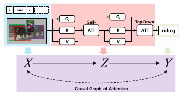
        
  

<!-- Simple eradication -->
   - [Causal Attention for Unbiased Visual Recognition](https://openaccess.thecvf.com/content/ICCV2021/papers/Wang_Causal_Attention_for_Unbiased_Visual_Recognition_ICCV_2021_paper.pdf)
  
      - 

Maheep's Notes

        Background plays a very common role as confounder and demands to train the model in way such as all the objectys come with various background so as to prevent bias in the model, e.g., a “dog” model is learned within “grass+dog” and “road+dog” respectively, so the “grass” and “road” contexts will no longer confound the “dog” recognition. But it faces with two types of problem:  
        1.) Such annotation is not only prohibitively expensive, but also inherently problematic, as the confounders are elusive in nature. 
        2.) Such coarser contexts will lead to the over-adjustment problem. The intervention not only removes the context, but also hurts beneficial causalities.  
        Also splitting the context split, to merge the ground-truth contexts into bigger splits to include all classes also faces problem as this kind of intervention removes the non-causal features of different contexts. Therefore the author proposes a causal attention module(CaaM) that self-annotates the confounders in unsupervised fashionto over-come the adjustment problem. This results in retaining of causal features
        
        `M` while eradicating the non-causal features `S` as shown in the figure below. Therefore to disentangle the the `S` and `M`, the equation can be derived as: 
        `P(Y|do(X)) = sigma_for_s sigma_for_m P(Y|X, s, m)P(m|X,s)P(s)`
        
   
   
        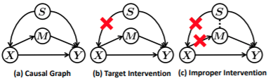
        
  

<!-- Using dictionary(last category) -->
   - [Causal Intervention for Weakly-Supervised Semantic Segmentation](https://openaccess.thecvf.com/content/ICCV2021/papers/Wang_Causal_Attention_for_Unbiased_Visual_Recognition_ICCV_2021_paper.pdf)
      - 

Maheep's Notes

         In Weakly-Supervised Semantic Segmentation(WSSS) the confounder creates a major problem as the non-causal features gets associated with positively correlated pixels to labels, and also disassociates causal but negatively correlated ones. The author proposes to eradicate it using the backdoor adjustment. The Ground Truth(GT) is extracted using the CAM and therefore pseudo-labels with is used to train the model. The author proposes 4 main varibales for the SCM, i.e. Confounder "C", Mediator "M" which act as the image-specific representation, Input "X" and Output "Y", where the direct effect of "C" is cutoff from "X", by using class-specific average mask to approzimate the confounder 

         `C = {c1, c2, c3,.....,cn}` where `n` is the class size to finally compute the equation. 
        

        
        
        
  

<!-- Simple deconfounding -->
   - [Comprehensive Knowledge Distillation with Causal Intervention](https://proceedings.neurips.cc/paper/2021/file/b9f35816f460ab999cbc168c4da26ff3-Paper.pdf)
      - 

Maheep's Notes

        The paper proposes CID for an efficient biased free knowledge distillation, which is able to transfer the class representations which are largely ignored by the existing literature and by using softened logits as sample context information removes biases with causal intervention. The author implements it as: 
        1.) They distill the feature vector in the last layer. 
        2.) They use MSE on normalized vectors so as to get the MSE not to get biased towards the samples that have large-norm features. 
        3.) They integrate the class representations using the class shapes to incorporate it into the student model as so not to only transfer the sample representation. 
        4.) By using the backdoor adjustment the effect of the prior knowledge of the teacher model because of the object and background co-occurences by setting each item to the prior knowledge to a class.  

        
        
  

<!-- Dicitonary(last method) -->
   - [Causal Intervention for Object Detection](https://ieeexplore.ieee.org/document/9643182)
      - 

Maheep's Notes

        The paper proposes to remove bias from the object detection models using the intervention, where the author uses the idea of two-stage detectors and apply backdoor adjustment to virtually obtain 

        `P(Y|do(X))` where the author proposes 4 variables namely input `X`, output `Y`, context confounder `C` and mediator `M` affected by both `X` and `C`, where the `C = {c1. c2, ..., cn}` belonging to different `n` categories in the dataset. The output `P(Y|do(X))` is represented as: 

        `P(Y|do(X)) = sigma P(c)P(Y|X,M = f(X,c))` where `M` is represented as  
        `M = sigma a_i*c_i*P(c_i)` 
        where `a_i` is the attention for category specific entry `c_i`.  

        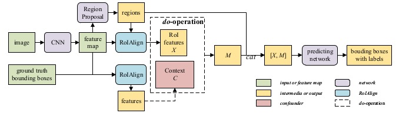
        
 

<!-- Simple deconfounding -->
   - [A Closer Look at Debiased Temporal Sentence Grounding in Videos: Dataset, Metric, and Approach](https://arxiv.org/pdf/2203.05243.pdf) 
      - 

Maheep's Notes

          The work focuses on Temporal Sentence Grounding in Videos, where SOTA models are being proposed but harness correlated features to increase the accuracy as tested by the author by creating a new dataset via merging two datasets and making the test data out of OOD examples. The author also argues on the metrics used by the previous works to get to optimal performance as the traditional metrics often fails when dataset contains over-long ground-truth moments get hit especialy with the small IOU threshold. Therefore the author proposes a new metric, i.e. *dR@n, IOU@m* that takes temporal distances between the predicted moments and ground-truth. To de-confound the network they propose to cut the different confounders effects on the label using the backdoor method and also to get the good/robust feature on language they exploit a semantic role labeling toolkit to parse the sentence into a three-layer semantic role tree, and a more fine-grained sentence feature is obtained by adopting hierarchical attention mechanism on the tree. For visual information, in order to discriminate video moments and distinguish different temporal relationships, a reconstruction loss function is created to enhance the video moment features.  

        
  

<!-- Memory bank(last method) -->
   - [Causal Intervention for Subject-deconfounded Facial Action Unit Recognition](https://www.aaai.org/AAAI22Papers/AAAI-399.ChenY.pdf) 
      - 

Maheep's Notes

          The work focuses on Facial expressions and the confounging factors that come due to individual's subject particular a slight variant in style to express an expression. The author solves this problem with a very unique method by taking into account the **Action Unit**, i.e. different sub-parts or muscles in a face where an individual may have some other mucles also getting activated than the muscles that are universal for that expression. The author proposes a model-agnostic system that not only considers the low-level facial-appearance features but also high level semantics relations among Action Units as they depend upon each other. The author builds and SCM by proposing 4 varibales, i.e. Image 
          
          *X*, Subject(Confounder) *S*, Latent Representation *R* and output *Y*, where the author eradicates the effect of *S* on *X*. The author implements it by having three modules: 
          1.) **Attention Module**: It takes the attention of the extracted feature and the different AU for each Subject which are computed by taking the average of all the samples of the Subject, denoted by `s_i` 
          2.) **Memory Module**: It consist `s_i` as defined above 
          3.) **Confounder Priors**:  It consist of the sample distribution of different `s_i` by taking the number of (samples in that subject)/(total samples)  

         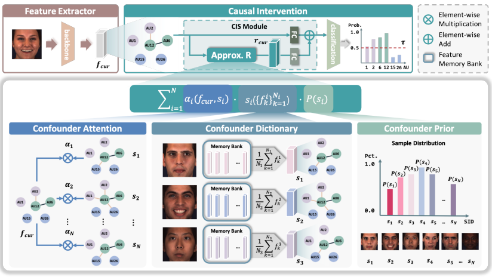
        
  

FrontDoor
---
   - [Confounder Identification-free Causal Visual Feature Learning](https://arxiv.org/abs/2111.13420)
      - 

Maheep's Notes

         The paper aims to eradicate all the confounders that are present without observing them using the frontdoor adjustment criteria and also try to explain the success of MAML algorithm. The work deals with two major questions:  
         1.) How to model the intervening effects from other samples on a given sample in the training process.  
         2.) How to estimate the global-scope intervening effect across all samples in the training set to find a suitable optimization direction.  
         and therefore proposes a gradient-based optimization strategy to mitigate the intervening effects using an efficient cluster then-sample algorithm to approximate the global-scope intervening effects for feasible optimization. The author implements it by explicitly modelling the intervening effects of another sample x̃ on Z = h(x) effecting Y by instantiating P (Y |Z = h(x), x̃) with the calculated gradients of the sample x̃ with respect to f 

         `P(Y|Z = h(x), x̃) = f(Z = h(x))P(x̃)`  
         after clustering-then-sampling using the k-mean.

        
        
  

Explanation
---
   - [Learn-Explain-Reinforce: Counterfactual Reasoning and Its Guidance to Reinforce an Alzheimer’s Disease Diagnosis Model](https://arxiv.org/abs/2108.09451) <!--- Not able to understand properly --> 
      - 

Maheep's Notes

         The work proposes to unify diagnostic model learning, visual explanation generation using the counterfactual explanation using a target class, and trained diagnostic model reinforcement guided by the visual explanation on the discriminative features extracted by the counterfactual explanation on the mSRI data for the muti-class classification. The author implements the system by learning the counterfactual map for explanation which consist of three modules 
         
         **Counterfactual Map Generator(CMG)**, **Reasoning Evaluator(RE)** and a **Discriminator(DC)**, where CMG generates the counterfactual image using the U-net technique giving a Mask and adding it to the input as given in the image below. RE directly evaluates the effect of the generated counterfactual map in producing the targeted label, and Discriminator makes it sure that the generated image look realistic. The **Reinforcement Representation Learning** tries to create a guide map using the above counterfactual map which highlight the extreme regions, i.e. the normal and the regions that have high probability that are abnormal.

        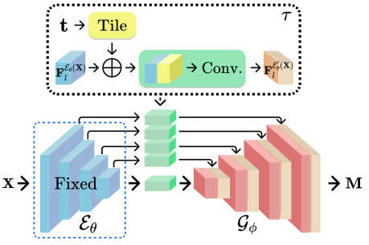

        
  

   - [Counterfactual Explanation of Brain Activity Classifiers using Image-to-Image Transfer by Generative Adversarial Network](https://arxiv.org/abs/2110.14927)
      - 

Maheep's Notes

        The paper proposes to generate counterfactual explanation for multi-class classification of fMRI data. The author proposes 
        
        **CAG** which is build upon **StarGAN**. The explanation is based upon the **Correct Classification** and **Incorrect Classification**, where the CAG converts the input to the target class and subtracts it pixel-wise so as to extract the activated regions, giving red(blue) output activation as to answer why the classifier predicted(not predicted) the target class. Auxillary discriminator is introduced so as to have a single discriminator to control multiple classes and produce their probability distribution, based on source and target class. 

        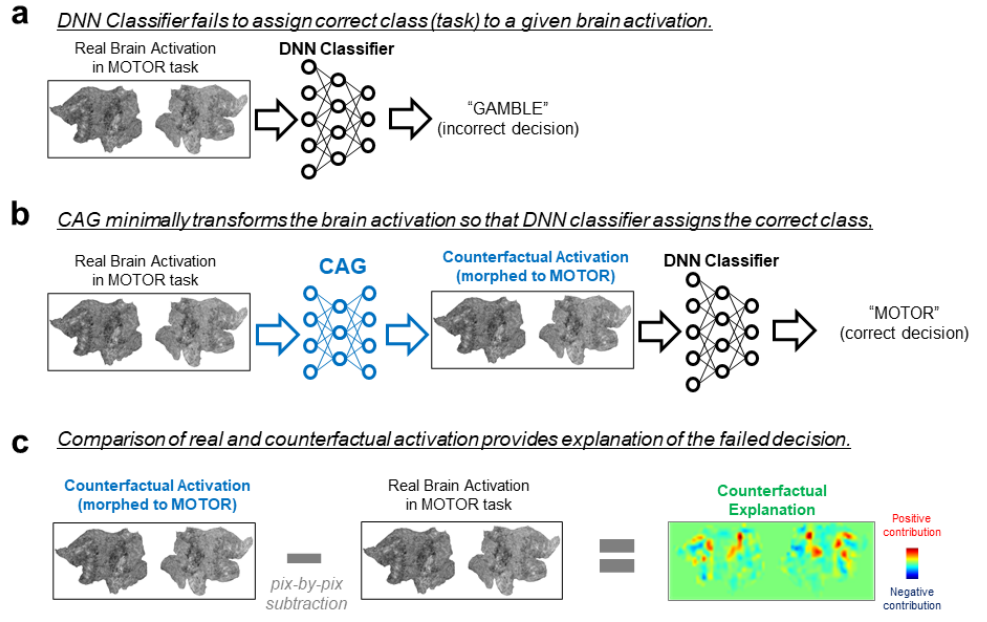

        
 

   - [Counterfactual Explanation Based on Gradual Construction for Deep Networks](https://arxiv.org/abs/2008.01897)
      - 

Maheep's Notes

         The work focuses on modifying the charecteristic of the image given the features of the Deep Neural Network classifier. The author takes in two measures, i.e. the image shold be easily explainable and should only be minimally modified.  
         The author impelements it using the two steps, namely: 
         
         1.) 
         
         **Masking Step**: It mask the appropriate region of the image, to which the model pays most attention, extracted using the gradients. 
         2.) **Composition Steps**: It perturbs the regions minimally so as to change the logits to the target class.

        

        
 

   - [GANterfactual - Counterfactual Explanations for Medical Non-Experts using Generative Adversarial Learning](https://arxiv.org/abs/2012.11905)
      - 

Maheep's Notes

         The work proposes to create counterfactual explanation images for medical images by taking in two measures, i.e. there should be minimal change in the original image and the classifier predicts it in to the target class. The author accomplishes this goal using the image-to-image translation using StarGAN as shown in the picture below.  

        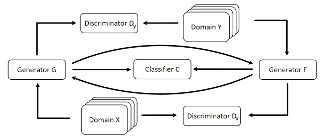

        
   

   - [Using Causal Analysis for Conceptual Deep Learning Explanation](https://arxiv.org/abs/2107.06098)
      - 

Maheep's Notes

         The work proposes to explain the model's decision using the hidden unit cells of the network in radiology. The author uses the associating the hidden units of the classifier to clinically relevant concepts using a linear sparse logistic regression. But to evaluate that the identified units truly influence the classifier’s outcome, they use mediation analysis through counterfactual interventions. A low-depth decision tree is constructed so as to translate all the discovered concepts into a straightforward decision rule, expressed to the radiologist. Technically the author implements it by using: 
         1.) 
         
         **Concept Associations**: The network is divided into 
         
         `phi1(.)` and `phi2(.)`, where the `phi1(.)` gives different concept in terms of features and `phi2(.)` do prediction. The output of `phi1(.)` gives a vector of `lbh` dimension with each unit having a binary prediction, i.e. if concept is present or absent.
          
         2.) **Causal concept ranking**: A counterfactual `x'` for the input   `x` is generated for causal inference using a cGAN, where the concepts are denoted with `Vk(x)` and the left over hidden units are denoted by `bar(Vk(x))` and the effect is measured by:  
         `A = phi2(phi1(do(Vk(x)), bar(Vk(x'))))`  
         `B = phi2(phi1(Vk(x), bar(Vk(x))))` 
         `Effect = E[A/B - 1]` 
         3.) **Surrogate explanation function**: A function `g(·)` is introduced as a decision tree because many clinical decision-making procedures follow a rule-based pattern, based on the intial classifier `f(.)` based on the logits produced for different concepts. 

        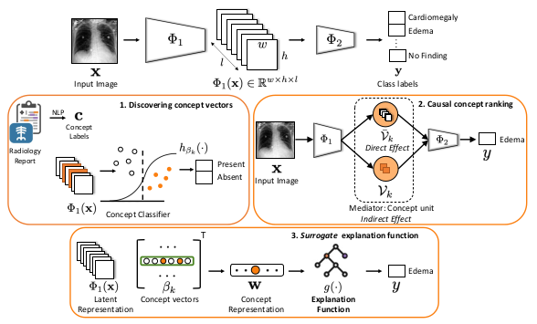

        
  

   - [COIN: Counterfactual Image Generation for VQA Interpretation](https://arxiv.org/pdf/2201.03342.pdf)
      - 

Maheep's Notes

        The paper focuses on interpretability approach for VQA models by generating counterfactual images by minimal possible change, ensuring the image looks realistic. This paper introduces an attention mechanism that identifies question-critical objects in the image and guides the counterfactual generator to apply the changes on specific regions. Moreover, a weighted reconstruction loss is introduced in order to allow the counterfactual generator to make more significant changes to question-critical spatial regions than the rest of the image.  
        This is implemented by instead of generating a counterfactual image 
        
        `I'` based on the original image , the latter is concatenated with the attention map `M`, such that the concatenation `[ I; M]` serves as an input to the generator `G`, where the answer is passed into the `G` so as to create `I'`, where the regions are identified using GRAD-CAM, where the discriminator `D` ensures that image looks realistic and reconstruction loss is used to do miimal changes. The whole process happens as shown in the figure.  

        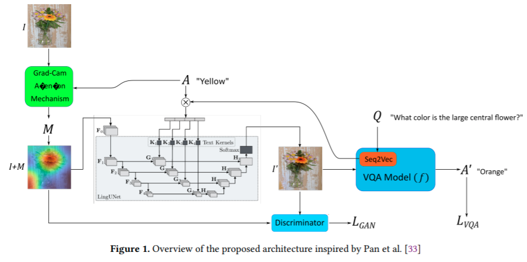
        
  

   - [Translational Lung Imaging Analysis Through Disentangled Representations](https://arxiv.org/abs/2203.01668) 
      - 

Maheep's Notes

         The work focuses on retrieving relevant information from the images of inter-species pathological processes by proposing the following features: 
         1.) able to infer the animal model, position, damage present and generate a mask covering the whole lung.  
         2.) Generate realistic lung images 
         3.) Generate counterfactual images, i.e. healthy versions of damaged input slice.  

         The author implements it by considering 3 factors for generating and masking the image, namely: animal model,
         
         `A`, the realtive position of axial slice, `S` and estimated lung damage, `Mtb`, via the hierarchy at different resolution scales `k`. By using the Noveau VAE to extract the latent space `z` variables to generate the mask `y` and image `x`.  

         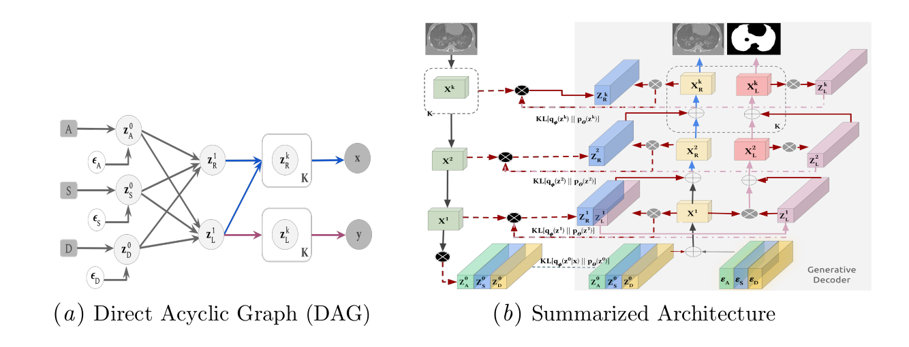
        
  

Generating Data using GAN
---

   - [Counterfactual Contrastive Learning for Weakly-Supervised Vision-Language Grounding](https://papers.nips.cc/paper/2020/file/d27b95cac4c27feb850aaa4070cc4675-Paper.pdf)
      - 

Maheep's Notes

        The paper aim to solve the problem of Weakly supervised Vision Language Grounding, i.e. to localize target moments in a video using a query. The author uses counterfactual scenario to make the process more robust, based on the feature-level, relation-level and interaction level.  
        The two types of approaches are introduced so as to generate the counterfactual scenarios, namely 
        
        **DCT** and **RCT**, where the **DCT** aims to generate negative counterfactual scenarios by damaging the essential part of the visual content and **RCT** aims to generate three types of counterfactual scenarios, namely: **feature-level**, **interaction-level** and **relation-level** generate positive counterfactual scenarios by damaging inessential part of the visual content based on the above defined 3 approaches.  
        A ranking loss is also developed so as to develop the difference between the positive and negative samples.  
        The **feature-level** focuses on the critical region proposals, which are modified using the memory bank containing the proposal features from randomly selected different samples, whereas the **interaction-level** features also uses memory bank to modify the interaction-level features, i.e. the word level features that correspond to the proposal features. The memory-bank contains the language features from different samples.  
        The **relational-level** approach focuses on the relation, i.e. the edges connecting the propsal "j" from proposal "i". The crucial edges are then destroyed by **DCT** whereas the inessential by **RCT**. 

        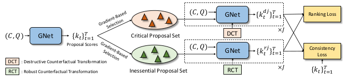
        
  

Augmentation
---
   - [C_3 : Compositional Counterfactual Constrastive Learning for Video-grounded Dialogues](https://arxiv.org/abs/2106.08914)
      - 

Maheep's Notes

        The paper focuses on the video-grounding using the diaglouges and inputs, where the author inlcudes the turn based events which let the model give high priority to some instances rather than uniformly giving to all. Also the author separates the dialogue context and video input into object and action, through which they are able to parse through if the query is about object or any action taken, as shown in the figure below.  
        
        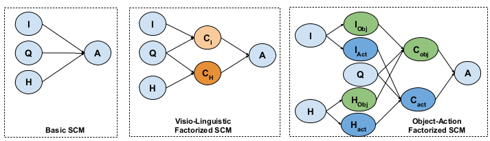

        Also they generate counterfactual scenarios by removing irrelavant objects or actions to create factual data and by removing relevant object or actions, they generate counterfactual data, finally making the equations as: 

        `H_t^- = H_{t, obj}^- + H_{t, act}` 
        `H_t^+ = H_{t, obj}^+ + H_{t, act}` 
        `I^- = I_obj + I_act^-` 
        `I^+ = I_obj + I_act^+` 

        where `H_t^-` denotes counterfactual dialogue context in instance `t` and `I^-` represents the counterfactual image input.

        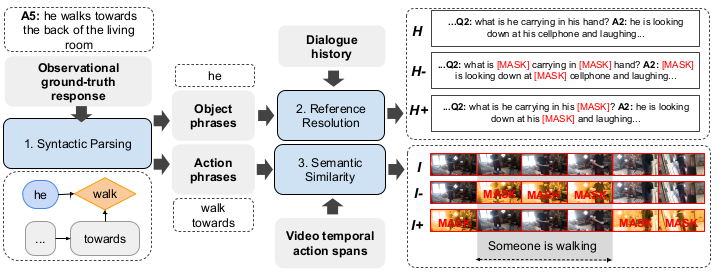
        
  

   - [Efficient Counterfactual Debiasing for Visual Question Answering](https://openaccess.thecvf.com/content/WACV2022/papers/Kolling_Efficient_Counterfactual_Debiasing_for_Visual_Question_Answering_WACV_2022_paper.pdf)
      - 

Maheep's Notes

        The paper proposes a novel model-agnostic counterfactual training procedure, namely Efficient Counterfactual Debiasing (ECD). The author implements the technique by defining the three modules in this work: 
        1.) 
        
        **ECD-V**: The module focuses on creating the counterfactual and factual scenes in the the visual regions which are identified by extracting the nouns using POS tagger from questions and similarity is defined between the nouns and object categories. The ones with highest scores are removed from the image.  
        2.) **ECD-Q**: The module focuses on creating the counterfactual and factual questions in the question regions by separating *question-type words* and *stop-words* to identify the critical words, which are removed to create counterfactual questions and factual are created by removing the inessential words, i.e. *question-type words* or *stop-words*. 
        3.) **Negative Answer Assignment**: The module assign ground-truth answers to counterfatual pairs. To make this effective the author analyzes the number of occurrences of each answer and normalize the number of occurrences of an answer for a specific question by the total number of occurrences of that question type in the training set. The top-N answers with the highest predicted probabilities are selected as A+ and the Ground-truth answers(GT) and the negative answers A- as all answers of GT but those in A+.

        
        
 

   - [Free Lunch for Co-Saliency Detection: Context Adjustment](https://arxiv.org/abs/2108.02093)
      - 

Maheep's Notes

        The paper focus on collecting dataset for co-saliency detection system called Context Adjustment Training. The author introduces counterfactual training to mitigate the finite dataset to achieve the true data distribution. Based on it the author proposes to use context adjustment using the 
        
        **group-cut-paste** method to imporve the data distribution. GCP turns image `I` into a canvas to be completed and paint the remaining part through the following steps:  
        (1) classifying candidate images into a semantic group Z (e.g., banana) by reliable pretrained models 
        (2) cutting out candidate objects (e.g., baseball, butterfly, etc.)  (3) pasting candidate objects into image samples as shown in the figure below. 
        To make the process more robust the author proposes to have three metrics, namely: 
        a.) **Abduction**: In the new generated data the co-saliency image should remina unchanged. 
        b.) **Action**: The mask sould remain unchanged from the GT of the image and should be optimal for it's value. 
        c.) **Prediction**: The probability distribution of the image should remian unchanged. 

        

        
 

   - [ALIGN-DEFORM-SUBTRACT: AN INTERVENTIONAL FRAMEWORK FOR EXPLAINING OBJECT DIFFERENCES](https://arxiv.org/abs/2203.04694) 
      - 

Maheep's Notes

         The work focuses to define the differences betwen the objects by intervening on the image of the source object 

         `X_s` converting into the target object image `X_t`, by modifying it and quantifying the parameters via changing it's **affnity** by changing the scaling `s`, translation `∆t` and in-plane rotation `∆θ`. **Shape** acts as the second parameter by which the image is changed. The transformation takes place in the same order as if shape is changed before that it will also have the effect of changing the pose of the image. **Subtract** act as the third module to change the image via removing the background using a segmentaion model to see the apperance difference using MSE.  

         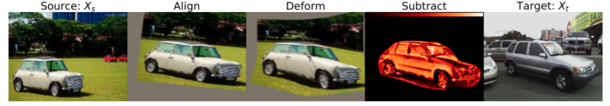
        
 

Augmentation_Others
---   
   - [Causality-inspired Single-source Domain Generalization for Medical Image Segmentation](https://arxiv.org/pdf/2111.12525.pdf)
      - 

Maheep's Notes

        The paper proposes solve the problem of Domain Generalization for image segementation m using the two modules: 
        1.) 
        
        **GIN**: It promotes to preserve the shape of information as it is one of the most improtant information that remains invariant while domain shift and also is intuitively causal to segmentation results.  
        This is implemented by augmenting the image to have diverse appearances via randomly-weighted shallow convolutional networks, as shown in the diagram below. 
        2.) **IPA**: It focuses on removing the confounding factors from the image like thebackground and also the acquisiton process, where different tissues are given different color. The author uses 

        `do(.)` to remove the confouning nature of on `A` on `S` by transforming the `A` using the `T_i(.)` photometric transformation.  
        The psuedo-correlation is proposed so as to deconfound background that is correlted with the output by changing the pixels that correspond to different values are given different values unsupervised fashion. The pseudo-correlation map is impelemnted by using the continous random-valued control points with low spatial frequency, which are multiplied with the `GIN` augmented image.  

        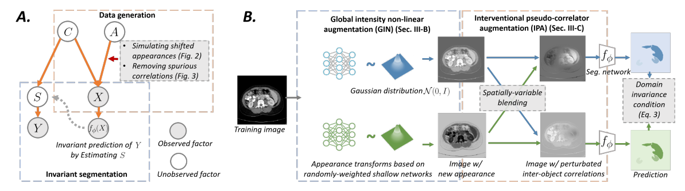
        
 

Subtraction
---
   - [Distilling Causal Effect of Data in Class-Incremental Learning](https://arxiv.org/abs/2103.01737)
      - 

Maheep's Notes

        The paper proposes to immune the forgetfull nature of NN while shifting to new data from old data. The author discusses the three main methods which are used now to mitigate this problem. 
        1.) 
        
        **Data Replay**: This focus on to include a small percentage of old data in the new data. 
        2.) **Feature Distillation** and **Logit Distillation**: This focuses on to the effect is the features/logits extracted from the new data by using the old network, which is imposed on the new training by using the distillation loss, regulating that the new network behavior should not deviate too much from the old one. 

        The paper focuses on to explain the causal effect of these methods. The work proposes to calculate the effect of old data on the current predicition  
        
        `Y`, making the equation `Effect = P(Y|D = d) - P(Y|D = 0)`, which comes `0` when the old data has no influence on `Y`, while if we calculate the impact in replay or distillation, will not be `0`. The work proposes to further enhace the replay method by passing down the causal effect of the old data, rather than the data. Therefore making the whole process computationally inexpensive by conditioning on `Xo`, i.e. the old data representaiton and therefore making the equation: 
        `Effect = P(Y|I, Xo)(P(I|Xo, D = d) - P(I|Xo, D = 0))`  
        further defining it as:  
        `Effect = P(Y|I, Xo)W(I = i, Xo, D)` 
        The paper aims to increase the value of `W(.)` expression as it depends the close similarity between the representation of the similar image in old model and new model.
        
         
        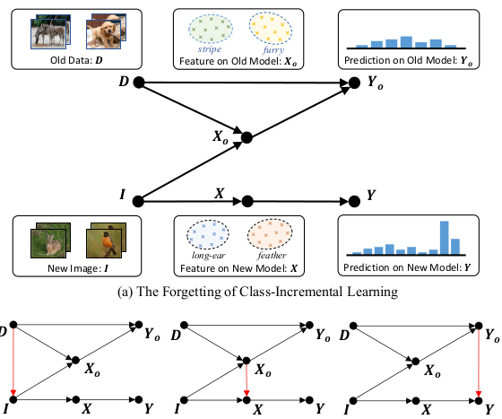

        
 

   - [Counterfactual Attention Learning for Fine-Grained Visual Categorization and Re-identification](https://arxiv.org/abs/2108.08728)
      - 

Maheep's Notes

        The paper proposes to improve attention using a counterfactual attention learning method based on causal inference. The author argues that the most existing methods learns the attention in a weakly-supervised way. The basic idea is to quantitate the quality of attentions by comparing the effects of facts (i.e., the learned attentions) and the counterfactuals (i.e., uncorrected attentions) on the final prediction (i.e., the classification score). Then, we propose to maximize the difference to encourage the network to learn more effective visual attentions and reduce the effects of biased training set. The author implements it by: 
        1.) The attention maps are extracted from the image, 

        `A = {A1, A2, A3,....., An}`, the attention maps are used to extract the respective feature from the image. `hi = gamma(X*Ai)`, where all the `hi` are normalized to get the `h = normalize(h, h2,...., hn)` which is used to predict. 
        2.) The attention is intervened to get the effect on the output of the model, i.e.  
        `Y_effect = E[Y(A = A, X = X) - Y(do(A = bar(A))), X = X]` 
        It is expected to achieve two-conditions using this method:  
        a. ) The attention model should improve the prediction based on wrong attentions as much as possible, which encourages the attention to dis- cover the most discriminative regions and avoid sub-optimal results  b.) The prediction based on wrong attentions is penalized, which forces the classifier to make decision based more on the main clues instead of the biased clues and reduces the influence of biased training set.

        

        
 

   - [Causal Scene BERT: Improving object detection by searching for challenging groups of data](https://arxiv.org/pdf/2202.03651) 
      - 

Maheep's Notes

          The work is based on the rare scenarios that occur in the self-driving where the model is built and then when it fails for a group, the dataset is collected, annotated and the model is trained on that, which is a very time-consuming and risky process. The author proposes to identify these groups during the training of the model such as specific 

          *weather patterns*, *Vehicle types* and *Vehicle positioning*. The author harnesses the Simulation and **MLM**(Masked Language Model) to apply causal intervention so as to generate counterfactual scenarios while **MLM**, acts as a Denoising Autoencoder to generate data near true distribution. The different tokens represent different groups such as *weather*, *agent asset*, *rotations*, etc. and are masked to generate counterfactual image. The author uses the score function `f(phi, I, L)` where `phi` is the model, `I` is the image and `L` is the label. The score function is used to identify the vulnerable groups using the `rho` function:  
          `rho` =  `f(phi, I', L')` - `f(phi, I, L)` 
          if `|rho| >= t`, where `t` is the threshold, which defines if the `rho` is very negative or positive then the modified group is vulnerable.

        
  

   - [Driver-centric Risk Object Identification](https://arxiv.org/abs/2106.13201) 
      - 

Maheep's Notes

         The work proposes to preapre the dataset for identifying risk objects using the Intention and Response of the driver, where a model is deployed to match the response prediction from the driver prediction. The author implements by having the modules of 

         **Perception**, which represents different embeddings of the objects present, **Comprehension** which evaluates the interaction between the driver and thing or stuff using the Ego-Thing Graph and Ego-Stuff Graph, where Ego-Thing Graph have the embedding of how the driver react with the things such as the car, person, bicycle and the Ego-Stuff Graph have the embedding of how the driver reacts with the Stuff in the envionment such as roads, footpath, and Traffic Sign. The last module is of **Projection**  which is used to predict the future forecasts.  

         The Causal reasoning module is added to the model so as to augment the data only in "GO" scenarion, i.e. no risk objects are present to remove the non-causal features by randomly selecting top k ransdom objects. It is also used in "STOP" scenarios, to identify the risk object identification by using the same intervention maethod of inpainting. The "GO" score is computed by removing the different object and the one object with removal that gives the highest "GO" score is identified as the risk object.  
        
 

Others
---
   - [How Well do Feature Visualizations Support Causal Understanding of CNN Activations?](https://arxiv.org/abs/2106.12447)
      - 

Maheep's Notes

        The paper proposes to identify the benefits of providing users with visualization of unit's activation based on different features of the input, so as to provide humnas with precise information about the image features that casuse a unit to be activated.  
        The author uses the counterfactually inspired task to evaluate how well do feature visualization support causal understanding of CNN activations. The author implements it by using 5 kiond of images, namely:  

        1.) 
        
        **Synthetic Reference** : These are image that are generated from optimized result of feature visualization method. 
        2.) **Natural Reference** : Most strong actiavted samples are taken from the dataset. 
        3.) **Mixed Reference** : 4 synthetic and 5 Natural refernce are taken, to take the best of both worlds 
        4.) **Blurred Reference** : Everything is blurred, except a patch. 
        5.) **No Reference** : Only query image is given and no other image. 

        The author concludes the research by concluding that the performance of humans with visualization and no visualization did not have very significant differences.

        
        
                

   - [CausalAF__Causal_Autoregressive_Flow_for_Goal_Directed_Safety_Critical](https://arxiv.org/abs/2110.13939)
      - 

Maheep's Notes

        The paper proposes to generate goal-direceted data satisfying a given goal for safety-critical situations. The author argues that the 
        
        **Behavioural Graph** unearths the causality from the **Causal Graph** so as to include in the generated samples. This is done using two methods namely: 
        1.) **COM** : It maintians the **Q** , to ensure that the cause is generated in terms of nodes only after the effect. It is also noted that the node have many parents, therefore the node is considered valid only when all of it's parents have been generated.  
        2,) **CVM** : The correct order of causal order is not sufficient for causality therefore CVM is proposed so as to only consider the nodes when the information of it's parents are available and the information only flow to a node from it's parents. 

        

        
                

   - [Improving Users’ Mental Model with Attention-directed Counterfactual Edits](https://arxiv.org/abs/2110.06863)
      - 

Maheep's Notes

        The paper show that showing controlled counterfactual image-question examples are more effective at improving the mental model of users as compared to simply showing random examples. The statement is evaluated by asking the users to predict the model’s performance on a test counterfactual image. It is noted that, overall an improvement in users’ accuracy to predict answer change when shown counterfactual explanations. The counterfactual image is generated either by retrieving an image where the answer is different or by removing the visually important patch from the image, which is identified using the attention maps, using a GAN network. The patch with high and low attention are removed to evaluate the decision of VQA. Based on it a user can hypothetically learn whether the VAQ model is behaving rationally or not. 

        

        
      

   - [Causal affect prediction model using a facial image sequence](https://arxiv.org/abs/2107.03886) 
      - 

Maheep's Notes

         The work proposes to learn the causal affect prediction network (CAPNet), which uses only past facial images to predict corresponding affective valence and arousal, after learning the causal inference between the past images facial-expressions and the current affective state. The author implements it as: 
         The system mainly consist of 2 modules: 
         1.) 
         
         **Feature Extractor**: The module consist of REsNeXt and SENet to extract the features from the image using the FER model as it is and output the valence and arousal of the subject. 
         2.) **Causality Extractor**: It consist of a LSTM layer and two FC layers. During the integration of sequential data into the single hidden state, the LSTM layer learn the causal inference between the past facial images and the affective state. The FC layers eventually convert the single hidden state to the predicted affective state.  

        

        
  

   - [iReason: Multimodal Commonsense Reasoning using Videos and Natural Language with Interpretability](https://arxiv.org/abs/2107.10300) 
      - 

Maheep's Notes

         The work proposes to extract the causal events using the videos and text. The author claimes that objects in the video and time-ordered nature of events promotes causality, therefore removing bias. The author implememnts by using the architecture given below. 

        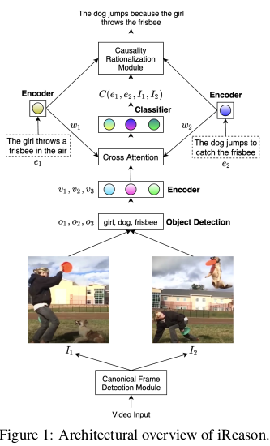

        The CFDM module localize the said events in the video and outputs a pair of images, i.e. 
        
        `I1` and `I2` from the video. The aim is to infer causality from the event in `I1` into `I2`. The **Causality Rationalization Module** outputs a string explaining the commonsense reasoning using natural language for causal events `e1` from `I1` and `e2` from `I2`.

        
  

   - [CausalCity: Complex Simulations with Agency for Causal Discovery and Reasoning](https://arxiv.org/abs/2106.13364) 
      - 

Maheep's Notes

         The work proposes to generate a data with rare events in substantial amount for safety-critical decisions of driving using a simulated environment having the ability to introduce confounders, observed and unobserved using the agency or high-level controls, that define the agents behaviour in an abstract format. The author implements it as: 

         The author introduces two main things that totallly build up the whole simulated environment, i.e. 
         
         **JSON** file that contains the vehicles that should be present, their start location, and high-level features which are flexible and can be regulated using the **Python API**. To make the whole enviroment 6 types of varibales are introduced, namely:  
         1.) **Environment Features**: It contains the information about the basic objects in the environment like trees, pole, etc.  
         2.) **Vehicles**: It contains the vehicle positions, their velocities and information about the collision.  
         3.) **Traffic Lights**: It contains the information where the traffic lights will be and how will they react at different time frame. 
         4.) **Environment**: It contains the information about the weather, from which the confounders can be easily added.  
         5.) **Views/Cameras**: It has the ability where to place the camera for recording, therefore providing the dataset with third person or bird eye view.  
         6.) **Logging**: The log of different vehicles and state of traffic lights are recorded in it. Although other things can also be included.    

         Using the author prepares two types of dataset: 
         a.) **Toy Dataset**: It contains no confounders, agency but only causal relationship. 
         b.) **CausalityCity**: It contains confounders, agency and also causal relationship.

        

        
  

 

   - [Dependent Multi-Task Learning with Causal Intervention for Image Captioning](https://arxiv.org/abs/2105.08573) 
      - 

Maheep's Notes

         The work proposes to enhance the capability of Image Captioning systems by creating the content consistency to have non-contradicting views and provide informative information. The author implements it by eradicating the counfounder, cutting the link between the visual features and possible confounders. This is done by introducing a mediator 

         `m` and the proxy confounder `c` to eradicate the real confounder `z_c`. In these type of systems it is to be considered that the mediator is not affected by the counfounder after the intervention. 

        

        
  

   - [Structure by Architecture: Disentangled Representations without Regularization](https://arxiv.org/abs/2006.07796) 
      - 

Maheep's Notes

         The work focuses on the problem of self-supervised structured representation learning using autoencoders for generative modeling. The author proposes the structural autoencoder architecture inspired by structural causal models, which orders information in the latent space, while also, encourages independence. Notably, it does so without additional loss terms or regularization. The SAE architec- ture produces high quality reconstructions and generated samples, improving extrapolation, as well as achieving a significant degree of disentanglement across a variety of datasets.

        
      

   - [EXTRACTING CAUSAL VISUAL FEATURES FOR LIMITED LABEL CLASSIFICATION](https://arxiv.org/abs/2103.12322) 
      - 

Maheep's Notes

         The work focuses to extract causal features
         
         `C`, separating them from context features `B` while computed from Grad-CAM using the Huffman encoding which increases the performance by 3% in terms of accuracy and also retains 15% less size in bit size.  
         The author implements it by arguing that given the just features `G = C U B` are given. By taking the analogy of the sets given below, the author extracts `B` as given in the following equations below: 

        

         `C_p = G_p - B_p`,.....................(1) i.e. for prediciton `p` 
         `B_p = C_(p,q) - C_(bar(p),bar(q)) - C_(bar(p),p)` ...................(2) 
         which denotes the following things: 
         `C_(p,q)`: "Why p or q?" 
         `C_(bar(p),bar(q))`: "Why neither P nor Q" 
         `C_(bar(p),p)`: "Why not P with 100% confidence?" 

         Therefore (1) can be eaily be obtained after substituting the value of (2) in it. 
        
  

   - [CRAFT: A Benchmark for Causal Reasoning About Forces and inTeractions](https://arxiv.org/abs/2012.04293) 
      - 

Maheep's Notes

         The work proposes a dataset named CRAFT visual question answering dataset that requires causal reasoning about physical forces and object interactions. It contains three question categories, namely:  

         1.) **Descriptive Questions** : It requires extracting the attributes of objects, especially those involving counting, need temporal analysis as well 
         2.) **Counterfactual Questions** : It requires understanding what would happen if one of the objects was removed from the scene. For ex: *“Will the small gray circle enter the basket if any of the other objects are removed?”*  
         3.) **Causal Questions** : It involves understanding the causal interactions between objects whether the object is causing, enabling, or preventing it.   

        
  

   - [Explanatory Paradigms in Neural Networks](https://arxiv.org/pdf/2202.11838) 
      - 

Maheep's Notes

          The work present a study on explainability in Neural Networks. The author explores the Observed Explanatory Paradigms through reasoning especially the 
          
          **Abductive Reasoning** from the three reasoning methods, including **Deductive Reasoning** and **Inductive Reasoning**. The author explains the **Abductive Reasoning** hypothesises to support a prediction and if seen abstractly defines it into three major fields, explained clearly by taking manifold into the picture, dealing with:  
          1.) **Observed Correlation**: It majorly deals with the question *Why P?*, where *P* is a class. The goal here is find all the dimensions of the manifold, denoted by 
          `T_f` from the constructerd manifold, denoted by `T` that justifies the class *P* classification from the network, denoted by `M_cu(.)` 
          2.) **Observed Counterfactual**: It majorly deals with the counterfactual question, i.e. *What if not P?*. It deals with interventions so as to change the direction of some of the dimensions by  intervention using `do(.)` calculus to indetify the most non-trivial features a specific attribute of *P* denoted by `M_cf(.)` 
          3.) **Observed Contrastive Explanations**: It majorly deals with the counterfactual question, i.e. *What P rathre than Q?*. It deals with interventions so as to change the direction of some of the dimensions to chenge the prediciton of network from `P` to `Q`, to identify the most non-trivial features separating class from *P* and *Q* denoted by `M_ct(.)` 
          The authors discusses **Probabalistic Components of Explanations** that can take into consideration the questions defined above and make explanation more substatial by: 
          `M_c(x) = M_cu(x) + M_ct(x) + M_cf(x)` 
          Besides this the author discusses about the **Contrast-CAM**, **Counterfactual-CAM**, **Grad-CAM** technique which is generally used for observing Observed Correlations. The **Counterfactual-CAM** is used for **Observed Counterfactual** negates the gradient to decrease the effect of the predicted class resulting in highlighted regions in case when the object used to make the decision were not present intially. The **Contrast-CAM** is used for third scenario of **Observed Contrastive Explanations** where a loss between class *P* and *Q* is constructed to backpropogate it and find contrastive features. 

         
        
  

