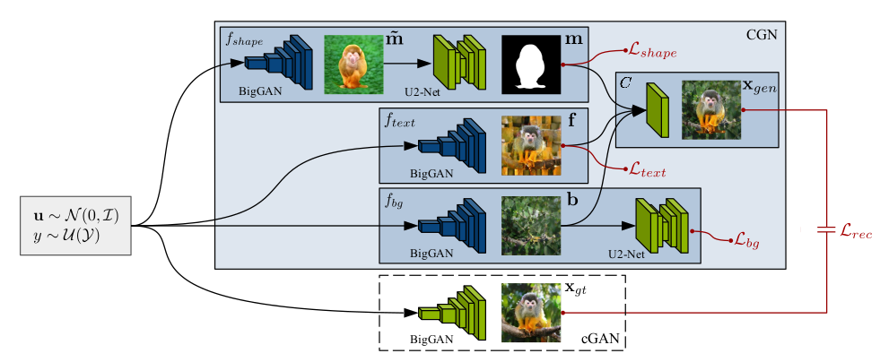

# Fields 

## Counterfactual Sythesizing or Causal augmentation

  - [Counterfactual Samples Synthesizing and Training for Robust Visual Question Answering](https://arxiv.org/pdf/2003.06576.pdf) [1, 5, 6]
      - 

Maheep's notes 

         In this research paper the author focuses on 2 major questions, i.e.  
         1) Visual-explainable: The model should rely on the right visual regions when making decisions. 
         2) Question-sensitive: The model should be sensitive to the linguistic variations in questions. 
         The author proposes a technique, i.e. CSST which consist  of CSS and CST which do counterfactual in VQA as the CSS generates the counterfactual samples by masking critical objects  in the images and words. The CST model tackles the second challenge of sensitivity is handled by  the CST which make the model learn to distinguish between the origianl samples and counterfactal ones. Addtionally it trains the model to learn both kind of samples, i.e. origianl and counterfactual ones, making  the model robust. 
        

  - [Counterfactual Zero-Shot and Open-Set Visual Recognition](https://arxiv.org/pdf/2103.00887.pdf) [4, 5, 6]
      - 

Maheep's notes 

         The author proposes a novel counterfactual framework for  both Zero-Shot Learning (ZSL) and Open-Set Recognition (OSR), whose common challenge is generalizing to the unseen-classes by only training on the seen-classes. all the unseen-class recognition methods stem from the same grand assumption: attributes (or features) learned from the training seen-classes are transferable to the testing unseen-classes. But this does not happen in practise.  

         ZSL is usually provided with an auxiliary set of class attributes to describe each seen- and unseen-class whereas the OSR has open environment setting with no information on the unseen-classes [51, 52], and the goal is to build a classifier for seen-classes. Thae author describers previous works in which the generated samples from the class attribute of an unseen-class, do not lie in the sample domain between the ground truth seen and unseen, i.e., they resemble neither the seen nor the unseen. As a result, the seen/unseen boundary learned from the generated unseen and the true seen samples is imbalanced.  

         The author proposes a technique using counterfactual, i.e. to generate samples using the class attributes, i.e. Y and sample attrubute Z by the counterfactual, i.e. 
         X would be x̃, had Y been y, given the fact that Z = z(X = x) and the consistency rule defines that if the ground truth is Y then x_bar would be x. The proposed genrative causal model P(X|Z, Y ) generate exapmles for ZSL and OSR. 
        

  - [CONTERFACTUAL GENERATIVE ZERO-SHOT SEMANTIC SEGMENTATION](https://arxiv.org/pdf/2106.06360.pdf) [1, 2, 6]
      - 

Maheep's Notes

        The paper proposes a zero-shot semantic segmentation. One of the popular zero-shot semantic segmentation methods is based on the generative model, but no one has set their eyes on the statstical spurious correlation. In this study the author proposes a counterfactual methods to avoid the confounder in the original model. In the spectrum of unsupervised methods, zero-shot learning always tries to get the visual knowledge of unseen classes by learning the mapping from word embedding to visual features. The contribution of the paper accounts as: 
        (1) They proposed a new strategy to reduce the unbalance in zero-shot semantic segmentation.  
        (2) They claim to explain why recent different structures of models can develop the performance of traditional work. 
        (3) They extend the model with their structures and improve its performance.

        The model will contain a total of 4 variables R, W, F and L. The generator will to generate the fake features using the word embeddings and real features of the seen class and will generate fake images using word embeddings after learning. However, this traditional model cannot capture the pure effect of real features on the label because the real features R not only determine the label L by the link R !L but also indirectly influence the label by path R ! F ! L. This structure, a.k.a. confounder. Therefore they remove the R!F!L and let it be W!F!L, removing the confounding effect of F. Also they  use GCN to generate the image or fake features from eord embeeddings using the GCN which alos provides to let the generator learn from similar classes. 
        

  - [Transporting Causal Mechanisms for Unsupervised Domain Adaptation](https://openaccess.thecvf.com/content/ICCV2021/papers/Yue_Transporting_Causal_Mechanisms_for_Unsupervised_Domain_Adaptation_ICCV_2021_paper.pdf) [1, 4, 5] 
      - 

Maheep's notes 

         Existing Unsupervised Domain Adaptation (UDA) literature adopts the covariate shift and conditional shift assumptions, which essentially encourage models to learn common features across domains, i.e. in source domain and target domain but  as it is unsupervised, the feature will inevitably lose non-discriminative semantics in source domain, which is however discriminative in target domain. This is represented by Covariate Shift: P (X|S = s) != P (X|S = t), where X denotes the samples, e.g., real-world vs. clip-art images; and 2) Conditional Shift: P (Y |X, S = s) != P (Y |X, S = t). In other words covariate dhift defiens that the features or images of both the target and source domain will be different. The conditional shift represents the logit probability from same class images in source and target domain will vary. The author argues that the features discartrded but are important say "U" are confounder to image and features extracterd.
         Therefore the author discovers k pairs of end-to-end functions {(M i , M i inverse )}^k in unsupervised fashion, where M(Xs) =  (Xt) and M i_inverse(Xt) = Xs , (M i , M i 1 ) corresponds to U i intervention. Specifically, training samples are fed into all (M i , M i 1 ) in parallel to compute L iCycleGAN for each pair. Only the winning pair with the smallest loss is updated. This is how they insert images with same content but by  adding U in both target and source domain using image generation. 
        

  - [CLEVRER: COLLISION EVENTS FOR VIDEO REPRESENTATION AND REASONING](https://arxiv.org/pdf/1910.01442.pdf) [1, 3, 4]
      - 

Maheep's notes 

         The authors propose CoLlision Events for Video REpresentation and Reasoning (CLEVRER) dataset, a diagnostic video dataset for systematic evaluation of computational models on a wide range of reasoning tasks. Motivated by the theory of human causal judgment, CLEVRER includes four types of question: descriptive (e.g., ‘what color’), explanatory (‘what’s responsible for’), predictive (‘what will happen next’), and counterfactual (‘what if’). 

          The dataset is build on CLEVR dataset and has predicitive both predictive and counterfactual questions, i.e. done by, Predictive questions test a model’s capability of predicting possible occurrences of future events after the video ends. Counterfactual questions query the outcome of the video under certain hypothetical conditions (e.g. removing one of the objects). Models need to select the events that would or would not happen under the designated condition. There are at most four options for each question. The numbers of correct and incorrect options are balanced. Both predictive and counterfactual questions require knowledge of object dynamics underlying the videos and the ability to imagine and reason about unobserved events.

          The dataset is being prepared by using the pysics simulation engine.
        

  - [Towards Robust Classification Model by Counterfactual and Invariant Data Generation](https://openaccess.thecvf.com/content/CVPR2021/papers/Chang_Towards_Robust_Classification_Model_by_Counterfactual_and_Invariant_Data_Generation_CVPR_2021_paper.pdf) [1, 2, 5]
      - 

Maheep's notes 

         The paper is about augmentaiton using the counterfactual inference by  using the human annotations of the subset of the features responsible (causal) for the labels (e.g. bounding boxes), and modify this causal set to generate a surrogate image that no longer has the same label (i.e. a counterfactual image). 
         Also they alter non-causal features to generate images still recognized as the original labels, which helps to learn a model invariant to these features. 

         They augment using the augmentaions as: None, CF(Grey), CF(Random), CF(Shuffle), CF(Tile), CF(CAGAN) 
         and the  augmentaions which alter the invariant features using: F(Random) F(Shuffle) F(Mixed-Rand) F(FGSM)
        
      

        
   - [Counterfactual Vision-and-Language Navigation via Adversarial Path Sampler](https://arxiv.org/pdf/1911.07308.pdf) [5, 6]
      - 

Maheep's Notes

        The paper focuses on Vision-and-Language Navigation (VLN). The author combine the adversarial training with counterfactual conditions to guide models that might lead to robust model. To do this, the author proposes the defined techniques: - 
         
         1) The author APS, i.e. adversarial path sampler which samples batch of paths P after augmenting them and reconstruct instructions I using Speaker. With the pairs of (P,I), so as to maximize the navigation loss L_NAV. 
         2) The NAV, i.e. navigation model trains so as to minimize the L_Nav making the whole process more robust and increasing the performance. 
         
        The APS samples the path based on the visual features v_t which are obtained using the attention on the feature space f_t and history h_t-1 and previous action taken a_t-1 to output the path using the predicted a_t and the features f_t.
        

   - [Question-Conditioned Counterfactual Image Generation for VQA](https://arxiv.org/pdf/1911.06352.pdf) [4, 6]
      - 

Maheep's Notes

        The paper on generating the counterfactual images for VQA, s.t.  
        i.) the VQA model outputs a different answer 
        ii.) the new image is minimally different from the original  
        iii) the new image is realistic  
        The author uses a LingUNet model for this and proposes three losses to make the perfect.  
        1.) Negated cross entropy for VQA model.   
        2.) l2 loss b/w the generated image and the original image.
        3.) Discriminator that penalizes unrealistic images.  
        
   

   - [COUNTERFACTUAL GENERATIVE NETWORKS](https://arxiv.org/abs/2101.06046) [1, 4, 5, 6]
      - 

Maheep's Notes

        The paper aims to propose a method so as to train the model having robustness on OOD data. To achieve this the author uses the concept of causilty, i.e. *independent mechanism(IM)* to generate counterfactual images. The author considers 3 IM's:  1.) One generates the object’s shape.  
        2.) The second generates the object’s texture. 
        3.) The third generates the background.  
        In this way the author makes a connection b/w the fields of causality, disentangled representaion, and invariant classifiers. The author uses cGAN with these learned IM to generate images based on the attributes given above.

        
        
  

   - [Learning to Contrast the Counterfactual Samples for Robust Visual Question Answering](https://aclanthology.org/2020.emnlp-main.265/) [2, 4, 5]
      - 

Maheep's Notes

        The paper proposes we introduce a novel self-supervised contrastive learning mechanism to learn the relationship between original samples, factual samples and counterfactual samples. They implement it by generating facutal and counterfactual image and try to increase the mutual information between the joint embedding of 
        
        `Q` and `V(mm(Q,V) = a)`, and joint embedding of `Q` and `V_+ (factual)(mm(Q,V+) = p)` by taking a cosine similarity b/w them. They also aim to decrease mutual information b/w `mm(Q,V-) = n` and `a` by taking cosine similarity`(s(a,n))`. The final formula becomes: 
        `L_c = E[-log(e^s(a,p)/e^s(a,p)+e^s(a,n))]`
         
        The total loss becomes `L = lambda_1*L_c + lambda_2*L_vqa` 
        
        
  

   - [Selecting Data Augmentation for Simulating Interventions](https://arxiv.org/abs/2005.01856) [1, 5, 6]
      - 

Maheep's Notes

        The paper argue that causal concepts can be used to explain the success of data augmentation by describing how they can weaken the spurious correlation between the observed domains and the task labels. The following can also be used to decide which augmentation to use so as to do intervention and achieve generalization. If one needs to do causal intervention using augmentaiton then he/she needs to make assumptions about the causal data generating process so as to identify hihg-level features h_d caused by a particular domain. To keep all this in mind they propose an algorithm that is able to select data augmentaion techniques that will improve domain genralization, i.e. Select Data Augmentaion(SDA). The proposed SDA consist of mainly 3 steps: 
        1.) Dividing all samples from the training domains into a training and validation set.  
        2.) By training a classifier to predict the domain d from input x. During training, apply the first    data augmentation in the list to the samples of the training set. Save the domain accuracy on the validation set after training. This step is repeated all data augmentations in the list. 
        3.) The data augmentation is slected with the lowest domain accuracy averaged over five seeds. If multiple data augmentations lie within the standard error of the selected one they are selected as well, i.e., there is no statistically significant difference between the augmentations.
        
  

   - [Counterfactual Attention Learning for Fine-Grained Visual Categorization and Re-identification](https://arxiv.org/abs/2108.08728) [1, 2, 4, 5]
      - 

Maheep's Notes

        The paper proposes counterfactual attention learning(CAL) to learn the attention with counterfactual causality. The author analyze the effect of the learned visual attention on network prediction through counterfactual intervention and maximize the effect to encourage the network to learn more useful attention for fine-grained image recognition. The basic idea is to quantitate the quality of attentions by comparing the effects of facts and the counterfactuals on the final prediction. The author implements it as : 
        They apply counterfactual intervention do(A= A') by imagining non-existent attention maps Ā to replace the learned attention maps and keeping the feature maps X unchanged using the random attention. uniform attention or reversed attention an then the evaluate the equation. 

        `Y_effect = E[Y(A = A, X = X)] - E[Y(A = A', X = X)]` 
        The loss comprises as:  
        `L = L_crossentropy(Y_effect, y) + L_others`, where L_others represents the original objective such as standard classification loss.
        
  

   - [Are VQA Systems RAD? Measuring Robustness to Augmented Data with Focused Interventions](https://arxiv.org/abs/2106.04484) [2, 5, 6]
      - 

Maheep's Notes

        The paper proposes a new robustness measure, Robustness to Augmented Data (RAD), which measures the consistency of model predictions between original and augmented examples. They define it as: 
        
        `RAD =|J(D;F) and J(D';F)|/|J(D;F)|`  , where `J(D;F)`
        as the set of example indices for which a model `f` correctly predicts `y`. `D'` represents the augmented example which is prepared as *VQA dataset there are three answer types: “yes/no”, “number” and “other”, and 65 question types. In augmentations, they generate “yes/no” questions from “number” and “other” questions, i.e. What color is the <Subj>? <Color> is changed to Is the color of <Subj> is <Color>?* 
        RAD is in [0, 1] and the higher the RAD of f is, the more robust f is.
        
 

   - [Causality-aware counterfactual confounding adjustment for feature representations learned by deep models](https://arxiv.org/abs/2004.09466) [2, 4, 5]
      - 

Maheep's Notes

        The paper proposes that counterfactual approach developed to deconfound linear structural causal models can still be used to deconfound the feature representations learned by deep neural network (DNN) models, so as to implement it the author argues that in a learned DNN the second last layer(just behind the softmax layer) has a very linear realtionship with the labels and can be used to intervene and generate counterfactual example to make the model robust. The author develops the causal diagram having 4 variables, P_ix, Y, C, S which represent the data distribution, label, indicates the presence of a selection mechanism generating an association between Y and C. The C represents the confounder.

        

        In order to remove/reduce the influence of C on the predictive performance of the classifier, they apply the causality-aware adjustment proposed to generate counterfactual features, X'. These counterfactual examples are used to train a logistic regression classifier, and then use the same algorithm to generate counterfactual in test set X_test' to generate predictions that are no longer biased by the confounder.
        
 

## Eliminating Bias using Causal Inference

   - [Adversarial Robustness through the Lens of Causality](https://arxiv.org/abs/2106.06196) [2, 4, 5]
      - 

Maheep's Notes

        The paper propose the adversarial distribution alignment method to eliminate the difference between the natural distribution and the adversarial distribution by incorporating cauality into mitigating adverserial vulnerability. They define the adverserial example as  
        
        `P_theta(X, Y) = sigma(P_theta(Y,s|X)*P_theta(X))`,  
        where s is the spurious correlation. As we know that the distribtuion of `X` can be hardly changed therefore `P_theta(X) = P(X)`. Therefore it can be assumed that the difference b/w `P_theta(Y,s|X)` and `P(Y,s|X)` is the main reason of the adverserial inrobustness. Therefore they define the loss as: 
        `min CE(h(X + E_adv ; theta), Y) + CE(h(X; theta), Y) + CE[P(Y| g(X, s)), P(Y|g(X + E_edv, s))]` 
         where `E_adv` adverserail perturbation, theta are parameters of the model, and g represents the paramter optimized to minimize the `CE`, i.e. Cross Entropy loss.
        
 

  - [Adversarial Visual Robustness by Causal Intervention](https://arxiv.org/abs/2106.09534) [2, 5] 
      - 

Maheep's notes 

         The paper focuses on adverserial training so as to prevent from adverserial attacks. The author use instrumental variable to achieve casual intervention.            The author proposes 2 techniques, i.e. 
         
         1) Augments the image with multiple retinoptic centres
         
         2) Encourage the model to learn causal features, rather than local confounding patterns.
         
         They propose the model to be such that max P (Y = ŷ|X = x + delta) - P(Y = ŷ|do(X = x + delta)), 
         subject to P (Y = ŷ|do(X = x + delta)) = P (Y = ŷ|do(X = x)), in other words they focus on annhilating the confounders using the retinotopic centres as the instrumental variable.
        

  - [Counterfactual VQA: A Cause-Effect Look at Language Bias](https://arxiv.org/pdf/2006.04315.pdf) [2, 4]
      - 

Maheep's notes 

         Besides, counterfactual training samples generation [12, 1, 58, 19, 31] helps to balance the training data, and outperform other debiasing methods by large margins on VQA-CP.
          
         The statement specifies the reason why the author in the origianl paper mentioned that we can generate missing labels with that  process in Machine Leanring. They formulate the language bias as the direct causal effect of questions on answers, and mitigate the bias by subtracting the direct language effect from the total causal effect. They  proposed a very simple method to debias the  NLP part in VQA using  the Causal Inference, i.e. they perform VQA using different layers for different part, i.e. for visual, question and visual+question which is denoted by Knowledge base K. They argue that if we train a model like this then we would have result with Z_q,k,v, then to get the Total Indirect Effect, they train another model with parameters as Z_q,v*k* and are subtracted from each other. to eliminate the biasness of the language model.     
        

  - [What If We Could Not See? Counterfactual Analysis for Egocentric Action Anticipation](https://vipl.ict.ac.cn/homepage/jsq/publication/2021-Zhang-IJCAI.pdf) [2]
      - 

Maheep's notes 

         Egocentric action anticipation aims at predicting the near future based on past observation in first-person vision. In addition to visual features which capture spatial and temporal representations, semantic labels act as high-level abstraction about what has happened. Since egocentric action anticipation is a vision-based task, they consider that visual representation of past observation has a main causal effect on predicting the future action. In the second stage of CAEAA, we can imagine a counterfactual situation: “what action would be predicted if we had not observed any visual representation?" 

         They ask this question so as to only get the effect of semantic label. As the visual feature is the main feature the semantic label can act as a confouder due to some situations occuring frequently. Therfore the author proposes to get the logits "A" from the pipeline without making any changes to the model and then also getting the logits "B" when they provide a random value to visual feature denoting the question of counterfactual, i.e. “what action would be predicted if we had not observed any visual representation?" getting the unbiased logit by: 

         Unbiased logit = A - B
        

  - [Interventional Few-Shot Learning](https://arxiv.org/pdf/2009.13000.pdf) [2, 4, 5]
      - 

Maheep's notes 

         In  this paper the author argues that in the prevailing Few-Shot Learning (FSL) methods: the pre-trained knowledge of the models is used which is indeed a confounder that limits the performance. They develop three effective IFSL algorithmic implementations based on the backdoor adjustment, the fine-tuning only exploits the D’s knowledge on “what to transfer”, but neglects “how to transfer”. Though stronger pretrained model improves the performance on average, it
         indeed degrades that of samples in Q dissimilar to S. The deficiency is expected  in the meta-learning paradigm, as fine-tune is also used in each meta-train episode

         The author proposes  the solution by proposing 4 variables, i.e. "D", "X", "C", "Y" where D is the pretrained model, X is the feature representaiton of the image, C is the low dimesion representation of X and Y are the logits. The author says the D affects both the X and C, also X affects C, X and C affects the logit Y. The autho removes the affect of D on X using backdoor.  
        

  - [Unbiased Scene Graph Generation from Biased Training](https://arxiv.org/pdf/2002.11949.pdf) [2, 3, 4]
      - 

Maheep's Notes

        The paper focuses on scene graph generation (SGG) task based on causal inference. The author use Total Direct Effect for an unbiased SGG. The author proposes the technique, i.e. 
         
         1) To take remove the context bias, the author compares it with the counterfactual scene, where visual features are wiped out(containing no objects). 
         
         The author argues that the true label is influenced by Image(whole content of the image) and context(individual objects, the model make a bias that the object is only to sit or stand for and make a bias for it) as confounders, whereas we only need the Content(object pairs) to make the true prediction. 
         The author proposes the TDE = y_e - y_e(x_bar,z_e), the first term denote the logits of the image when there is no intervention, the latter term signifies the logit when content(object pairs) are removed from the image, therfore giving the total effect of content and removing other effect of confounders.    
        

  
   - [Counterfactual Vision and Language Learning](https://openaccess.thecvf.com/content_CVPR_2020/papers/Abbasnejad_Counterfactual_Vision_and_Language_Learning_CVPR_2020_paper.pdf) [1, 6]
      - 

Maheep's Notes

        The paper focuses on VQA models using the counterfactual intervention to make it robust. They ask a crucial question, i.e. “what would be the minimum alteration to the question or image that could change the answer”. The author uses the observational data as well as the counterfactual data to predict the answer. To do this, the author proposes the defined technique: - 
         
         1) The author replaces the embedding of the question or image using another question or image so as to predict the correct answer and minimize counterfactual loss. 
        

        
   - [ECINN: Efficient Counterfactuals from Invertible Neural Networks](https://arxiv.org/pdf/2103.13701.pdf) [3, 5, 6]
      - 

Maheep's Notes

        The paper utilizes the generative capacities of invertible neural networks for image classification to generate counterfactual examples efficiently. The main advantage of this network is that it is fast and invertible, i.e. it has full information preservation between input and output layers, where the other networks are surjective in nature, therfore also making the evaluation easy. The network claims to change only class-dependent features while ignoring the class-independence features succesfully. This happens as the INNs have the property that thier latent spaces are semantically organized. When many latent representations of samples from the same class are averaged, then class-independent information like background and object orientation will cancel out and leaves just class-dependent information 

        `x' = f_inv(f(x) + alpha*delta_x)` 
         
        where,  
        `x'` :Counterfactual image.  
        `f`: INN and therfore `f_inv` is the inverse of `f`. 
        `delta_x`: the infoprmation to be added to convert the latent space of image to that of counterfactual image. 
        `||z + alpha_0*delta_x- µ_p || = ||z + alpha_0*delta_x - µ_q ||` where the z + alpha_0*delta_x is the line separating the two classes and µ_q and µ_q are the mean distance from line. Therefore  
        `alpha = alpha_0 + 4/5*(1-alpha_0)`  
        

   - [On Causally Disentangled Representations](https://arxiv.org/pdf/2112.05746.pdf) [1, 2, 4, 5]
      - 

Maheep's Notes

        The paper focuses on causal disentanglement that focus on disentangle factors of variation and therefore proposes two new metrics to study causal disentanglement and one dataset named CANDLE. Generative factors G is said to be disentangled only if they are influenced by their parents and not confounders. The system is implemented as:    
        A latent model M (e,g, pX ) with an encoder e, generator g and a data distribution pX , assumes a prior p(Z) on the latent space, and a generator g is parametrized as p(X|Z), then posterior p(Z|X) is approzimated using a variational distribution q (Z|X) parametrized by another deep neural network, called the encoder e. Therefore we obtain a z for every g and acts as a proxy for it.  
        1.) **Unconfoundess metric**: If a model is able to map each Gi to a unique ZI ,the learned latent space Z is unconfounded and hence the property is known as unconfoundedness.  
        2.)**Counterfactual Generativeness**: a counterfactual instance of x w.r.t. generative factor Gi , x'(i.e., the counterfactual of x with change in only Gi) can be generated by intervening on the latents of x corresponding to Gi , ZIx and any change in the latent dimensions of Z that are x not responsible for generating G i , i.e. Z\I, should have no influence on the generated counterfactual instance x' w.r.t. generative factor Gi. It can be computed using the Avergae Causal Effect(ACE).  
        
  

   - [Causal Interventional Training for Image Recognition](https://ieeexplore.ieee.org/document/9656623) [1, 2]
      - 

Maheep's Notes

        The paper focuses on proposing an augmentaiton technique which focuses on eradicating the bias that is bad and keeping the bias that is good for the model. Therefore the author proposes a causal graph consisting of x:image; y:label; C:context; A:good bias and B:bad bias. The author considers B as the confounding variable b/w the x and C, therefore tries to remove it using the backdoor criteria. 
        
  

   - [Improving_Weakly_supervised_Object_Localization_via_Causal_Intervention](https://arxiv.org/pdf/2104.10351.pdf) [1, 2, 4, 5]
      - 

Maheep's Notes

        The paper proposes CI-CAM which explores the causalities among image features, contexts, and categories to eliminate the biased object-context entanglement in the class activation maps thus improving the accuracy of object localization. The author argues that in WSCOL context acts as a confounder and therefore eliminates it using backdoor-adjustment. The implement it by the following procedure: -  
        The architecture contains a backbone network to extract the features. The extracted features are then processed into CAM module where a GAP and classifier module outputs scores which are multipluied by weights to produce class activation maps.  
        The features are then passed through Causal Context Pool which stores the context of all images of every class, then other CAM module repeats the same procudure as of CAM1 and outputs image with class activation map.       

        
        
  

   - [Latent Causal Invariant Model](https://arxiv.org/abs/2011.02203) [2, 4, 5]
      - 

Maheep's Notes

        The paper focus on issue of generalization and therefore propose Latent Causal Invariance Model(LaCIM). The author introduce variables that are separated into (a) output-causative factors, i.e. 
        
        `S` and (b) others that are spuriously correlated `Z` from V(latent variable). 
        There exists a spurious correlation b/w `S` and `Z`. The author argues that we will get a `p(y|do(s*)) = p(y|s*)` 
        
 

* [Two Causal Principles for Improving Visual Dialog](https://arxiv.org/abs/1911.10496)

* [Weakly-Supervised Video Object Grounding via Causal Intervention](https://arxiv.org/pdf/2112.00475.pdf)

* [Towards Unbiased Visual Emotion Recognition via Causal Intervention](https://arxiv.org/abs/2107.12096)   

* [Human Trajectory Prediction via Counterfactual Analysis](https://openaccess.thecvf.com/content/ICCV2021/papers/Chen_Human_Trajectory_Prediction_via_Counterfactual_Analysis_ICCV_2021_paper.pdf)

* [Interventional Video Grounding with Dual Contrastive Learning](https://arxiv.org/abs/2106.11013)

* [TSMOBN GENERALIZATION FOR UNSEEN CLIENTS IN FEDERATED LEARNING](https://arxiv.org/abs/2110.09974)

* [Learning Domain Invariant Relationship with Instrumental Variable for Domain Generalization](https://arxiv.org/pdf/2110.01438.pdf)

* [The Blessings of Unlabeled Background in Untrimmed Videos](https://arxiv.org/abs/2103.13183)

* [Domain Generalization using Causal Matching](https://arxiv.org/abs/2006.07500)

* [Counterfactual Debiasing Inference for Compositional Action Recognition](https://dl.acm.org/doi/abs/10.1145/3474085.3475472)

* [Deconfounded Video Moment Retrieval with Causal Intervention](https://arxiv.org/abs/2106.01534)

* [Intervention Video Relation Detection](https://dl.acm.org/doi/pdf/10.1145/3474085.3475540)

* [Visual Commonsense R-CNN](https://arxiv.org/pdf/2002.12204.pdf)

## Causal Explanation

* [Meaningful Explanations of Black Box AI Decision Systems](https://ojs.aaai.org//index.php/AAAI/article/view/5050)
  
* [WHEN CAUSAL INTERVENTION MEETS ADVERSARIAL EXAMPLES AND IMAGE MASKING FOR DEEP NEURAL NETWORKS](https://arxiv.org/pdf/1902.03380.pdf) 

* [Counterfactual Visual Explanations](https://arxiv.org/pdf/1904.07451.pdf)

* [Beyond Trivial Counterfactual Explanations with Diverse Valuable Explanations](https://arxiv.org/pdf/2103.10226.pdf)

* [SCOUT: Self-aware Discriminant Counterfactual Explanations](https://arxiv.org/pdf/2004.07769.pdf)

* [Born Identity Network: Multi-way Counterfactual Map Generation to Explain a Classifier’s Decision](https://arxiv.org/pdf/2011.10381.pdf)

* [Counterfactual Explanation and Causal Inference In Service of Robustness in Robot Control](https://arxiv.org/pdf/2009.08856.pdf)

* [Counterfactual Explanation Based on Gradual Construction for Deep Networks](https://arxiv.org/pdf/2008.01897.pdf)

* [CoCoX: Generating Conceptual and Counterfactual Explanations via Fault-Lines](https://ojs.aaai.org/index.php/AAAI/article/view/5643/5499)

* [CX-ToM: Counterfactual Explanations with Theory-of-Mind for Enhancing Human Trust in Image Recognition Models](https://arxiv.org/pdf/2109.01401.pdf)

* [DeDUCE: Generating Counterfactual Explanations At Scale](https://arxiv.org/pdf/2111.15639.pdf)

* [Designing Counterfactual Generators using Deep Model Inversion](https://arxiv.org/pdf/2109.14274.pdf)

* [EXPLAINABLE IMAGE CLASSIFICATION WITH EVIDENCE COUNTERFACTUAL](https://arxiv.org/pdf/2004.07511.pdf)

* [Explaining Visual Models by Causal Attribution](https://arxiv.org/pdf/1909.08891.pdf)

* [Explaining the Black-box Smoothly-A Counterfactual Approach](https://arxiv.org/pdf/2101.04230.pdf)

* [Explaining the Behavior of Black-Box Prediction Algorithms with Causal  Learning](https://arxiv.org/pdf/2006.02482.pdf)

* [Explaining Classifiers with Causal Concept Effect (CaCE)](https://arxiv.org/pdf/1907.07165.pdf)

* [Fast Real-time Counterfactual Explanations](https://arxiv.org/pdf/2007.05684.pdf)

* [GENERATIVE_COUNTERFACTUAL_INTROSPECTION_FOR_EXPLAINABLE_DEEP_LEARNING](https://arxiv.org/pdf/1907.03077.pdf)

* [Generative_Counterfactuals_for_Neural_Networks_via_Attribute_Informed_Perturbations](https://arxiv.org/pdf/2101.06930.pdf)

* [FINDING AND FIXING SPURIOUS PATTERNS WITH EXPLANATIONS](https://arxiv.org/pdf/2106.02112.pdf)

* [Contrastive_Counterfactual_Visual_Explanations_With_Overdetermination](https://arxiv.org/pdf/2106.14556.pdf)

* [Training_calibration‐based_counterfactual_explainers_for_deep_learning](https://www.nature.com/articles/s41598-021-04529-5)

* [Generating Natural Counterfactual Visual Explanations](https://www.ijcai.org/proceedings/2020/0742.pdf)

* [INTERPRETABILITY_THROUGH_INVERTIBILITY_A_DEEP_CONVOLUTIONAL_NETWORK](https://openreview.net/pdf?id=8YFhXYe1Ps)

* [Discriminative Attribution from Counterfactuals](https://arxiv.org/pdf/2109.13412.pdff)

* [Proactive Pseudo-Intervention: Contrastive Learning For Interpretable Vision Models](https://arxiv.org/abs/2012.03369)

* [Latent Space Explanation by Intervention](https://arxiv.org/abs/2112.04895)

## Others
* [How Should Pre-Trained Language Models Be Fine-Tuned Towards Adversarial Robustness?](https://openreview.net/pdf?id=pl2WX3riyiq) 

* [Introspective Distillation for Robust Question Answering](https://arxiv.org/pdf/2111.01026.pdf)

* [Model-Based Counterfactual Synthesizer for Interpretation](https://arxiv.org/pdf/2106.08971.pdf)

* [The Intriguing Relation Between Counterfactual Explanations and Adversarial Examples](https://arxiv.org/pdf/2009.05487.pdf)

* [Discovering Causal Signals in Images](https://arxiv.org/abs/1605.08179)

* [Causality matters in medical imaging](https://www.nature.com/articles/s41467-020-17478-w)